# Claude Agentic Framework v4.0 — Architecture & Dependency Map
<!-- Generated: 2026-04-08 | Git: caf-hooks Rust binary added -->
<!-- Regenerate: /arch-map -->

## Sections (read only what you need — discard after use)
| # | Section | When to read |
|---|---------|--------------|
| 1 | [Blast-radius table](#quick-reference-if-x-changes-update-y) | Before making any change — find downstream impact |
| 2 | [Mermaid diagram](#full-dependency-diagram) | When you need to understand the full system topology |
| 3 | [Critical paths](#critical-workflow-paths) | When user asks how to run X workflow |
| 4 | [Data lineage](#data-file-lineage) | When a data file changes and you need to know what to rebuild |
| 5 | [Duplication warnings](#duplication-warnings) | When editing a config or profile defined in multiple places |
| 6 | [Module import graph](#module-import-graph) | When tracing how modules depend on each other |

---

## Quick Reference: "If X changes, update Y"

| Changed | Must Also Update | Commands to Re-run |
|---------|------------------|--------------------|
| `templates/settings.json.template` | All 30 hook paths are validated at install time. If you rename/move a hook .py file, update the template path first. | `bash install.sh` |
| `global-hooks/framework/facts/fact_manager.py` | `auto_fact_extractor.py` imports `fact_manager`. Section headers (CONFIRMED/GOTCHAS/PATHS/PATTERNS/STALE) parsed by session injection. | Test: `uv run scripts/run_tests.py --fast` |
| `data/model_tiers.yaml` | `scripts/generate_docs.py` reads this to build README/CLAUDE.md tier tables. Agent selection logic references tiers at runtime. | `uv run scripts/generate_docs.py` |
| `data/caddy_config.yaml` | `analyze_request.py` + `auto_delegate.py` both read this for skill matching and delegation strategy. | No rebuild — loaded at runtime |
| `data/budget_config.yaml` | `auto_cost_warnings.py` reads budgets. `/costs` command reads the same file. | No rebuild — loaded at runtime |
| `global-hooks/damage-control/patterns.yaml` | `unified-damage-control.py` loads this for all Bash/Edit/Write protection patterns. | `uv run scripts/run_tests.py --fast` (eval suite) |
| `global-hooks/framework/knowledge/knowledge_db.py` | ALL knowledge pipeline writers call `get_canonical_db_path()`. If `DB_PATH` constant changes, all writers auto-update. Never hardcode the DB path elsewhere. | Verify: `grep -r 'knowledge.db' global-hooks/` |
| `.claude/FACTS.md` | Written by `auto_fact_extractor.py` via `fact_manager.add()`. Injected at session start. `validate_facts.py` prunes entries >90 days at Stop. | No rebuild — auto-managed |
| `.claude/MEMORY.md` | Written by `auto_memory_writer.py` at Stop. Uses git diff + compressed context for ground truth. Max 30 entries, 20 lines each. | No rebuild — auto-managed |
| `.claude/PROJECT_CONTEXT.md` | Written by `/prime` command. Read by `auto_prime_inject.py` at SessionStart. Git-hash validated — auto-invalidates on commit. | `/prime` to regenerate |
| `install.sh` | Reads template, validates all hook .py files exist, creates symlinks for agents/commands/skills to `~/.claude/`, writes `~/.claude/settings.json`, installs git pre-push hook. | `bash install.sh` |
| `scripts/generate_docs.py` | Reads `global-agents/`, `global-commands/`, `global-skills/`, `guides/`, `docs/`, `templates/settings.json.template`, `data/model_tiers.yaml`. Writes `README.md` + `CLAUDE.md`. | `uv run scripts/generate_docs.py` |
| `caf-hooks/src/**/*.rs` | Rust hook implementations. After changes, rebuild binary. If adding new hook subcommand, wire into `main.rs` + `hooks/mod.rs`. | `cd caf-hooks && cargo build --release` |
| `caf-hooks/Cargo.toml` | Rust dependency changes. Rebuild binary after editing. | `cd caf-hooks && cargo build --release` |
| Any `global-agents/*.md` | Run `bash install.sh` to re-symlink to `~/.claude/agents/`. Run `uv run scripts/generate_docs.py` to update counts. | `bash install.sh && uv run scripts/generate_docs.py` |
| Any `global-commands/*.md` | Run `bash install.sh` to re-symlink to `~/.claude/commands/`. Run `uv run scripts/generate_docs.py` to update counts. | `bash install.sh && uv run scripts/generate_docs.py` |
| Any `global-skills/*/` | Run `bash install.sh` to re-symlink to `~/.claude/skills/`. Run `uv run scripts/generate_docs.py` to update counts. | `bash install.sh && uv run scripts/generate_docs.py` |
| `global-hooks/framework/context/auto_context_manager.py` | Writes summaries to `~/.claude/data/compressed_context/`. `pre_compact_preserve.py` reads from the same directory — path must match. | No rebuild — pipeline coupled |
| `global-hooks/framework/context/pre_compact_preserve.py` | Reads `~/.claude/data/compressed_context/` written by `auto_context_manager.py`. Also reads git diff and transcript. | No rebuild — pipeline coupled |
| `global-hooks/framework/guardrails/circuit_breaker_wrapper.py` | State stored in `~/.claude/guardrails/hook_state.json`. Logs in `~/.claude/guardrails/logs/`. Imports `circuit_breaker.py`, `hook_state_manager.py`, `config_loader.py`. | Delete `~/.claude/guardrails/hook_state.json` to reset |
| `global-hooks/framework/session/session_startup.py` | Orchestrates: `session_lock_manager.py`, `verify_skills.py`, `validate_docs.py`, `auto_prime.py`. All called via subprocess. | No rebuild — subprocess calls |
| `apps/observability/server/src/index.ts` | Bun server on port 4000. Reads/writes `events.db` (SQLite). WebSocket at `/stream`. | `bun run dev` in `apps/observability/server/` |
| `apps/observability/client/src/App.vue` | Root Vue component. Imports all composables + components. Connects to server on port 4000. | `bun run dev` in `apps/observability/client/` |

---

## Full Dependency Diagram

```mermaid
flowchart TD

  subgraph RUST["🦀 Rust Binary (caf-hooks, 2.0MB)"]
    RUST_BIN["`**caf-hooks**
    12 hooks, 3040 LOC
    ~6-32x faster than Python`"]
    RUST_CB["`**circuit_breaker.rs**
    built-in CB (no wrapper)`"]
    RUST_TYPES["`**types.rs + io.rs**
    shared JSON I/O`"]
    RUST_HOOKS["`**hooks/**
    damage_control, memory_writer
    fact_extractor, epistemic_guard...`"]
  end

  subgraph CONFIG["Configuration Layer"]
    TEMPLATE["`**settings.json.template**
    30 hooks, 9 events`"]
    MODEL_TIERS["`**model_tiers.yaml**
    7 Opus, 1 Haiku`"]
    CADDY_CFG["`**caddy_config.yaml**
    delegation strategy`"]
    BUDGET_CFG["`**budget_config.yaml**
    daily/weekly/monthly`"]
    PATTERNS["`**patterns.yaml**
    damage control rules`"]
  end

  subgraph INSTALL["Installation"]
    INSTALLER["`**install.sh**
    symlinks + settings.json`"]
    GENDOCS["`**generate_docs.py**
    README + CLAUDE.md`"]
  end

  subgraph SESSION["Session Startup (SessionStart)"]
    STARTUP["`**session_startup.py**
    orchestrator`"]
    LOCK_MGR["`**session_lock_manager.py**
    multi-session isolation`"]
    PRIME_INJECT["`**auto_prime_inject.py**
    cache check + inject`"]
    REPOMAP["`**repo_map.py**
    TreeSitter symbols`"]
  end

  subgraph CLASSIFY["Request Classification (UserPromptSubmit)"]
    CADDY["`**analyze_request.py**
    Caddy classifier`"]
    DELEGATE["`**auto_delegate.py**
    delegation strategy`"]
  end

  subgraph GUARD["Security (PreToolUse)"]
    DAMAGE["`**unified-damage-control.py**
    Bash/Edit/Write filter`"]
    REVIEW_TEAM["`**auto_review_team.py**
    team review gate`"]
  end

  subgraph POST["PostToolUse Hooks (11)"]
    FACTS_EXT["`**auto_fact_extractor.py**
    → .claude/FACTS.md`"]
    CTX_MGR["`**auto_context_manager.py**
    → compressed_context/`"]
    ERROR_AN["`**auto_error_analyzer.py**`"]
    COST_WARN["`**auto_cost_warnings.py**`"]
    VOICE["`**auto_voice_notifications.py**`"]
    ESCALATE["`**auto_escalate.py**`"]
    REFINE["`**auto_refine.py**`"]
    DEP_AUDIT["`**auto_dependency_audit.py**`"]
    BUNDLE_LOG["`**context-bundle-logger.py**`"]
    TEAM_REV["`**auto_team_review.py**`"]
    STATUS["`**status_line_custom.py**`"]
  end

  subgraph STOP_HOOKS["Stop Hooks (6)"]
    MEMORY_W["`**auto_memory_writer.py**
    → .claude/MEMORY.md`"]
    VALIDATE_F["`**validate_facts.py**
    prune >90 days`"]
    VOICE_DONE["`**voice_done.py**`"]
    LTHREAD["`**check_lthread_progress.py**`"]
    LOCK_RELEASE["`**session_lock_manager.py**
    release locks`"]
    REPOMAP_STOP["`**repo_map.py**
    update symbol index`"]
  end

  subgraph CIRCUIT["Circuit Breakers"]
    CB_WRAP["`**circuit_breaker_wrapper.py**
    PostToolUseFailure`"]
  end

  subgraph MEMORY["Memory Layer Files"]
    FACTS_FILE[(".claude/FACTS.md")]
    MEMORY_FILE[(".claude/MEMORY.md")]
    CONTEXT_CACHE[(".claude/PROJECT_CONTEXT.md")]
    REPOMAP_FILE[("~/.claude/REPO_MAP.md")]
    COMPRESSED[("~/.claude/data/compressed_context/")]
  end

  subgraph KNOWLEDGE["Knowledge DB"]
    KDB["`**knowledge_db.py**
    get_canonical_db_path()`"]
    SQLITE[(knowledge.db)]
    JSONL[("knowledge.jsonl")]
  end

  subgraph OBS["Observability App"]
    OBS_SERVER["`**server/src/index.ts**
    Bun :4000`"]
    OBS_CLIENT["`**client/src/App.vue**
    Vue 3 :5173`"]
    EVENTS_DB[(events.db)]
  end

  %% Configuration → Installation
  TEMPLATE --> INSTALLER
  MODEL_TIERS --> GENDOCS
  TEMPLATE --> GENDOCS

  %% Installation outputs
  INSTALLER -->|"generates"| SETTINGS["~/.claude/settings.json"]
  INSTALLER -->|"symlinks"| AGENTS_DIR["~/.claude/agents/"]
  INSTALLER -->|"symlinks"| CMDS_DIR["~/.claude/commands/"]
  INSTALLER -->|"symlinks"| SKILLS_DIR["~/.claude/skills/"]

  %% Session startup flow
  STARTUP --> LOCK_MGR
  STARTUP --> PRIME_INJECT
  PRIME_INJECT -->|"reads"| CONTEXT_CACHE
  REPOMAP -->|"writes"| REPOMAP_FILE

  %% Classification flow
  CADDY_CFG --> CADDY
  CADDY_CFG --> DELEGATE
  CADDY --> DELEGATE

  %% Security
  PATTERNS --> DAMAGE

  %% PostToolUse memory writes
  FACTS_EXT -->|"via fact_manager"| FACTS_FILE
  CTX_MGR -->|"writes summaries"| COMPRESSED
  COST_WARN -.->|"reads"| BUDGET_CFG

  %% Stop memory writes
  MEMORY_W -->|"writes"| MEMORY_FILE
  MEMORY_W -->|"reads"| COMPRESSED
  VALIDATE_F -->|"prunes"| FACTS_FILE

  %% Context compaction pipeline
  COMPRESSED -->|"read at PreCompact"| PRE_COMPACT["`**pre_compact_preserve.py**`"]

  %% Circuit breaker wraps PostToolUse hooks
  CB_WRAP -.->|"wraps"| POST

  %% Knowledge DB
  KDB --> SQLITE
  KDB --> JSONL

  %% Observability
  OBS_SERVER --> EVENTS_DB
  OBS_CLIENT -->|"REST + WS"| OBS_SERVER

  %% Cross-layer dependencies
  FACTS_EXT -.->|"imports"| FACT_MGR["`**fact_manager.py**`"]
  FACT_MGR --> FACTS_FILE

  %% Rust binary replaces Python hooks (6-32x speedup)
  RUST_BIN -.->|"replaces"| POST
  RUST_BIN -.->|"replaces"| GUARD
  RUST_BIN -.->|"replaces"| STOP_HOOKS
  RUST_CB -.->|"replaces"| CB_WRAP
  RUST_HOOKS -->|"writes"| FACTS_FILE
  RUST_HOOKS -->|"writes"| MEMORY_FILE
```



---

## Critical Workflow Paths

### Path 1 — Session Startup (~2-5s)
```
SessionStart event
  → session_startup.py (orchestrator)
    → session_lock_manager.py (register + check conflicts)
    → verify_skills.py (SHA-256 integrity check)
    → validate_docs.py (doc validation)
    → auto_prime.py (load PROJECT_CONTEXT.md if valid)
  → auto_prime_inject.py (inject cache as system-reminder)
  → repo_map.py (TreeSitter index if ≥200 files, cached)
```
**Trigger**: Every new Claude Code session
**Output**: Agent primed with project context, symbol index, session registered

### Path 2 — Request Classification & Delegation (~1-2s)
```
UserPromptSubmit event
  → analyze_request.py (Caddy: keyword + pattern match)
    reads: data/caddy_config.yaml
    output: task classification + skill suggestions
  → auto_delegate.py
    reads: data/caddy_config.yaml
    output: delegation strategy (direct / orchestrate / rlm / fusion)
  → kr_mode.py (Korean mode toggle if active)
  → auto_skill_generator.py (pattern detection for auto-skills)
```
**Trigger**: Every user prompt
**Output**: Execution plan injected as system reminder

### Path 3 — Tool Execution Security Gate (~<100ms)
```
PreToolUse event (Bash|Edit|Write)
  → session_lock_manager.py (file conflict check)
  → unified-damage-control.py
    reads: .claude/hooks/damage-control/patterns.yaml
    checks: blocked commands, protected paths, traversal attacks
    output: allow / block decision
  → auto_review_team.py (team review gate if active)
```
**Trigger**: Every Bash, Edit, or Write tool call
**Output**: Permission decision (allow/block with reason)

### Path 4 — PostToolUse Processing (~200ms-1s per hook)
```
PostToolUse event (11 hooks, circuit-breaker wrapped)
  → context-bundle-logger.py (save session state)
  → auto_error_analyzer.py [Bash] (detect error patterns)
  → auto_cost_warnings.py [*] (budget threshold check)
  → auto_refine.py [Bash] (quality suggestions)
  → auto_dependency_audit.py [Write|Edit] (dep change detection)
  → auto_context_manager.py [Write|Edit] (pre-compress at 70%)
    writes: ~/.claude/data/compressed_context/{task_id}.md
  → auto_voice_notifications.py [Bash|Write|Edit] (TTS alerts)
  → auto_team_review.py [*] (team review triggers)
  → auto_fact_extractor.py [Bash|Write|Edit] (fact extraction)
    writes: .claude/FACTS.md via fact_manager
  → auto_escalate.py [Write|Edit] (escalation triggers)
  → status_line_custom.py [Bash|Write] (status bar update)
```
**Trigger**: After every tool execution
**Output**: Memory writes, cost alerts, error analysis, quality suggestions

### Path 5 — Session End & Memory Persistence (~2-3s)
```
Stop event (6 hooks)
  → session_lock_manager.py (release all locks)
  → check_lthread_progress.py (persist thread state)
  → auto_memory_writer.py
    reads: git diff --stat, git log -1, compressed_context/
    writes: .claude/MEMORY.md (max 30 entries, 20 lines each)
  → validate_facts.py
    reads + prunes: .claude/FACTS.md (>90 day entries → STALE)
  → voice_done.py (completion TTS)
  → repo_map.py (update symbol index cache)
```
**Trigger**: Session end
**Output**: Session memory persisted, facts validated, locks released

### Path 6 — Context Compaction Pipeline (~1-2s)
```
PreCompact event (context window near limit)
  → pre_compact_preserve.py
    reads: JSONL transcript, ~/.claude/data/compressed_context/, git diff
    injects: active tasks, modified files, key decisions, recent errors
    output: preservation instructions for Claude Code's compaction model
```
**Trigger**: Automatic when context usage exceeds threshold
**Output**: Critical state preserved through compaction

### Path 7 — Installation & Config Update (~5-10s)
```
bash install.sh
  → reads: templates/settings.json.template
  → validates: all 30 hook .py files exist at __REPO_DIR__/ paths
  → generates: ~/.claude/settings.json (replaces __REPO_DIR__)
  → symlinks: global-agents/ → ~/.claude/agents/
  → symlinks: global-commands/ → ~/.claude/commands/
  → symlinks: global-skills/ → ~/.claude/skills/
  → installs: .git/hooks/pre-push
  → runs: uv run scripts/generate_docs.py
    → writes: README.md, CLAUDE.md (with accurate counts)
```
**Trigger**: Manual `bash install.sh`
**Output**: Full system configured and documented

---

## Data File Lineage

| File | Producer | Consumers | Rebuild When |
|------|----------|-----------|--------------|
| `~/.claude/settings.json` | `install.sh` (from template) | Claude Code harness (all hook dispatch) | Template changes → `bash install.sh` |
| `.claude/FACTS.md` | `auto_fact_extractor.py` (via `fact_manager`) | Session start injection, `validate_facts.py` | Auto-managed; prune >90 days |
| `.claude/MEMORY.md` | `auto_memory_writer.py` | Session start (on-demand read) | Auto-managed; max 30 entries |
| `.claude/PROJECT_CONTEXT.md` | `/prime` command | `auto_prime_inject.py` at SessionStart | Git hash changes → `/prime` |
| `~/.claude/REPO_MAP.md` | `repo_map.py` (TreeSitter) | Session start injection | Git hash changes → auto-regenerate |
| `~/.claude/data/compressed_context/*.md` | `auto_context_manager.py` | `pre_compact_preserve.py`, `auto_memory_writer.py` | Auto-managed per session |
| `~/.claude/data/knowledge-db/knowledge.db` | `knowledge_db.py` writers | `knowledge_db.py` readers (FTS5 search) | Auto-managed; append-only |
| `~/.claude/knowledge.jsonl` | `knowledge_db.py` | Durability backup for knowledge.db | Auto-managed; append-only |
| `~/.claude/guardrails/hook_state.json` | `circuit_breaker_wrapper.py` | Circuit breaker state machine | Delete to reset; auto-recovers 60s |
| `~/.claude/session-locks/*.json` | `session_lock_manager.py` | Multi-session conflict detection | Auto-managed per session |
| `README.md` | `scripts/generate_docs.py` | Humans, GitHub | `uv run scripts/generate_docs.py` |
| `CLAUDE.md` | `scripts/generate_docs.py` | Claude Code (loaded every session) | `uv run scripts/generate_docs.py` |
| `apps/observability/server/events.db` | `server/src/index.ts` | `client/src/App.vue` (via REST/WS) | Auto-managed; `reset-system.sh` to clear |
| `data/model_tiers.yaml` | Manual edit | `generate_docs.py`, agent selection | `uv run scripts/generate_docs.py` after edit |
| `data/caddy_config.yaml` | Manual edit | `analyze_request.py`, `auto_delegate.py` | Loaded at runtime — no rebuild needed |
| `data/budget_config.yaml` | Manual edit | `auto_cost_warnings.py`, `/costs` | Loaded at runtime — no rebuild needed |
| `global-hooks/damage-control/patterns.yaml` | Manual edit | `unified-damage-control.py` | Loaded at runtime; test with eval suite |

---

## Duplication Warnings

### 1. Knowledge DB Path (CRITICAL)
- **Source of truth**: `knowledge_db.py:DB_PATH` constant + `get_canonical_db_path()` function
- **Path**: `~/.claude/data/knowledge-db/knowledge.db`
- **Rule**: ALL writers MUST call `get_canonical_db_path()`. Never hardcode the path.
- **Risk**: Split-brain writes if a new module hardcodes a different path.

### 2. FACTS.md Section Headers
- **Source of truth**: `fact_manager.py` section header constants
- **Sections**: CONFIRMED, GOTCHAS, PATHS, PATTERNS, STALE
- **Used by**: `auto_fact_extractor.py` (categorizes facts), session injection (parses sections)
- **Risk**: Mismatched headers break fact parsing silently.

### 3. Prime Cache Path
- **Writer**: `auto_prime.py` → `.claude/PROJECT_CONTEXT.md`
- **Reader**: `auto_prime_inject.py` → `.claude/PROJECT_CONTEXT.md`
- **Both hardcode the same path**. Changing one without the other breaks priming.

### 4. Compressed Context Directory
- **Writer**: `auto_context_manager.py` → `~/.claude/data/compressed_context/`
- **Readers**: `pre_compact_preserve.py` + `auto_memory_writer.py`
- **Risk**: Path mismatch breaks context preservation during compaction AND memory writing.

### 5. Circuit Breaker State Path
- **Writer + Reader**: `circuit_breaker_wrapper.py` → `~/.claude/guardrails/hook_state.json`
- **Internal imports**: `circuit_breaker.py`, `hook_state_manager.py`
- **Risk**: Path change requires updating all three files.

### 6. Model Tiers ↔ Documentation
- **Source**: `data/model_tiers.yaml`
- **Derived**: `README.md` + `CLAUDE.md` (via `generate_docs.py`)
- **Risk**: Editing YAML without re-running `generate_docs.py` causes stale docs.

### 7. Python ↔ Rust Hook Duality (NEW)
- **Python**: `global-hooks/framework/` (original implementations)
- **Rust**: `caf-hooks/src/hooks/` (12 hooks ported, 25 remaining)
- **Both read the same stdin JSON and produce the same stdout JSON**
- **Risk**: Behavior divergence if Python hook is updated but Rust port is not. During transition, settings.json.template still points to Python. Switch to Rust by changing command paths.
- **Benchmark**: Rust is 6-32x faster (see `/tmp/caf_rust_benchmark_results.md`)

### 8. Damage Control Patterns Location
- **Primary**: `global-hooks/damage-control/patterns.yaml`
- **Fallback**: `.claude/skills/damage-control/patterns.yaml` (project-local skill copy)
- **Loaded by**: `unified-damage-control.py` (checks project dir first, then skill dir)
- **Risk**: Two copies can diverge. Project-local copy takes precedence.

---

## Module Import Graph

```
Claude Code Harness
  │
  ├── SessionStart
  │     └── session_startup.py (orchestrator)
  │           ├── session_lock_manager.py
  │           ├── verify_skills.py
  │           ├── validate_docs.py
  │           └── auto_prime.py
  │     └── auto_prime_inject.py
  │     └── repo_map.py → tree-sitter (third-party)
  │
  ├── UserPromptSubmit
  │     ├── analyze_request.py → pyyaml, anthropic (third-party)
  │     │     └── skill_auditor.py
  │     ├── auto_delegate.py
  │     ├── kr_mode.py
  │     └── auto_skill_generator.py
  │
  ├── PreToolUse
  │     ├── session_lock_manager.py
  │     ├── unified-damage-control.py → pyyaml (third-party)
  │     │     └── reads patterns.yaml
  │     └── auto_review_team.py
  │
  ├── PostToolUse (11 hooks, all circuit-breaker wrapped)
  │     ├── context-bundle-logger.py
  │     ├── auto_error_analyzer.py
  │     ├── auto_cost_warnings.py → reads budget_config.yaml
  │     ├── auto_refine.py
  │     ├── auto_dependency_audit.py
  │     ├── auto_context_manager.py → writes compressed_context/
  │     ├── auto_voice_notifications.py
  │     ├── auto_team_review.py
  │     ├── auto_fact_extractor.py
  │     │     └── fact_manager.py ← shared library
  │     ├── auto_escalate.py
  │     └── status_line_custom.py
  │
  ├── PostToolUseFailure
  │     └── circuit_breaker_wrapper.py
  │           ├── circuit_breaker.py
  │           ├── hook_state_manager.py
  │           └── config_loader.py
  │
  ├── Stop (6 hooks)
  │     ├── session_lock_manager.py
  │     ├── check_lthread_progress.py
  │     ├── auto_memory_writer.py → reads compressed_context/
  │     ├── validate_facts.py
  │     ├── voice_done.py
  │     └── repo_map.py
  │
  ├── SubagentStop
  │     └── subagent_tracker.py
  │
  ├── ConfigChange
  │     └── audit_config_change.py
  │
  └── PreCompact
        └── pre_compact_preserve.py → reads compressed_context/

Knowledge Pipeline (separate subsystem)
  └── knowledge_db.py ← canonical DB path
        ├── inject_knowledge.py
        ├── observe_patterns.py
        └── analyze_session.py

Observability App (separate subsystem)
  ├── server/src/index.ts → bun:sqlite (events.db)
  │     ├── src/db.ts
  │     ├── src/cost.ts
  │     └── src/types.ts
  └── client/src/main.ts → Vue 3
        ├── App.vue
        ├── composables/ (10 composables)
        └── components/ (18 components)

Installation (offline)
  ├── install.sh
  │     ├── reads templates/settings.json.template
  │     ├── writes ~/.claude/settings.json
  │     └── symlinks global-*/ → ~/.claude/
  └── scripts/generate_docs.py
        ├── reads global-agents/, global-commands/, global-skills/
        ├── reads data/model_tiers.yaml, templates/settings.json.template
        └── writes README.md, CLAUDE.md
```

---

*Generated by `/arch-map` skill. Run `/arch-map` again after major structural changes.*
