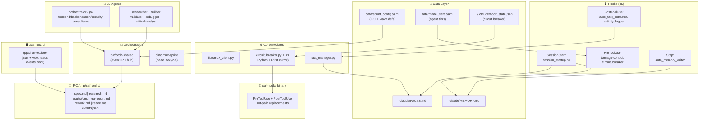

# Claude Agentic Framework v4.1 — Architecture & Dependency Map
<!-- Generated: 2026-04-14 | Git: d6ca118d -->
<!-- Regenerate: /arch-map -->

## 🗂️ Sections
| # | Section | Read when |
|---|---------|-----------|
| 1 | [Quick Reference](#quick-reference) | Before making changes — find blast radius |
| 2 | [System Topology](#system-topology) | When you need full system diagram |
| 3 | [Orchestration Flow](#orchestration-flow) | When working on /orchestrate or agents |
| 4 | [Critical Paths](#critical-paths) | When user asks how to run X workflow |
| 5 | [Duplication Warnings](#duplication-warnings) | When editing code that exists in multiple places |

---

## Quick Reference: "If X changes, update Y"

| Changed | Must Also Update |
|---------|-----------------|
| `data/sprint_config.yaml` | `bin/orch-shared` (IPC base dir, wave defs) |
| IPC base path `/tmp/caf_orch` | `bin/orch-shared`, `bin/orch-event`, `bin/cmux-sprint` |
| `templates/settings.json.template` | Run `bash install.sh` — never edit `~/.claude/settings.json` directly |
| `global-hooks/framework/session/session_startup.py` | Hook registration; run `bash install.sh` |
| `~/.claude/hook_state.json` schema | `caf-hooks/src/circuit_breaker.rs` AND `global-hooks/framework/guardrails/circuit_breaker.py` |
| `caf-hooks/src/` (any Rust hook) | `cargo build --release` from workspace root |
| `Cargo.toml` (workspace root) | `caf-hooks/Cargo.toml` shares workspace deps — check version alignment |
| `global-agents/*.md` | Run `bash install.sh` to re-symlink to `~/.claude/agents/` |
| `global-skills/*/SKILL.md` | Run `bash install.sh` to re-symlink to `~/.claude/skills/` |
| `global-commands/*.md` | Run `bash install.sh` to re-symlink to `~/.claude/commands/` |
| `global-skills/orchestrate/SKILL.md` | Wave definitions, consultant routing table, QA loop |
| `data/model_tiers.yaml` | Agent `model:` frontmatter fields, `global-hooks/framework/caddy/analyze_request.py` |
| `lib/cmux_client.py` (socket API) | `bin/orch-shared`, `bin/cmux-sprint`, `lib/agent_display.py` |
| `apps/run-explorer/server/src/index.ts` | Client types in `apps/run-explorer/shared/types.ts` |

---

## System Topology


```mermaid
flowchart TD
  subgraph DATA["💾 Data Layer"]
    SC["data/sprint_config.yaml\n(IPC + wave defs)"]
    MT["data/model_tiers.yaml\n(agent tiers)"]
    FACTS[".claude/FACTS.md"]
    MEM[".claude/MEMORY.md"]
    HS["~/.claude/hook_state.json\n(circuit breaker)"]
  end

  subgraph IPC["🔗 IPC /tmp/caf_orch/<id>/"]
    IPCFS["spec.md | research.md\nresults/*.md | qa-report.md\nrework.md | report.md\nevents.jsonl"]
  end

  subgraph CORE["⚙️ Core Modules"]
    CC["lib/cmux_client.py"]
    CB["circuit_breaker.py + .rs\n(Python + Rust mirror)"]
    FM["fact_manager.py"]
  end

  subgraph HOOKS["🪝 Hooks (45)"]
    SESSION["SessionStart:\nsession_startup.py"]
    PRE["PreToolUse:\ndamage-control, circuit_breaker"]
    POST["PostToolUse:\nauto_fact_extractor, activity_logger"]
    STOP["Stop:\nauto_memory_writer"]
  end

  subgraph RUST["🦀 caf-hooks binary"]
    CHOOKS["PreToolUse + PostToolUse\nhot-path replacements"]
  end

  subgraph ORCH["📜 Orchestration"]
    OS["bin/orch-shared\n(event IPC hub)"]
    CS["bin/cmux-sprint\n(pane lifecycle)"]
  end

  subgraph AGENTS["🤖 22 Agents"]
    CONSULTANTS["orchestrator · po\nfrontend/backend/arch/security consultants"]
    WORKERS["researcher · builder\nvalidator · debugger · critical-analyst"]
  end

  subgraph UI["🖥️ Dashboard"]
    RUNX["apps/run-explorer\n(Bun + Vue, reads events.jsonl)"]
  end

  SC --> OS
  MT --> PRE
  HS --> CB
  CB --> CHOOKS
  SESSION --> FACTS
  SESSION --> MEM
  POST --> FM --> FACTS
  STOP --> MEM
  OS --> IPCFS
  CONSULTANTS --> OS
  WORKERS --> OS
  RUNX --> IPCFS
```

---

## Orchestration Flow

**Wave 0a — Consultation (interactive, user in the loop)**
- Orchestrator loads relevant consultants (frontend/backend/architecture/security)
- All consultants spawn in one message (parallel)
- Each reads the codebase and uses `AskUserQuestion` to talk to the user
- Each produces a spec section
- Orchestrator synthesizes → `/tmp/caf_orch/<id>/spec.md`
- Get explicit user approval before proceeding

**Wave 0b — Research (parallel, no user)**
- Spawn researchers for prior art, proven patterns, library options
- Write to `/tmp/caf_orch/<id>/research.md`
- Update spec if findings change the approach

**Wave 1 — Build (parallel builders)**
- Decompose spec into independent work streams
- Spawn one builder per stream in one message
- Each implements against spec
- Write results to `/tmp/caf_orch/<id>/results/builder-*.md`

**Wave 2 — QA Loop**
- Spawn validator (haiku) — exercises actual behavior
- **PASS** → skip to Final Report
- **FAIL** → spawn relevant consultants (no user questions) to diagnose
  - Consultants produce `/tmp/caf_orch/<id>/rework.md`
  - Apply correction → re-run validator
  - Max 2 iterations; escalate to user after 2 failures

**Final Report** → `/tmp/caf_orch/<id>/report.md` → delivered to user

---

## Critical Paths

### A — Standard orchestration
```
/orchestrate task
  → orchestrator reads task, generates orch_id
  → bin/orch-shared init <orch_id>
  → Wave 0a: consultants (parallel) → spec approved
  → Wave 0b: researchers (parallel) → spec updated
  → Wave 1: builders (parallel) → results written
  → Wave 2: validator → PASS/FAIL
  → on FAIL: consultants re-evaluate (no user) → rework → retry
  → report.md → deliver
```

### B — Session startup
```
SessionStart → session_startup.py
  → auto_prime.py (PROJECT_CONTEXT.md if git hash matches)
  → inject last 5 MEMORY.md entries
```

### C — Hook chain (every tool call)
```
PreToolUse → damage-control (100+ patterns) → circuit_breaker
  ↓ tool executes
PostToolUse → auto_fact_extractor → FACTS.md
             activity_logger → activity_log.jsonl
  ↓ session ends
Stop → auto_memory_writer → MEMORY.md
```

### D — Install / symlink
```
Edit templates/settings.json.template
  → bash install.sh
  → re-symlinks agents/ skills/ commands/
  → regenerates ~/.claude/settings.json
  → cargo build --release (if Rust available)
```

---

## Duplication Warnings

These exist in BOTH Python and Rust — change behavior in BOTH or document why they diverge:

| Logic | Python | Rust |
|-------|--------|------|
| Circuit breaker | `global-hooks/framework/guardrails/circuit_breaker.py` | `caf-hooks/src/circuit_breaker.rs` |
| Fact extractor | `global-hooks/framework/facts/auto_fact_extractor.py` | `caf-hooks/src/hooks/auto_fact_extractor.rs` |
| Memory writer | `global-hooks/framework/memory/auto_memory_writer.py` | `caf-hooks/src/hooks/auto_memory_writer.rs` |

---

## Agent Roster (22)

| Role | Agent | Model |
|------|-------|-------|
| Orchestration | `orchestrator` | Opus |
| Architecture | `project-architect` | Opus |
| Consultation facilitator | `po` | Sonnet |
| Consultants (Wave 0a) | `frontend-consultant`, `backend-consultant`, `architecture-consultant`, `security-consultant` | Sonnet |
| Research (Wave 0b) | `researcher`, `academic-researcher`, `code-researcher` | Sonnet |
| Build (Wave 1) | `builder` | Sonnet |
| Analysis | `critical-analyst`, `debugger`, `scout-report-suggest`, `meta-agent` | Sonnet |
| Onboarding | `onboard-planner`, `onboard-builder` | Sonnet |
| Validation (Wave 2) | `validator` | Haiku |
| Background | `agent-watchdog`, `health-checker`, `docs-scraper` | Haiku |

---

*Generated by `/arch-map`. Run `/arch-map` after major structural changes.*
