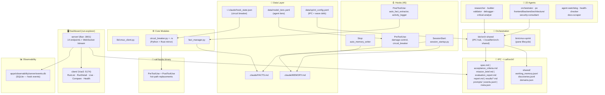

# Claude Agentic Framework v4.2 — Architecture & Dependency Map
<!-- Generated: 2026-04-14 | Git: d13a9e698e5fa5fb4057296091f35b28d1f3158e -->
<!-- Regenerate: /arch-map -->

## 🗂️ Sections
| # | Section | Read when |
|---|---------|-----------|
| 1 | [Quick Reference](#quick-reference) | Before making changes — find blast radius |
| 2 | [System Topology](#system-topology) | When you need full system diagram |
| 3 | [Orchestration Flow](#orchestration-flow) | When working on /orchestrate or agents |
| 4 | [Critical Paths](#critical-paths) | When user asks how to run X workflow |
| 5 | [Data & IPC Schema](#data--ipc-schema) | When adding new run metadata or event types |
| 6 | [Run Explorer Architecture](#run-explorer-architecture) | When editing the dashboard |
| 7 | [Duplication Warnings](#duplication-warnings) | When editing code that exists in multiple places |
| 8 | [Agent Roster](#agent-roster) | When spawning agents or checking model tiers |

---

## Quick Reference: "If X changes, update Y"

| Changed | Must Also Update |
|---------|-----------------|
| `global-skills/orchestrate/SKILL.md` | Wave definitions, consultant routing, QA loop rules |
| `ORCH_BASE` (`~/.caf/orch/`) | `bin/orch-shared`, `apps/run-explorer/server/src/config.ts`, `install.sh` |
| `apps/run-explorer/server/src/handlers/*` | `apps/run-explorer/shared/types.ts` (API contracts) |
| `global-agents/<agent>.md` | Run `bash install.sh` to re-symlink to `~/.claude/agents/` |
| `global-skills/*/SKILL.md` | Run `bash install.sh` to re-symlink to `~/.claude/skills/` |
| `global-commands/*.md` | Run `bash install.sh` to re-symlink to `~/.claude/commands/` |
| IPC schema (events.jsonl, meta.json) | `apps/run-explorer/server/src/services/runParser.ts` |
| `data/model_tiers.yaml` | Agent `model:` frontmatter fields in `global-agents/` |
| `lib/cmux_client.py` socket API | `bin/orch-shared`, `bin/cmux-sprint`, `lib/agent_display.py` |
| `caf-hooks/src/` (any Rust hook) | `cargo build --release` from workspace root |
| `Cargo.toml` (workspace root) | `caf-hooks/Cargo.toml` — keep workspace versions aligned |
| `templates/settings.json.template` | Run `bash install.sh` — never edit `~/.claude/settings.json` directly |
| `~/.claude/hook_state.json` schema | `caf-hooks/src/circuit_breaker.rs` AND `global-hooks/framework/guardrails/circuit_breaker.py` |
| Run Explorer port (3001/5174) | CI/CD, reverse proxy config, docs |

---

## System Topology


```mermaid
flowchart TD
  subgraph DATA["💾 Data Layer"]
    SC["data/sprint_config.yaml\n(IPC + wave defs)"]
    MT["data/model_tiers.yaml\n(agent tiers)"]
    FACTS[".claude/FACTS.md"]
    MEM[".claude/MEMORY.md"]
    HS["~/.claude/hook_state.json\n(circuit breaker)"]
  end

  subgraph IPC["🔗 IPC ~/.caf/orch/<id>/"]
    IPCFS["spec.md | acceptance_criteria.md\nmission_brief.md | evaluation_report.md\nreport.md | results/*.md\nprompts/ | events.jsonl | meta.json"]
    SHARED["shared/\nworking_memory.jsonl\ndiscoveries.jsonl\ndomains.json"]
  end

  subgraph CORE["⚙️ Core Modules"]
    CC["lib/cmux_client.py"]
    CB["circuit_breaker.py + .rs\n(Python + Rust mirror)"]
    FM["fact_manager.py"]
  end

  subgraph HOOKS["🪝 Hooks (45)"]
    SESSION["SessionStart:\nsession_startup.py"]
    PRE["PreToolUse:\ndamage-control, circuit_breaker"]
    POST["PostToolUse:\nauto_fact_extractor, activity_logger"]
    STOP["Stop:\nauto_memory_writer"]
  end

  subgraph RUST["🦀 caf-hooks binary"]
    CHOOKS["PreToolUse + PostToolUse\nhot-path replacements"]
  end

  subgraph ORCH["📜 Orchestration"]
    OS["bin/orch-shared\n(IPC hub, ~/.local/bin/orch-shared)"]
    CS["bin/cmux-sprint\n(pane lifecycle)"]
  end

  subgraph AGENTS["🤖 22 Agents"]
    CONSULTANTS["orchestrator · po\nfrontend/backend/architecture/\nsecurity-consultant"]
    WORKERS["researcher · builder\nvalidator · debugger · critical-analyst"]
    BG["agent-watchdog · health-checker\ndocs-scraper"]
  end

  subgraph UI["🖥️ Dashboard (run-explorer)"]
    RUNX_S["server/ (Bun :3001)\n14 endpoints + WebSocket /stream"]
    RUNX_C["client/ (Vue3 :5174)\nRunList · RunDetail · Live · Compare · Health"]
  end

  subgraph OBS["📊 Observability"]
    EVDB["apps/observability/server/events.db\n(SQLite — hook events)"]
  end

  SC --> OS
  MT --> PRE
  HS --> CB
  CB --> CHOOKS
  SESSION --> FACTS
  SESSION --> MEM
  POST --> FM --> FACTS
  STOP --> MEM
  OS --> IPCFS
  OS --> SHARED
  CONSULTANTS --> OS
  WORKERS --> OS
  RUNX_S --> IPCFS
  RUNX_S --> EVDB
  RUNX_S --> RUNX_C
```

---

## Orchestration Flow

**Wave 0a — Consultation (interactive, user in loop)**
- Orchestrator analyzes complexity: trivial / simple / standard / complex
- Standard/complex: spawn relevant consultants in parallel (frontend/backend/architecture/security)
- Each reads codebase, asks user clarifying questions, produces a spec section
- Synthesize → `~/.caf/orch/<id>/spec.md`; get explicit user approval before Wave 0b
- Simple tasks: skip Wave 0a entirely

**Wave 0b — Research (parallel, no user)**
- Spawn 1–3 researchers: prior art, proven patterns, security concerns, library options
- Write findings to `~/.caf/orch/<id>/research.md`; update spec if approach changes

**Wave 1 — Build (parallel builders, min 3 agents total)**
- Decompose spec into independent work streams; spawn one builder per stream in ONE message
- Model: `haiku` for exact replacements, `sonnet` for reasoning/multi-file/security
- Results: `~/.caf/orch/<id>/results/builder-*.md`

**Wave 2 — QA Loop**
- Spawn validator (haiku) to exercise actual behavior
- **PASS** → optional evaluator (critical-analyst/sonnet) for standard/complex → Final Report
- **FAIL 1st** → spawn debugger → diagnose → fresh builders with diagnosis injected
- **FAIL 2nd** → kill-and-reassign: fresh builder with full failure history
- **After 2 failures** → escalate to user with `rework.md` diagnosis

**Final Report** → `~/.caf/orch/<id>/report.md` + `bin/orch-shared write-retro <id>` → delivered to user

---

## Critical Paths

### A — Standard orchestration
```
/orchestrate task
  → generate orch_id, bin/orch-shared init <orch_id>  (or: orch-shared init <orch_id>)
  → Wave 0a: consultants (parallel) → spec approved by user
  → Wave 0b: researchers (parallel) → spec updated
  → Wave 1: builders (parallel, min 3 agents) → results written
  → Wave 2: validator → PASS/FAIL
  → on FAIL: debugger → rework → retry (max 2)
  → report.md + write-retro → deliver
```

### B — Simple orchestration
```
/orchestrate simple-task
  → skip Wave 0a (no consultation)
  → Wave 0b: researcher
  → Wave 1: builder
  → Wave 2: validator
  → report.md → deliver
```

### C — Session startup
```
SessionStart → session_startup.py
  → auto_prime.py (PROJECT_CONTEXT.md if git hash matches)
  → inject last 5 MEMORY.md entries
```

### D — Hook chain (every tool call)
```
PreToolUse → damage-control (100+ patterns) → circuit_breaker
  ↓ tool executes
PostToolUse → auto_fact_extractor → FACTS.md
             activity_logger → activity_log.jsonl
  ↓ session ends
Stop → auto_memory_writer → MEMORY.md
```

### E — Install / symlink
```
Edit templates/settings.json.template
  → bash install.sh
  → creates ~/.caf/orch/
  → symlinks bin/orch-shared → ~/.local/bin/orch-shared  (global cross-repo access)
  → re-symlinks agents/ skills/ commands/ to ~/.claude/
  → regenerates ~/.claude/settings.json
  → cargo build --release (if Rust available)
  → doctor checks (agent count, skill count, orch-shared accessible)
```

---

## Data & IPC Schema

### ORCH_BASE: `~/.caf/orch/`

Persistent, cross-repo orchestration store. All projects write here after `bash install.sh`.

**Per-run directory: `~/.caf/orch/<orch_id>/`**

| File | Written by | Purpose |
|------|-----------|---------|
| `spec.md` | Wave 0a consultants | Approved specification |
| `acceptance_criteria.md` | Orchestrator (from user) | Success criteria for validator |
| `mission_brief.md` | Orchestrator | Task context and history |
| `research.md` | Wave 0b researchers | Prior art, patterns, security |
| `results/builder-*.md` | Wave 1 builders | Build logs per stream |
| `qa-report.md` | Wave 2 validator | Test results (PASS/FAIL + details) |
| `debug-report.md` | Wave 2 debugger | Root cause on first failure |
| `rework.md` | Wave 2 consultants | Spec gap or approach changes |
| `evaluation_report.md` | Critical analyst | Quality gate verdict |
| `report.md` | Orchestrator | Final delivery summary |
| `events.jsonl` | bin/orch-event | One JSON line per state change |
| `meta.json` | bin/orch-shared init | `{orch_id, cwd}` — project origin |
| `prompts/` | Orchestrator | Consultation prompts (reference) |

**`meta.json` schema** (used by run-explorer for project grouping):
```json
{"orch_id": "orch_1776101724", "cwd": "/Users/tom/Documents/caf-team"}
```
`project` field in API = last path segment of `cwd`.

---

## Run Explorer Architecture

**Server** (Bun, `:3001`): `apps/run-explorer/server/src/index.ts`

| Endpoint | Handler | Source |
|----------|---------|--------|
| `GET /api/runs` | `handlers/runs.ts` | `~/.caf/orch/` (needs `acceptance_criteria.md` or `mission_brief.md`) |
| `GET /api/runs/:id` | `handlers/runs.ts` | Full run detail incl. spec + evaluation |
| `GET /api/runs/:id/leads/:name` | `handlers/leads.ts` | Prompt + results per lead |
| `GET /api/runs/:id/events` | `handlers/orchEvents.ts` | `events.jsonl` as JSON array |
| `GET /api/compare` | `handlers/compare.ts` | Diff two runs by token/quality |
| `GET /api/live/events` | `handlers/live.ts` | SQLite events.db |
| `POST /api/live/events` | `handlers/live.ts` | Write live event |
| `POST /api/live/events/:id/respond` | `handlers/live.ts` | HITL response relay |
| `GET /api/costs/summary` | `handlers/costs.ts` | Aggregated cost from cost_tracking.jsonl |
| `WS /stream` | `index.ts` | Real-time event push to client |

**Client** (Vue3, `:5174`): `apps/run-explorer/client/src/`

| View | Route | Purpose |
|------|-------|---------|
| `RunListView.vue` | `/` | All runs, grouped by project, status filter |
| `RunDetailView.vue` | `/runs/:id` | Spec, acceptance criteria, evaluation, leads |
| `LiveView.vue` | `/live` | Real-time hook event stream |
| `ComparisonView.vue` | `/compare` | Side-by-side diff |
| `HealthView.vue` | `/health` | System health |

---

## Duplication Warnings

Change behavior in BOTH Python and Rust, or document why they diverge:

| Logic | Python | Rust |
|-------|--------|------|
| Circuit breaker | `global-hooks/framework/guardrails/circuit_breaker.py` | `caf-hooks/src/circuit_breaker.rs` |
| Fact extractor | `global-hooks/framework/facts/auto_fact_extractor.py` | `caf-hooks/src/hooks/auto_fact_extractor.rs` |
| Memory writer | `global-hooks/framework/memory/auto_memory_writer.py` | `caf-hooks/src/hooks/auto_memory_writer.rs` |

---

## Agent Roster (22)

| Role | Agent | Model |
|------|-------|-------|
| Orchestration | `orchestrator` | Opus |
| Architecture | `project-architect` | Opus |
| Consultation | `po` | Sonnet |
| Consultants (Wave 0a) | `frontend-consultant`, `backend-consultant`, `architecture-consultant`, `security-consultant` | Sonnet |
| Research (Wave 0b) | `researcher`, `academic-researcher`, `code-researcher` | Sonnet |
| Build (Wave 1) | `builder` | Sonnet |
| Analysis | `critical-analyst`, `debugger`, `scout-report-suggest`, `meta-agent` | Sonnet |
| Onboarding | `onboard-planner`, `onboard-builder` | Sonnet |
| Validation (Wave 2) | `validator` | Haiku |
| Background | `agent-watchdog`, `health-checker`, `docs-scraper` | Haiku |

---

## Key Changes Since v4.1

1. **Deleted: `caf-hud/`** — Rust TUI dashboard removed entirely
2. **Deleted: 8 lead agents** — replaced by 4 consultants (frontend/backend/architecture/security)
3. **New: `apps/run-explorer/`** — Bun+Vue3 dashboard (server :3001, client :5174)
4. **IPC base path** — `/tmp/caf_orch/` → `~/.caf/orch/` (persistent, cross-repo)
5. **`bin/orch-shared`** — globally symlinked to `~/.local/bin/orch-shared` by `install.sh`
6. **`orchestrate` SKILL.md** — consultant model + upstream parallelism rules (min 3 agents, model selection table, failure escalation, dynamic skill spawning)

---

*Generated by `/arch-map`. Run `/arch-map` after major structural changes.*
