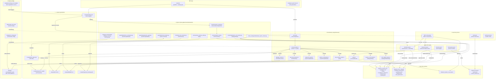

# Claude Agentic Framework v4.0 — Architecture & Dependency Map
<!-- Generated: 2026-04-11 | Git: 2755665e -->
<!-- Regenerate: /arch-map -->

## 🗂️ Sections (read only what you need)
| # | Section | When to read |
|---|---------|--------------|
| 1 | [Blast-radius table](#quick-reference) | Before any change — find downstream impact |
| 2 | [Mermaid diagram](#full-dependency-diagram) | When you need full system topology |
| 3 | [IPC flow](#orchestrate-ipc-flow) | When debugging orchestrate / lead lifecycle |
| 4 | [Data lineage](#data-file-lineage) | When a shared data file changes |
| 5 | [Hook registry](#hook-registry) | When adding/removing hooks |
| 6 | [Duplication warnings](#duplication-warnings) | When editing CB state, IPC paths, or model config |

---

## Quick Reference: "If X changes, update Y"

| Changed | Must Also Update |
|---------|-----------------|
| `templates/settings.json.template` | Run `bash install.sh` — never edit `~/.claude/settings.json` directly |
| `global-hooks/framework/session/session_startup.py` (sub-hook list) | Update `spawn_hud.py` if new sub-hook added; test with `caf-hooks doctor` |
| `global-hooks/framework/session/spawn_hud.py` | `templates/settings.json.template` entry; run `bash install.sh` |
| Any hook file in `global-hooks/` referenced from `settings.json.template` | Run `bash install.sh` to re-symlink; verify with `caf-hooks doctor` |
| `data/model_tiers.yaml` | `scripts/model-tiers.sh`, orchestrate SKILL.md references, `cost_tracker.py` tier names |
| `data/sprint_config.yaml` | `bin/cmux-sprint` (IPC base dir hardcoded), `bin/orch-shared` (ORCH_BASE), `caf-hud/src/main.rs` |
| IPC base path `/tmp/caf_orch` | `bin/cmux-sprint`, `bin/orch-shared`, `bin/orch-event`, `global-hooks/framework/session/spawn_hud.py`, `global-hooks/hooks_SubagentStart/inject_sprint_context.py`, `caf-hud/src/main.rs` (6 files) |
| `~/.claude/hook_state.json` schema | Both `caf-hooks/src/circuit_breaker.rs` AND `global-hooks/framework/guardrails/circuit_breaker.py` / `hook_state_manager.py` |
| `caf-hooks/src/` (any Rust hook) | `cargo build --release` from workspace root; verify binary at `target/release/caf-hooks` |
| `caf-hud/src/main.rs` | `cargo build --release` from workspace root; verify binary at `target/release/caf-hud` |
| `Cargo.toml` (workspace root) | Both `caf-hooks/Cargo.toml` and `caf-hud/Cargo.toml` share workspace deps — check version alignment |
| `global-agents/*.md` | Run `bash install.sh` to re-symlink to `~/.claude/agents/` |
| `global-skills/*/SKILL.md` | Run `bash install.sh` to re-symlink to `~/.claude/skills/` |
| `global-commands/*.md` | Run `bash install.sh` to re-symlink to `~/.claude/commands/` |
| `scripts/pre-push-hook.sh` | `.git/hooks/pre-push` (installed by `install.sh`); run `bash install.sh` to reinstall |
| `global-skills/orchestrate/SKILL.md` | Templates in `global-skills/orchestrate/templates/` are referenced by path — keep in sync |
| `global-hooks/framework/facts/auto_fact_extractor.py` | `global-hooks/framework/facts/fact_manager.py` (sibling import); Rust mirror `caf-hooks/src/hooks/auto_fact_extractor.rs` |
| `global-hooks/framework/memory/auto_memory_writer.py` | Rust mirror `caf-hooks/src/hooks/auto_memory_writer.rs` |
| `bin/orch-shared` (subcommand interface) | `bin/cmux-sprint` (calls it for broadcast), `global-skills/orchestrate/SKILL.md`, `global-skills/orchestrate/templates/lead-prompt.md` |
| Lead roles list in `bin/cmux-sprint` | `caf-hud/src/main.rs` (same hardcoded list for status parsing), `data/sprint_config.yaml` |

---

## Full Dependency Diagram


```mermaid
flowchart TD

  subgraph USER["👤 User Entry Points"]
    CTEAM["bin/cteam\n(session launcher)"]
    ORCH_SKILL["Skill: /orchestrate\n(SKILL.md protocol)"]
    DOCTOR["caf-hooks doctor\n(health check)"]
  end

  subgraph RUST["🦀 Rust Binaries (target/release/)"]
    CAF_HOOKS["caf-hooks\n(hook dispatcher)"]
    CAF_HUD["caf-hud\n(TUI dashboard)"]
    RUST_CB["circuit_breaker.rs\n(shared --cb gate)"]
    RUST_DC["damage_control.rs\n(PreToolUse block)"]
    RUST_EG["epistemic_guard.rs\n(UserPromptSubmit)"]
    RUST_EO["enforce_orchestrate.rs\n(UserPromptSubmit)"]
    RUST_AF["auto_fact_extractor.rs\n(PostToolUse)"]
    RUST_AM["auto_memory_writer.rs\n(Stop)"]
    RUST_SC["session_cost_tracker.rs\n(SubagentStop)"]
    RUST_OD["orch_depth_tracker.rs\n(SubagentStart/Stop)"]
  end

  subgraph PYTHON_HOOKS["🐍 Python Hooks (global-hooks/framework/)"]
    SESSION_STARTUP["session/session_startup.py\n(SessionStart dispatcher)"]
    SPAWN_HUD["session/spawn_hud.py\n(HUD launcher)"]
    ENFORCE_ORCH["guardrails/enforce_orchestrate.py\n(UserPromptSubmit)"]
    EP_GUARD["guardrails/epistemic_guard.py\n(UserPromptSubmit)"]
    PY_CB["guardrails/circuit_breaker.py\n(Python CB impl)"]
    FACT_EX["facts/auto_fact_extractor.py\n(PostToolUse)"]
    MEM_WRITER["memory/auto_memory_writer.py\n(Stop)"]
    INJECT_SPRINT["hooks_SubagentStart/inject_sprint_context.py"]
    DAMAGE_CTL["damage-control/unified-damage-control.py\n(PreToolUse)"]
    COST_TRACKER["monitoring/session_cost_tracker.py\n(SubagentStop)"]
  end

  subgraph BIN["🔧 bin/ IPC Scripts"]
    CMUX_SPRINT["bin/cmux-sprint\n(lead launcher + watchdog)"]
    ORCH_SHARED["bin/orch-shared\n(shared workspace API)"]
    ORCH_EVENT["bin/orch-event\n(event logger)"]
    SESSION_EVENT["bin/session-event\n(session tracker)"]
  end

  subgraph IPC_TMP["💾 /tmp IPC (runtime)"]
    ORCH_DIR["/tmp/caf_orch/orch_id/\n• prompts/*.md\n• *.status\n• acceptance_criteria.md\n• surfaces.json\n• events.jsonl"]
    SHARED_DIR["/tmp/caf_orch/.../shared/\n• working_memory.jsonl\n• questions.jsonl\n• domains.json\n• test_queue.jsonl"]
    COST_TMP["/tmp/caf_session_cost_id.jsonl"]
    SESSION_TMP["/tmp/caf_session/\n• tasks.jsonl\n• current_session_id"]
  end

  subgraph PERSIST["💾 ~/.claude/ (persistent)"]
    SETTINGS["~/.claude/settings.json\n(hook registry)"]
    HOOK_STATE["~/.claude/hook_state.json\n(CB state)"]
    ORCH_RESULTS["~/.claude/data/orch_results/\n(archived jobs)"]
    FACTS_MD[".claude/FACTS.md"]
    MEMORY_MD[".claude/MEMORY.md"]
    COST_LOG["~/.claude/logs/cost_tracking.jsonl"]
  end

  subgraph DATA_CFG["⚙️ data/ (config)"]
    MODEL_TIERS["data/model_tiers.yaml\n(model routing)"]
    SPRINT_CFG["data/sprint_config.yaml\n(orchestrate config)"]
    PATTERNS_YAML["damage-control/patterns.yaml\n(100+ block patterns)"]
    SETTINGS_TMPL["templates/settings.json.template\n(hook registration source)"]
  end

  subgraph INSTALL["📦 Setup"]
    INSTALL_SH["install.sh\n(symlinks + settings gen)"]
    PRE_PUSH["scripts/pre-push-hook.sh\n(doc generation)"]
  end

  %% Setup wiring
  SETTINGS_TMPL -->|"bash install.sh"| SETTINGS
  INSTALL_SH --> SETTINGS
  INSTALL_SH -->|symlinks| CAF_HOOKS

  %% SessionStart chain
  SETTINGS -->|registers| SESSION_STARTUP
  SESSION_STARTUP --> SPAWN_HUD
  SPAWN_HUD -->|Popen| CMUX_SPRINT
  CMUX_SPRINT -->|launch-hud| CAF_HUD

  %% Hook dispatching
  SETTINGS -->|registers all hooks| CAF_HOOKS
  CAF_HOOKS --> RUST_CB
  RUST_CB -->|--cb gate| RUST_DC
  RUST_CB -->|--cb gate| RUST_EG
  RUST_CB -->|--cb gate| RUST_EO
  RUST_CB -->|--cb gate| RUST_AF
  RUST_CB -->|--cb gate| RUST_AM
  RUST_CB -->|--cb gate| RUST_SC
  RUST_CB -->|--cb gate| RUST_OD

  %% Circuit breaker state
  RUST_CB <-->|read/write| HOOK_STATE
  PY_CB <-->|read/write| HOOK_STATE

  %% Orchestrate flow
  ORCH_SKILL -->|write prompts| ORCH_DIR
  ORCH_SKILL -->|bin calls| CMUX_SPRINT
  ORCH_SKILL -->|bin calls| ORCH_SHARED
  CMUX_SPRINT -->|reads prompts| ORCH_DIR
  CMUX_SPRINT -->|writes status/surfaces| ORCH_DIR
  ORCH_SHARED -->|reads/writes| SHARED_DIR
  ORCH_EVENT -->|appends events| ORCH_DIR
  INJECT_SPRINT -->|reads mission+AC| ORCH_DIR
  INJECT_SPRINT -->|reads memory| SHARED_DIR

  %% HUD reads
  CAF_HUD -->|polls| ORCH_DIR
  CAF_HUD -->|polls| SHARED_DIR
  CAF_HUD -->|idle: last job| ORCH_RESULTS
  ORCH_SHARED -->|cleanup → archive| ORCH_RESULTS

  %% Facts + Memory
  FACT_EX -->|writes| FACTS_MD
  RUST_AF -->|writes| FACTS_MD
  MEM_WRITER -->|writes| MEMORY_MD
  RUST_AM -->|writes| MEMORY_MD

  %% Cost tracking
  RUST_SC -->|appends| COST_TMP
  RUST_SC -->|appends| COST_LOG
  COST_TRACKER -->|appends| COST_TMP
  COST_TRACKER -->|appends| COST_LOG

  %% Session tracking
  SESSION_EVENT -->|writes| SESSION_TMP
  CTEAM -->|reads/writes| SESSION_TMP

  %% Damage control
  DAMAGE_CTL -->|reads patterns| PATTERNS_YAML
  RUST_DC -->|reads patterns| PATTERNS_YAML

  %% Config reads
  MODEL_TIERS -.->|consulted by| ORCH_SKILL
  SPRINT_CFG -.->|consulted by| CMUX_SPRINT
```

---

## Orchestrate IPC Flow

```
User types /orchestrate
    │
    ▼ UserPromptSubmit hooks fire (parallel)
  enforce_orchestrate.py → blocks with SKILL enforcement reminder
  epistemic_guard.py     → injects OBSERVED/INFERRED reminder (if analysis)
    │
    ▼ Claude invokes Skill("orchestrate") → loads SKILL.md
    │
    ▼ Phase 1: PM specs with user, writes:
  /tmp/caf_orch/<id>/acceptance_criteria.md
  /tmp/caf_orch/<id>/mission_brief.md
    │
    ▼ Phase 2.5: PM launches Wave 0 (ONE message, all parallel):
  Agent("planning-lead",   model=opus,  subagent_type=lead)
  Agent("research-topic1", model=haiku, subagent_type=researcher)
  Agent("research-topic2", model=haiku, subagent_type=researcher)
    │
    │ Each subagent triggers SubagentStart hooks:
    │   • orch-depth-tracker     → /tmp/caf_orch_depth++
    │   • inject_sprint_context  → reads mission/AC/memory → additionalContext (2500 chars)
    │
    ▼ Wave 0 completes → PM writes lead prompts to /tmp/caf_orch/<id>/prompts/
    │
    ▼ Phase 4: Launch Wave 1 (ONE message, all parallel):
  cmux mode:    bin/cmux-sprint launch-agent <id> engineering-lead 1
                bin/cmux-sprint launch-agent <id> qa-lead 1
                bin/cmux-sprint poll-agents <id> engineering-lead qa-lead
  agents-only:  Agent("engineering-lead", ...) + Agent("qa-lead", ...) in one message
    │
    │ Leads write to:
    │   /tmp/caf_orch/<id>/results/<role>_result.md
    │   /tmp/caf_orch/<id>/<role>.status = {"status":"done"}
    │   (via orch-shared: shared/working_memory.jsonl, shared/questions.jsonl)
    │
    │ caf-hud polls /tmp/caf_orch/<id>/ every 1s → shows live status
    │
    ▼ Phase 5: Merge → bin/cmux-sprint merge-leads <id>
    ▼ Phase 6: Evaluate → Agent("evaluator", model=sonnet, subagent_type=critical-analyst)
    ▼ Phase 7: Feedback loop (max 2 iterations)
    ▼ Phase 8: bin/orch-shared cleanup <id>
                 → archives to ~/.claude/data/orch_results/<id>/
                 → removes /tmp/caf_orch/<id>/
               caf-hud enters Idle mode → reads archived job
```

---

## Data File Lineage

| File/Path | Written By | Read By | Rebuild When |
|-----------|------------|---------|--------------|
| `/tmp/caf_orch/<id>/prompts/*.md` | orchestrate PM | `cmux-sprint` (injects into pane) | New job starts |
| `/tmp/caf_orch/<id>/acceptance_criteria.md` | orchestrate PM | `caf-hud`, `inject_sprint_context.py` | New job |
| `/tmp/caf_orch/<id>/<role>.status` | `cmux-sprint`, leads | `caf-hud`, `cmux-sprint poll-*` | Each lead completes |
| `/tmp/caf_orch/<id>/surfaces.json` | `cmux-sprint` | `orch-shared broadcast`, `caf-hud` | New cmux pane opened |
| `/tmp/caf_orch/<id>/shared/working_memory.jsonl` | `orch-shared append-memory` | `caf-hud`, `inject_sprint_context.py` | Lead shares decision |
| `/tmp/caf_orch/<id>/shared/questions.jsonl` | `orch-shared ask-pm` | `caf-hud`, `inject_sprint_context.py`, `orch-shared wait-answer` | Lead asks PM |
| `/tmp/caf_orch/<id>/results/*_result.md` | leads | `inject_sprint_context.py`, evaluator | Lead completes |
| `~/.claude/data/orch_results/<id>/` | `orch-shared cleanup` | `caf-hud` (idle mode) | Job completes |
| `~/.claude/hook_state.json` | Rust CB, Python `hook_state_manager.py` | Both CB impls | Hook failure/recovery |
| `~/.claude/settings.json` | `install.sh` (from template) | Claude Code (at startup), `doctor.rs` | Run `bash install.sh` |
| `<cwd>/.claude/FACTS.md` | `auto_fact_extractor.py`, Rust `auto-fact-extractor` | `inject_facts.py` (SessionStart) | PostToolUse events |
| `<cwd>/.claude/MEMORY.md` | `auto_memory_writer.py`, Rust `auto-memory-writer` | Session context | Stop hook fires |
| `~/.claude/logs/cost_tracking.jsonl` | `session_cost_tracker.py`, Rust `session-cost-tracker` | `monitoring/model_usage_cli.py` | Each SubagentStop |

---

## Hook Registry

**45 hooks across 16 events.** All registered in `templates/settings.json.template`.

| Event | Hook | Type | Purpose |
|-------|------|------|---------|
| SessionStart | `session_startup.py` | Python | Master dispatcher → runs sub-hooks in sequence |
| SessionStart | `check_gstack.py` | Python | gstack availability check |
| SessionStart | `spawn_hud.py` | Python | Launch caf-hud if CMUX_SURFACE_ID set |
| UserPromptSubmit | `kr_mode.py` | Python | Korean language mode |
| UserPromptSubmit | `analyze_request.py` | Python | Request type classification (caddy) |
| UserPromptSubmit | `auto_delegate.py` | Python | Auto-delegation hints (caddy) |
| UserPromptSubmit | `epistemic-guard` | Rust | OBSERVED/INFERRED/UNCERTAIN reminder |
| UserPromptSubmit | `enforce-orchestrate` | Rust | Force `/orchestrate` for multi-agent tasks |
| PreToolUse | `orchestrator-tool-guard` | Rust | Prevent orchestrator from using build tools directly |
| PreToolUse | `session_lock_manager.py` | Python | Concurrent session protection |
| PreToolUse | `damage-control` | Rust | Block dangerous commands (100+ patterns) |
| PreToolUse | `auto_review_team.py` | Python | Code review on writes (CB-wrapped) |
| PostToolUse | `context-bundle-logger` | Rust | Log tool I/O for context bundles |
| PostToolUse | `auto-error-analyzer` | Rust | Auto-analyze tool errors |
| PostToolUse | `auto-refine` | Rust | Refinement suggestions |
| PostToolUse | `auto_context_manager.py` | Python | Context compression management |
| PostToolUse | `auto-escalate` | Rust | Escalation detection |
| PostToolUse | `auto_voice_notifications.py` | Python | TTS notifications |
| PostToolUse | `auto_team_review.py` | Python | Team review dispatch |
| PostToolUse | `auto-fact-extractor` | Rust | Extract facts → FACTS.md |
| Stop | `session_lock_manager.py` | Python | Release session lock |
| Stop | `check_lthread_progress.py` | Python | lthread progress check |
| Stop | `auto-memory-writer` | Rust | Write session summary → MEMORY.md |
| Stop | `validate_facts.py` | Python | Prune stale FACTS.md entries |
| Stop | `auto_dependency_audit.py` | Python | Dependency audit |
| Stop | `auto_skill_generator.py` | Python | Auto-generate skills |
| Stop | `activity_logger.py` | Python | Activity log append |
| Stop | `voice-done` | Rust | "Done" TTS announcement |
| SubagentStart | `subagent-tracker` | Rust | Track agent metadata |
| SubagentStart | `orch-depth-tracker` | Rust | Orchestration depth counter |
| SubagentStart | `inject_sprint_context.py` | Python | Mission/AC/memory context injection |
| SubagentStop | `subagent-tracker` | Rust | Record completion |
| SubagentStop | `orch-depth-tracker` | Rust | Decrement depth |
| SubagentStop | `session-cost-tracker` | Rust | Token cost from transcript |
| SubagentStop | `lead_result_store.py` | Python | Stub (no-op) |
| SubagentStop | `voice-done` | Rust | TTS on subagent done |
| TaskCompleted | `task-quality-gate` | Rust | Quality gate check |
| CwdChanged | `project_fingerprint.py` | Python | Fingerprint project on dir change |
| FileChanged | `file-watcher` | Rust | Track file changes |
| ConfigChange | `audit-config-change` | Rust | Audit settings.json changes |
| PreCompact | `pre_compact_preserve.py` | Python | Preserve context before compact |
| PostCompact | `post-compact-verify` | Rust | Verify context after compact |

**Note**: Every Rust hook runs via `caf-hooks --cb <hook-name>`. The `--cb` flag gates through `circuit_breaker.rs` before the hook executes. Python hooks use `circuit_breaker_wrapper.py` for CB-guarded ones.

---

## Duplication Warnings

### 1. Circuit Breaker — Dual Implementation
**Python**: `global-hooks/framework/guardrails/circuit_breaker.py` + `hook_state_manager.py`
**Rust**: `caf-hooks/src/circuit_breaker.rs`
Both read/write `~/.claude/hook_state.json`. Schema changes must be kept in sync. Rust version used for all Rust hooks via `--cb`; Python version wraps Python hooks.

### 2. IPC Base Path — 6 Hardcodes
`/tmp/caf_orch` is hardcoded (not read from config at runtime) in:
1. `bin/cmux-sprint` — `ORCH_BASE` constant
2. `bin/orch-shared` — `ORCH_BASE` constant
3. `bin/orch-event` — path construction
4. `global-hooks/framework/session/spawn_hud.py`
5. `global-hooks/hooks_SubagentStart/inject_sprint_context.py`
6. `caf-hud/src/main.rs`

`data/sprint_config.yaml` declares this path but is **not read at runtime** by the bins. Changing the IPC dir requires updating all 6 locations.

### 3. Lead Roles — Dual Hardcode
The 8 lead roles are hardcoded in both `bin/cmux-sprint` (wave assignment) and `caf-hud/src/main.rs` (status display). Adding a new lead type requires updating both. `data/sprint_config.yaml` has the canonical list but is not read by either binary at runtime.

### 4. Fact/Memory Extraction — Dual Implementation
Both Python and Rust versions of `auto_fact_extractor` and `auto_memory_writer` are active in `settings.json.template`. Logic changes must be applied to both.

### 5. Damage Control — Dual Implementation
`global-hooks/damage-control/unified-damage-control.py` and `caf-hooks/src/hooks/damage_control.rs` both enforce patterns from `global-hooks/damage-control/patterns.yaml`. Both active. New patterns go in `patterns.yaml` — both impls read it.

---

## Module Import Graph

```
Claude Code (settings.json)
  └── caf-hooks binary (Rust dispatch, target/release/)
        ├── circuit_breaker.rs          ← gates all Rust hooks via --cb
        ├── hooks/damage_control.rs     → reads damage-control/patterns.yaml
        ├── hooks/auto_fact_extractor.rs → writes .claude/FACTS.md
        ├── hooks/auto_memory_writer.rs  → writes .claude/MEMORY.md
        ├── hooks/session_cost_tracker.rs → /tmp/caf_session_cost_*.jsonl
        ├── hooks/doctor.rs              → reads settings.json, disk state, cmux socket
        └── hooks/[18 more]

  └── caf-hud binary (Rust TUI, target/release/)
        ├── reads /tmp/caf_orch/<id>/ (active mode, 1s poll)
        └── reads ~/.claude/data/orch_results/ (idle mode)

  └── session_startup.py (Python SessionStart)
        ├── session/session_lock_manager.py
        ├── security/verify_skills.py
        ├── security/validate_docs.py
        ├── automation/auto_prime.py
        ├── automation/inject_always_loaded_skills.py
        └── session/spawn_hud.py → bin/cmux-sprint launch-hud → caf-hud

  └── global-hooks/framework/guardrails/
        ├── circuit_breaker.py           ← Python CB (wraps Python hooks)
        │     └── hook_state_manager.py  → ~/.claude/hook_state.json
        │     └── config_loader.py       → ~/.claude/guardrails.yaml
        │     └── state_schema.py
        ├── enforce_orchestrate.py       → caf_mode.py (optional)
        └── epistemic_guard.py           → caf_mode.py (optional)

  └── global-hooks/framework/facts/
        ├── auto_fact_extractor.py       → fact_manager.py → .claude/FACTS.md
        ├── inject_facts.py              ← reads FACTS.md
        └── validate_facts.py            → fact_manager.py

  └── global-hooks/framework/monitoring/
        ├── session_cost_tracker.py      → cost_tracker.py → cost_tracking.jsonl
        └── model_usage_cli.py           → cost_tracker.py ← reads cost_tracking.jsonl

bin/ IPC (shell + Python):
  bin/cmux-sprint  → lib/cmux_client.py + [bin/sprint-event, bin/orch-event as subprocs]
  bin/orch-shared  → lib/cmux_client.py + [bin/cmux-sprint send-agent for broadcast]
  bin/cteam        → lib/cmux_client.py + [dashboard/sprint_report.py, activity_report.py]
```

---

*Generated by `/arch-map`. Run `/arch-map` again after major structural changes.*
