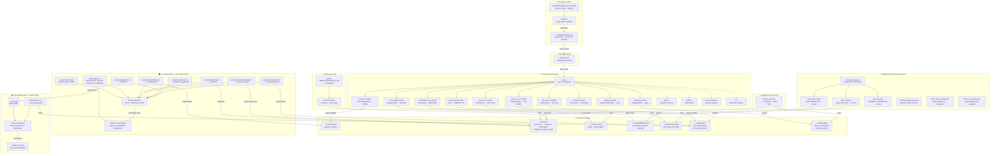

# Claude Agentic Framework v4.3 — Architecture & Dependency Map
<!-- Generated: 2026-04-14 | Git: 7d286ff52652e80d74ac1e0a18eeac58acd9e5f8 -->
<!-- Regenerate: /arch-map -->

## 🗂️ Sections (read only what you need — discard after use)
| # | Section | When to read |
|---|---------|--------------|
| 1 | [Blast-radius table](#quick-reference) | Before making any change — find downstream impact |
| 2 | [Mermaid diagram](#full-dependency-diagram) | When you need the full system topology |
| 3 | [Critical paths](#critical-paths) | When user asks how to run X workflow |
| 4 | [Data lineage](#data-file-lineage) | When a data file changes and you need to know what to rebuild |
| 5 | [Duplication warnings](#duplication-warnings) | When editing configs defined in multiple places |
| 6 | [Module import graph](#module-import-graph) | When tracing imports or refactoring |

---

## Quick Reference: "If X changes, update Y"

| Changed | Must Also Update |
|---------|-----------------|
| `caf-hooks/src/types.rs` | All 25 hook impls in `caf-hooks/src/hooks/` — recompile with `cargo build -r` |
| `caf-hooks/src/main.rs` (subcommand list) | Hook entries in `templates/settings.json.template` + `install.sh` |
| `apps/run-explorer/shared/types.ts` | Both `server/src/` handlers and `client/src/` composables/views that import types |
| `~/.caf/sessions/*.jsonl` format | `sessionParser.ts` (reader) + `session_recorder.rs` (writer) must stay in sync |
| `~/.caf/orch/{id}/` directory structure | `runParser.ts`, `orchEventReader.ts`, `dashboard/activity_report.py` |
| `apps/run-explorer/server/src/config.ts` (paths) | All server-side services that read `ORCH_BASE_DIR`, `EVENTS_DB_PATH` |
| `apps/observability/server/src/db.ts` (schema) | All queries in `index.ts`, `cost.ts`, observability client types |
| `global-hooks/framework/session/session_startup.py` | Re-run `install.sh` to re-link, check hook chain ordering |
| `templates/settings.json.template` | Run `bash install.sh` — never edit `settings.json` directly |
| `data/model_tiers.yaml` | `global-agents/*.md` model fields, Caddy routing decisions |
| `global-skills/orchestrate/SKILL.md` | `global-skills/orchestrate/templates/` (lead-prompt.md, delivery-format.md, etc.) — kept in sync manually |
| `caf-hooks/src/hooks/session_recorder.rs` (event format) | `sessionParser.ts` parse logic |
| `global-hooks/framework/guardrails/state_schema.py` | `hook_state_manager.py` + all Python hooks reading state |
| `bin/orch-shared` (event schema) | `orchEventReader.ts` + `dashboard/activity_report.py` |

---

## Full Dependency Diagram


```mermaid
flowchart TD

  subgraph CLAUDE["🤖 Claude Harness"]
    harness["Claude Code\n(settings.json hooks)"]
  end

  subgraph RUST["🦀 caf-hooks (Rust binary)"]
    main["main.rs\nrouter + dispatcher"]
    session_rec["session_recorder\nSessionStart/Stop → JSONL"]
    mem_writer["auto_memory_writer\nStop → MEMORY.md"]
    fact_ext["auto_fact_extractor\nPostToolUse → FACTS.md"]
    cost_track["session_cost_tracker\nSubagentStop → cost JSONL"]
    subagent_tr["subagent_tracker\nSubagentStop → alerts"]
    orch_depth["orch_depth_tracker\nSubagentStart → depth file"]
    orch_guard["orchestrator_tool_guard\nPreToolUse → block/allow"]
    damage["damage_control\nPreToolUse → block/allow"]
    epistemic["epistemic_guard\nUserPromptSubmit → inject"]
    err_anal["auto_error_analyzer\nPostToolUse → error log"]
    types_rs["types.rs\nHookEvent structs"]
    state_rs["state.rs\nshared state"]
    circuit["circuit_breaker.rs\nfail-open wrapper"]
    io_rs["io.rs\nstdin/stdout helpers"]
  end

  subgraph PERSISTENCE["💾 Persistent Storage"]
    sessions_dir["~/.caf/sessions/\n{session_id}.jsonl"]
    orch_dir["~/.caf/orch/\n{orch_id}/ → meta.json, events.jsonl\nprompts/, results/, shared/"]
    orch_state["~/.caf/orch_state/\ndepth + guard.marker"]
    memory_md["~/.claude/MEMORY.md\n(per-project episodic memory)"]
    facts_md["~/.claude/FACTS.md\n(per-project facts DB)"]
    cost_log["~/.claude/logs/\ncost_tracking.jsonl\nerror_patterns.jsonl"]
    claude_data["~/.claude/data/\nagent_tracking.jsonl\nactivity_log.jsonl"]
  end

  subgraph PYTHON["🐍 global-hooks (Python framework)"]
    sess_startup["session_startup.py\nSessionStart orchestrator"]
    inject_mem["inject_memory.py\nreads MEMORY.md → context"]
    inject_facts["inject_facts.py\nreads FACTS.md → context"]
    auto_prime["auto_prime.py\nPROJECT_CONTEXT.md → context"]
    damage_py["unified-damage-control.py\nPatterns YAML enforcer"]
    hook_state["hook_state_manager.py\nstate_schema.py → state.json"]
    enforce_orch["enforce_orchestrate.py\nUserPromptSubmit guardrail"]
  end

  subgraph RUN_EXPLORER["🖥️ run-explorer (Bun + Vue3 :3001/:5173)"]
    re_server["server/src/index.ts\nHTTP + WebSocket :3001"]
    re_config["server/src/config.ts\nPORTS, paths, CORS"]
    re_session_parser["services/sessionParser.ts\n← ~/.caf/sessions/"]
    re_run_parser["services/runParser.ts\n← ~/.caf/orch/"]
    re_orch_reader["services/orchEventReader.ts\n← orch events.jsonl"]
    re_eval_parser["services/evalParser.ts\n← evaluation_report.md"]
    re_cost_svc["services/costTracker.ts\n← cost_tracking.jsonl"]
    re_db_reader["services/dbReader.ts\n← events.db"]
    re_types["shared/types.ts\nRunSummary, Session,\nOrchEvent, LeadOutput"]
    re_client["client/src/ (Vue3 SPA)\nviews/, composables/, components/"]
  end

  subgraph OBSERVABILITY["📊 observability (Bun + SQLite :3002)"]
    obs_server["server/src/index.ts\nPOST /hook-event + WebSocket"]
    obs_db[("events.db\nSQLite WAL")]
    obs_cost["server/src/cost.ts\n← cost_tracking.jsonl"]
    obs_client["client/src/ (Vue3)\nlive event dashboard"]
  end

  subgraph DASHBOARD["📜 dashboard (Python CLI)"]
    activity_rpt["activity_report.py\n← ~/.caf/orch/ → ANSI HUD"]
  end

  subgraph INSTALL["⚙️ Install & Config"]
    template["templates/settings.json.template\nmaster config — edit this"]
    install_sh["install.sh\ncargo build + symlinks"]
    settings_json["~/.claude/settings.json\n(generated — never edit directly)"]
  end

  subgraph ORCHESTRATE["🎯 /orchestrate skill"]
    orch_sk["global-skills/orchestrate/SKILL.md\n+ templates/"]
    orch_shared["bin/orch-shared\nevent bus + retro writer"]
  end

  %% Claude → caf-hooks
  harness -->|"stdin JSON"| main
  main --> session_rec & mem_writer & fact_ext & cost_track
  main --> subagent_tr & orch_depth & orch_guard & damage & epistemic & err_anal
  main -.-> types_rs & state_rs & circuit & io_rs

  %% Rust → Persistence
  session_rec -->|"append JSONL"| sessions_dir
  mem_writer -->|"atomic write"| memory_md
  fact_ext -->|"append"| facts_md
  cost_track -->|"append JSONL"| cost_log
  subagent_tr -->|"append"| claude_data
  err_anal -->|"append"| cost_log
  orch_depth -->|"write JSON"| orch_state
  orch_guard -->|"reads"| orch_state

  %% Python → reads
  inject_mem -->|"reads"| memory_md
  inject_facts -->|"reads"| facts_md
  sess_startup --> inject_mem & inject_facts & auto_prime

  %% run-explorer reads
  re_session_parser -->|"reads JSONL"| sessions_dir
  re_run_parser -->|"reads dirs"| orch_dir
  re_orch_reader -->|"reads events.jsonl"| orch_dir
  re_cost_svc -->|"reads JSONL"| cost_log
  re_db_reader -->|"reads SQLite"| obs_db

  %% run-explorer internal
  re_config --> re_server
  re_types --> re_server & re_client
  re_session_parser & re_run_parser & re_orch_reader --> re_server
  re_eval_parser & re_cost_svc & re_db_reader --> re_server
  re_server -->|"HTTP/WS :3001"| re_client

  %% Observability
  obs_db --> obs_server
  obs_cost -->|"reads"| cost_log
  obs_cost --> obs_server
  obs_server -->|"WebSocket"| obs_client

  %% Dashboard
  activity_rpt -->|"reads"| orch_dir
  activity_rpt -->|"reads"| claude_data

  %% Install chain
  template --> install_sh -->|"generates"| settings_json -->|"hooks config"| harness

  %% Orchestrate → orch dir
  orch_sk --> orch_shared -->|"writes dirs"| orch_dir
```

---

## Critical Paths

### ⚡ Path A — Session Recording (~instant per event)
Claude session start → `caf-hooks session-recorder` → appends `{type, ts, cwd, prompt?}` to `~/.caf/sessions/{session_id}.jsonl` → run-explorer `sessionParser.ts` reads on `/api/sessions` → Session list/detail views in UI.

```bash
ls ~/.caf/sessions/
cat ~/.caf/sessions/<session_id>.jsonl
```

### ⚡ Path B — Orchestration Run Lifecycle (~minutes)
`/orchestrate` → `bin/orch-shared init` creates `~/.caf/orch/{id}/` → PO + consultants → leads write to `prompts/`, `results/`, `shared/` → `bin/orch-shared write-retro` appends evaluation → run-explorer `runParser.ts` reads on `/api/runs` → Run list + detail in UI. Dashboard `activity_report.py` polls live.

```bash
uv run dashboard/activity_report.py    # live ANSI HUD
cd apps/run-explorer && bun run dev    # → http://localhost:5173
```

### ⚡ Path C — Memory + Facts Cross-Session Continuity (~1s at Stop)
Session ends → `auto_memory_writer.rs` reads git diff + compressed context → writes dated entry to `{cwd}/.claude/MEMORY.md` (dedup on commit hash, prune >30) → next session: `inject_memory.py` prepends to context. Parallel: `auto_fact_extractor.rs` appends to `FACTS.md` on Bash/Write success throughout session.

### ⚡ Path D — Cost Tracking Pipeline (~instant per SubagentStop)
SubagentStop → `session_cost_tracker.rs` parses transcript tokens + model → calculates USD → appends to `~/.claude/logs/cost_tracking.jsonl` → `observability/server/src/cost.ts` aggregates → `/api/costs/*`.

### ⚡ Path E — Damage Control / Security Blocking (~instant)
PreToolUse (Bash/Edit/Write) → `damage_control.rs` checks 100+ regex patterns → exit 2 to BLOCK or exit 0 to allow. `unified-damage-control.py` runs in parallel for Python-side patterns.

### ⚡ Path F — Install / Config Change
Edit `templates/settings.json.template` → `bash install.sh` → cargo build caf-hooks → symlinks global-{hooks,skills,agents}/ into `~/.claude/` → generates `~/.claude/settings.json`.

---

## Data File Lineage

| File/Dir | Producer | Consumers | Rebuild When |
|----------|----------|-----------|--------------|
| `~/.caf/sessions/{id}.jsonl` | `session_recorder.rs` | `sessionParser.ts` → `/api/sessions` | Format changes in recorder or parser |
| `~/.caf/orch/{id}/` | `bin/orch-shared` + lead agents | `runParser.ts`, `orchEventReader.ts`, `evalParser.ts`, `activity_report.py` | `orch-shared` schema change |
| `~/.caf/orch_state/depth` | `orch_depth_tracker.rs` | `orchestrator_tool_guard.rs` | Reset automatically on session end |
| `~/.claude/MEMORY.md` | `auto_memory_writer.rs` (Stop hook) | `inject_memory.py` (SessionStart) | Auto; prunes >30 entries |
| `~/.claude/FACTS.md` | `auto_fact_extractor.rs` (PostToolUse) | `inject_facts.py` (SessionStart) | Auto; `validate_facts.py` prunes >90 days |
| `~/.claude/logs/cost_tracking.jsonl` | `session_cost_tracker.rs` | `cost.ts` (obs), `costTracker.ts` (run-explorer) | Token/model format change |
| `~/.claude/settings.json` | `install.sh` from template | Claude harness | **Never edit directly** |
| `apps/observability/server/events.db` | `obs/server/src/db.ts` via POST /hook-event | `dbReader.ts`, obs client | Schema change → rebuild DB |
| `apps/run-explorer/shared/types.ts` | Manual (source of truth) | All server handlers + all client composables/views | Both sides must update together |
| `.claude/PROJECT_CONTEXT.md` | `/arch-map` + `auto_prime.py` | Session context at start | Run `/arch-map` after major restructure |
| `data/model_tiers.yaml` | Manual | `global-agents/*.md`, Caddy routing, orchestrate skill | When adding/removing agents |

---

## Duplication Warnings

**⚠️ 1. Damage control patterns in two systems**
- `caf-hooks/src/hooks/damage_control.rs` — Rust regex, rules in `settings.json damagePrevention.rules[]`
- `global-hooks/damage-control/unified-damage-control.py` + `patterns.yaml` — Python patterns
Both run on PreToolUse. Add new block patterns to **both**. Rust runs first (faster); Python catches edge cases.

**⚠️ 2. Session event format without shared schema**
- `caf-hooks/src/hooks/session_recorder.rs` — write side (fields: ts, ms, type, cwd, prompt?)
- `apps/run-explorer/server/src/services/sessionParser.ts` — read side (must match field names)
No shared schema file. If you add a field to the recorder, update the parser + `shared/types.ts`.

**⚠️ 3. Orchestrate skill split across files**
- `global-skills/orchestrate/SKILL.md` — core logic
- `global-skills/orchestrate/templates/` — lead-prompt.md, delivery-format.md, acceptance-criteria.md, etc.
Templates referenced by SKILL.md but not auto-validated. Renamed template section = silent failure.

**⚠️ 4. Port numbers hardcoded in multiple places**
- `apps/run-explorer/server/src/config.ts` — PORT=3001
- `apps/run-explorer/client/src/config.ts` — API_URL=localhost:3001
- `apps/observability/server/src/index.ts` — :3002
No shared env config. Changing a port requires updating both server config and client config.

**⚠️ 5. Orch dir path in two places**
- `apps/run-explorer/server/src/config.ts` — `ORCH_BASE_DIR = ~/.caf/orch`
- `bin/orch-shared` — hardcoded `~/.caf/orch/` write path
Must stay in sync manually.

---

## Module Import Graph

```
Claude Harness (settings.json hooks)
  └── caf-hooks/src/main.rs           ← Rust entry point, subcommand router
        ├── hooks/mod.rs              ← re-exports all hooks
        │     ├── session_recorder   ← writes ~/.caf/sessions/
        │     ├── auto_memory_writer ← writes ~/.claude/MEMORY.md
        │     ├── auto_fact_extractor← writes ~/.claude/FACTS.md
        │     ├── session_cost_tracker← writes ~/.claude/logs/cost_tracking.jsonl
        │     ├── subagent_tracker   ← writes ~/.claude/data/agent_tracking.jsonl
        │     ├── orch_depth_tracker ← writes ~/.caf/orch_state/
        │     ├── orchestrator_tool_guard ← reads ~/.caf/orch_state/ (BLOCKING)
        │     ├── damage_control     ← reads settings.json rules (BLOCKING)
        │     ├── epistemic_guard    ← inject only
        │     ├── auto_error_analyzer← writes ~/.claude/logs/error_patterns.jsonl
        │     ├── auto_escalate, auto_refine ← inject only
        │     ├── context_bundle_logger, file_watcher
        │     ├── post_compact_verify, stop_failure_recovery
        │     ├── task_quality_gate, voice_done
        │     ├── enforce_orchestrate, doctor
        │     └── audit_config_change← writes ~/.claude/logs/config_audit.jsonl
        ├── types.rs                  ← HookEvent, ToolInput (ALL hooks depend on this)
        ├── state.rs                  ← AppState (shared mutable)
        ├── circuit_breaker.rs        ← fail-open wrapper
        └── io.rs                    ← stdin/stdout JSON helpers

global-hooks/framework/session/session_startup.py  ← SessionStart orchestrator
  ├── session_lock_manager.py
  ├── verify_skills.py
  ├── validate_docs.py
  ├── auto_prime.py              ← reads .claude/PROJECT_CONTEXT.md
  ├── inject_always_loaded_skills.py
  └── spawn_hud.py

global-hooks/framework/guardrails/
  ├── hook_state_manager.py     ← reads/writes ~/.claude/hook_state.json
  ├── state_schema.py           ← JSON schema (hook_state_manager depends on this)
  ├── circuit_breaker_wrapper.py
  ├── enforce_orchestrate.py
  └── epistemic_guard.py

apps/run-explorer/server/src/
  index.ts                      ← Bun HTTP+WS server, route registration
  config.ts                     ← ports, paths (ALL services import this)
  handlers/
    ├── runs.ts        ← runParser + orchEventReader + evalParser
    ├── sessions.ts    ← sessionParser
    ├── costs.ts       ← costTracker
    ├── live.ts        ← WebSocket + dbReader
    ├── leads.ts       ← runParser
    ├── compare.ts     ← runParser + tokenEstimator
    ├── events.ts      ← dbReader
    └── orchEvents.ts  ← orchEventReader
  services/
    ├── runParser.ts          ← reads ~/.caf/orch/
    ├── sessionParser.ts      ← reads ~/.caf/sessions/
    ├── orchEventReader.ts    ← reads orch events.jsonl
    ├── evalParser.ts         ← reads evaluation_report.md
    ├── costTracker.ts        ← reads cost_tracking.jsonl
    ├── dbReader.ts           ← reads events.db (SQLite)
    └── tokenEstimator.ts     ← pure util, no I/O

apps/run-explorer/shared/types.ts   ← shared types (server + client both import)

apps/run-explorer/client/src/
  router/index.ts               ← /runs, /runs/:id, /sessions, /sessions/:id, /live, /health, /compare
  App.vue                       ← root
  views/                        ← RunList, RunDetail, SessionList, SessionDetail, Live, Health, Comparison
  composables/                  ← useRuns, useSessions, useLiveEvents, useOrchEvents, useCosts, useHealth
  components/                   ← StatusBadge, EventsTable, LeadAccordion, WaveStepBar, etc.
```

---

## Hook Event Matrix

| Hook Event | Rust Handlers | Python Handlers |
|-----------|---------------|-----------------|
| SessionStart | session_recorder | session_startup.py → [lock, verify, prime, inject] |
| UserPromptSubmit | epistemic_guard, enforce_orchestrate | enforce_orchestrate.py, epistemic_guard.py, circuit_breaker_wrapper.py |
| PreToolUse | damage_control *(blocking)*, orchestrator_tool_guard *(blocking)* | unified-damage-control.py |
| PostToolUse | auto_fact_extractor, auto_error_analyzer, auto_refine, auto_escalate, context_bundle_logger, file_watcher | auto_code_review.py, auto_cost_warnings.py, auto_prime_inject.py |
| PostToolUseFailure | stop_failure_recovery | — |
| SubagentStart | orch_depth_tracker | subagent_tracker.py |
| SubagentStop | subagent_tracker, session_cost_tracker | auto_review_team.py |
| Stop | auto_memory_writer, voice_done | auto_memory_writer.py (Python fallback) |
| StopFailure | stop_failure_recovery | stop_failure_recovery.py |
| PostCompact | post_compact_verify | — |
| ConfigChange | audit_config_change | — |
| TaskCompleted | task_quality_gate | — |
| CwdChanged, FileChanged | file_watcher | — |

---

*Generated by `/arch-map` skill. Run `/arch-map` again after major structural changes.*
