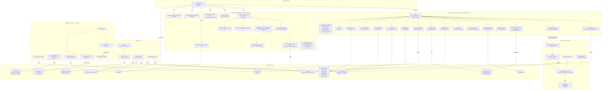

# Claude Agentic Framework v5.3 — Architecture & Dependency Map
<!-- GIT_HASH: ec477d8be4ff1662e4464226ebbf879ffbb8f5bd -->
<!-- Generated: 2026-07-13 | Git: ec477d8be4ff1662e4464226ebbf879ffbb8f5bd -->
<!-- Regenerate: /arch-map -->

## 🗂️ Sections (read only what you need — discard after use)
| # | Section | When to read |
|---|---------|--------------|
| 1 | [Blast-radius table](#quick-reference) | Before making any change — find downstream impact |
| 2 | [Mermaid diagram](#full-dependency-diagram) | When you need the full system topology |
| 3 | [Critical paths](#critical-paths) | When user asks how to run X workflow |
| 4 | [Data lineage](#data-file-lineage) | When a data file changes and you need to know what to rebuild |
| 5 | [Duplication & dead-surface warnings](#duplication-warnings) | When editing configs or hooks defined in multiple places |
| 6 | [Module / hook wiring graph](#module-import-graph) | When tracing what actually fires vs. what only exists |
| 7 | [Hook event matrix](#hook-event-matrix) | When wiring or debugging a hook |

> **Post-restructure note (v5.3).** The framework shrank hard: **8 agents** (was 22),
> **16 skills** (was 31), **9 commands** (was 14), **31 hook firings across 16 events**.
> Security moved from *dormant* to *live*: damage-control is now wired into `PreToolUse`
> via the Rust binary with **fancy-regex** (lookahead patterns that silently no-op'd under
> the old `regex` crate now compile). The **FACTS/MEMORY hook layer is retired** — native
> Claude Code memory replaced it (the Rust writers still exist but are **unwired**).
> `CLAUDE.md` + `README.md` are **generated** by `scripts/generate_docs.py`, not hand-edited.

---

## Quick Reference: "If X changes, update Y"

| Changed | Must Also Update |
|---------|-----------------|
| `caf-hooks/src/types.rs` / `state.rs` / `io.rs` | Every hook in `caf-hooks/src/hooks/` — rebuild with `cargo build --release` (installer step 0c does this) |
| `caf-hooks/src/main.rs` (`HookCommand` enum / subcommand names) | `templates/settings.json.template` command strings **must match the clap subcommand exactly** → then `bash install.sh` |
| `templates/settings.json.template` | Run `bash install.sh` (regenerates `~/.claude/settings.json` + injects `PATH` and `CAF_HOOKS_DIR`). **Never edit `~/.claude/settings.json` directly** (zero-access to the agent) |
| `global-hooks/damage-control/patterns.yaml` | Consumed by `damage_control.rs` at runtime via `$CAF_HOOKS_DIR`. **Human-only edit** (path is read-only to the agent). Verify each pattern *compiles under fancy-regex and actually fires* — presence in the YAML has never meant enforcement |
| `data/model_tiers.yaml` (tiers or `agent_tiers`) | `scripts/generate_docs.py` `TIER_ORDER` **must list every tier key** or those agents vanish from docs; then re-run it (pre-push hook does). Also `global-agents/*.md` `model:` fields |
| add/remove file in `global-agents/`, `global-commands/`, `global-skills/` | Re-run `uv run scripts/generate_docs.py` (regenerates `CLAUDE.md` + `README.md` counts); `install.sh` re-symlinks into `~/.claude/`. If it's a ghost in `model_tiers.yaml`, generate_docs warns |
| `install.sh` symlink logic | `~/.claude/{commands,skills,agents}/` link sets; caf skills win name collisions over gstack (`rm -rf` before `ln -s`) |
| `apps/run-explorer/shared/types.ts` | All `server/src/handlers/*` + `services/*` and all `client/src/` views/composables that import it (no codegen — manual sync) |
| `~/.caf/sessions/{id}.jsonl` format | Writer `caf-hooks/src/hooks/session_recorder.rs` **and** reader `run-explorer/.../services/sessionParser.ts` |
| `~/.caf/orch/{id}/` layout | Writer `bin/orch-shared` **and** readers `runParser.ts`, `orchEventReader.ts`, `evalParser.ts` |
| `~/.caf/orch_state/` schema | Writer `orch_depth_tracker.rs` **and** reader `orchestrator_tool_guard.rs` (the delegation-blocking gate) |
| `~/.claude/logs/cost_tracking.jsonl` schema | Writer `session_cost_tracker.rs` **and** readers `costTracker.ts`, `runCosts.ts`, `bin/postmortem`, `scripts/rotate_logs.py` |
| `~/.claude/data/stop_failures.jsonl` schema | Writer `stop_failure_recovery.rs` **and** reader `bin/postmortem` |
| `global-hooks/framework/session/session_startup.py` (sub-hook list) | Each referenced `.py` must exist — **2 are currently missing** (`session_lock_manager.py`, `security/verify_skills.py`) and silently skipped |
| `data/caddy_config.yaml` | `install.sh` symlinks it → `~/.claude/caddy_config.yaml`, read by `analyze_request.py` (Caddy classifier) |

---

## Full Dependency Diagram


```mermaid
flowchart TD

  subgraph CLAUDE["🤖 Claude Harness"]
    harness["Claude Code\n(~/.claude/settings.json hooks)"]
  end

  subgraph RUST["🦀 caf-hooks (single Rust binary — target/release/caf-hooks)"]
    main["main.rs\nclap subcommand router\n+ circuit-breaker gate"]
    session_rec["session-recorder\nSessionStart/UserPromptSubmit/Stop"]
    damage["damage-control ⛔\nPreToolUse Bash|Edit|Write"]
    tool_guard["orchestrator-tool-guard ⛔\nPreToolUse Read|Grep|Glob|Edit|Bash"]
    enforce["enforce-orchestrate\nUserPromptSubmit"]
    ctx_log["context-bundle-logger\nPostToolUse (async)"]
    err_anal["auto-error-analyzer\nPostToolUse Bash / Failure"]
    escalate["auto-escalate\nPostToolUse * (async)"]
    subagent_tr["subagent-tracker\nSubagentStart/Stop"]
    orch_depth["orch-depth-tracker\nSubagentStart/Stop"]
    cost_track["session-cost-tracker\nSubagentStop (async)"]
    task_gate["task-quality-gate\nTaskCompleted"]
    filewatch["file-watcher\nFileChanged (manifests)"]
    audit_cfg["audit-config-change\nConfigChange"]
    postcompact["post-compact-verify\nPostCompact (async)"]
    stopfail["stop-failure-recovery\nStopFailure"]
    voicedone["voice-done\nStop (async)"]
    dead_rust["⚰️ UNWIRED but compiled:\nauto-memory-writer, auto-fact-extractor,\nepistemic-guard, auto-refine, doctor\n+ ~12 not_implemented() stubs"]
  end

  subgraph PYTHON["🐍 global-hooks (wired Python — uv run --no-project)"]
    cb_wrap["circuit_breaker_wrapper.py\nwraps py hooks → hook_state.json"]
    sess_startup["session/session_startup.py\nSessionStart orchestrator"]
    auto_prime["automation/auto_prime.py\nreads .claude/PROJECT_CONTEXT.md"]
    inject_lessons["automation/inject_lessons.py\nreads ~/.claude/lessons.md"]
    kr["korean/kr_mode.py\nUserPromptSubmit"]
    caddy["caddy/analyze_request.py\nreads ~/.claude/caddy_config.yaml"]
    voice["notifications/auto_voice_notifications.py\nAskUserQuestion + Notification (macOS say)"]
    dep_audit["automation/auto_dependency_audit.py\nStop"]
    activity["automation/activity_logger.py\nStop"]
    health["health/hook_health_monitor.py\nStop"]
    fingerprint["automation/project_fingerprint.py\nCwdChanged"]
    precompact["context/pre_compact_preserve.py\nPreCompact"]
    dead_py["⚰️ UNWIRED subtree:\nknowledge/ review/ teams/ monitoring/\n+ most of automation/ (~50 of ~60 .py)"]
  end

  subgraph PERSIST["💾 Persistent Storage"]
    sessions_dir[("~/.caf/sessions/\n{id}.jsonl")]
    orch_dir[("~/.caf/orch/{id}/\nmeta.json, events.jsonl,\nprompts/ results/ shared/")]
    orch_state[("~/.caf/orch_state/ + state/agent_starts/\ndepth + guard marker")]
    cost_log[("~/.claude/logs/cost_tracking.jsonl")]
    data_sinks[("~/.claude/data/*.jsonl\nstop_failures, agent_tracking,\nactivity_log, task_completions,\nfile_changes, logs/config_audit")]
    bundles[("~/.claude/bundles/")]
    health_dir[("~/.caf/health/")]
    proj_ctx["~/.claude/... .claude/PROJECT_CONTEXT.md"]
    settings[("~/.claude/settings.json\n(generated — zero-access)")]
    events_db[("events.db ⚠️ NO PRODUCER\n~/.caf/events.db")]
    transcripts[("~/.claude/projects/*/*.jsonl\n(native transcripts)")]
  end

  subgraph GEN["⚙️ Install & Doc Generation"]
    template["templates/settings.json.template\n(master config)"]
    installsh["install.sh\ncargo build + symlinks + env inject"]
    gendocs["scripts/generate_docs.py\nTIER_ORDER=fable,opus,sonnet,haiku"]
    tiers["data/model_tiers.yaml"]
    genout["CLAUDE.md + README.md\n(generated)"]
    prepush[".git/hooks/pre-push\n→ generate_docs.py"]
  end

  subgraph ORCH["🎯 Orchestration"]
    orch_sk["global-skills/orchestrate/SKILL.md"]
    orch_shared["bin/orch-shared\nevent bus + retro writer"]
    postmortem_bin["bin/postmortem\ntimeline reconstructor"]
    rotate["scripts/rotate_logs.py"]
  end

  subgraph EXPLORER["🖥️ run-explorer (Bun + Vue3 :3001)"]
    re_server["server/src/index.ts + config.ts"]
    re_sessions["services/sessionParser.ts"]
    re_runs["services/runParser.ts + orchEventReader.ts + evalParser.ts"]
    re_costs["services/costTracker.ts + handlers/runCosts.ts"]
    re_db["services/dbReader.ts + handlers/live.ts"]
    re_types["shared/types.ts"]
    re_client["client/src/ (Vue3 SPA)"]
  end

  %% harness → hooks
  harness -->|stdin JSON| main
  main --> session_rec & damage & tool_guard & enforce & ctx_log & err_anal & escalate
  main --> subagent_tr & orch_depth & cost_track & task_gate & filewatch & audit_cfg & postcompact & stopfail & voicedone
  main -.-> dead_rust
  harness -->|uv run| cb_wrap --> sess_startup & voice & dep_audit & activity
  sess_startup --> auto_prime & inject_lessons
  harness -->|uv run| kr & caddy & health & fingerprint & precompact
  auto_prime -->|reads| proj_ctx

  %% hooks → storage
  session_rec -->|append| sessions_dir
  damage -.->|reads patterns.yaml via CAF_HOOKS_DIR| template
  orch_depth -->|write| orch_state
  tool_guard -->|reads BLOCK| orch_state
  cost_track -->|append| cost_log
  subagent_tr & task_gate & filewatch & audit_cfg & stopfail --> data_sinks
  ctx_log --> bundles
  health --> health_dir

  %% install / docs
  template --> installsh -->|generates| settings -->|hooks config| harness
  installsh --> gendocs
  tiers --> gendocs -->|writes| genout
  prepush --> gendocs

  %% orchestration
  orch_sk --> orch_shared -->|writes| orch_dir
  postmortem_bin -->|reads| transcripts & data_sinks & cost_log
  rotate -->|rotates| cost_log & data_sinks

  %% explorer reads (terminal consumers)
  re_sessions -->|reads| sessions_dir
  re_runs -->|reads| orch_dir
  re_costs -->|reads| cost_log
  re_db -->|reads / would-write| events_db
  re_types --> re_server & re_client
  re_server -->|HTTP/WS :3001| re_client
```

---

## Critical Paths

### ⚡ Path A — Session Recording (~instant per event)
`SessionStart` / `UserPromptSubmit` / `Stop` → `caf-hooks session-recorder` → appends to `~/.caf/sessions/{id}.jsonl` → `run-explorer sessionParser.ts` reads on `GET /api/sessions` → Session views.
```bash
ls ~/.caf/sessions/ && cat ~/.caf/sessions/<id>.jsonl
```

### ⚡ Path B — Orchestration Run (~minutes)
`/orchestrate` → `Skill(orchestrate)` → orchestrator spawns consultant/builder team → `bin/orch-shared` writes `~/.caf/orch/{id}/` (`meta.json`, `events.jsonl`, `prompts/ results/ shared/`) → `runParser.ts` + `orchEventReader.ts` + `evalParser.ts` read on `GET /api/runs`.
```bash
cd apps/run-explorer && bun run dev   # → http://localhost:3001/
```

### ⚡ Path C — Damage-Control Block (~instant, BLOCKING)
`PreToolUse (Bash|Edit|Write)` → `caf-hooks damage-control` → reads `global-hooks/damage-control/patterns.yaml` (695 lines) via `$CAF_HOOKS_DIR`, matches with **fancy-regex** → `exit 2` = block. Sole enforcer now (the old Python `unified-damage-control.py` is gone). A pattern that fails to compile warns loudly instead of silently no-op'ing.

### ⚡ Path D — Delegation Gate (~instant, BLOCKING)
`SubagentStart/Stop` → `orch-depth-tracker` writes depth to `~/.caf/orch_state/` → `PreToolUse (Read|Grep|Glob|Edit|Bash)` → `orchestrator-tool-guard` reads the guard marker → blocks the orchestrator from using file/exec tools directly, forcing delegation.

### ⚡ Path E — Cost Tracking (~instant per SubagentStop)
`SubagentStop` → `caf-hooks session-cost-tracker` parses the agent transcript → appends USD to `~/.claude/logs/cost_tracking.jsonl` → read by `costTracker.ts` / `runCosts.ts`, `bin/postmortem`, and rotated by `scripts/rotate_logs.py`.

### ⚡ Path F — Install / Docs Regeneration
Edit `templates/settings.json.template` **or** `data/model_tiers.yaml` → `bash install.sh` → `cargo build --release` (caf-hooks) → symlink `global-{commands,skills,agents}/` into `~/.claude/` → inject `PATH` + `CAF_HOOKS_DIR` → generate `~/.claude/settings.json` → run `generate_docs.py` → rewrite `CLAUDE.md` + `README.md`. The `pre-push` git hook re-runs `generate_docs.py` before every push.

### ⚡ Path G — Postmortem (on failure)
Something fails → `stop-failure-recovery` writes `~/.claude/data/stop_failures.jsonl` → `/postmortem` or `bin/postmortem` reconstructs a timeline from the **native transcript** (`~/.claude/projects/*/*.jsonl`) + `stop_failures.jsonl` + `cost_tracking.jsonl`.

### ⚡ Path H — Session Priming
`SessionStart` → `session_startup.py` → `auto_prime.py` reads `.claude/PROJECT_CONTEXT.md` + `inject_lessons.py` reads `~/.claude/lessons.md` → injected as authoritative context.

---

## Data File Lineage

| File / Dir | Producer | Consumers | Rebuild / Note |
|------------|----------|-----------|----------------|
| `~/.caf/sessions/{id}.jsonl` | `session_recorder.rs` | `sessionParser.ts` → `/api/sessions` | Format change → update both sides |
| `~/.caf/orch/{id}/` | `bin/orch-shared` (+ orchestrate agents) | `runParser.ts`, `orchEventReader.ts`, `evalParser.ts` | `orch-shared` schema change |
| `~/.caf/orch_state/` + `state/agent_starts/` | `orch_depth_tracker.rs` | `orchestrator_tool_guard.rs` (BLOCKING) | Reset per session |
| `~/.claude/logs/cost_tracking.jsonl` | `session_cost_tracker.rs` | `costTracker.ts`, `runCosts.ts`, `bin/postmortem`, `rotate_logs.py` | Token/model schema change |
| `~/.claude/data/stop_failures.jsonl` | `stop_failure_recovery.rs` | `bin/postmortem` | Failure-family schema change |
| `~/.claude/data/{agent_tracking,activity_log,task_completions,file_changes,subagent_alerts}.jsonl` | `subagent_tracker.rs`, `activity_logger.py`, `task_quality_gate.rs`, `file_watcher.rs` | `rotate_logs.py` (mostly **write-only sinks** — no live reader) | Rotated by size |
| `~/.claude/data/logs/config_audit.jsonl` | `audit_config_change.rs` | (audit trail — no active reader) | — |
| `~/.claude/bundles/` | `context_bundle_logger.rs` | (snapshot store) | — |
| `~/.caf/health/` | `hook_health_monitor.py` (Stop) | `caf-hooks doctor` | — |
| `~/.claude/hook_state.json` | `circuit_breaker_wrapper.py` + Rust CB gate | main.rs CB check | Delete or wait 60s to reset |
| `.claude/PROJECT_CONTEXT.md` | `/arch-map` + manual | `auto_prime.py` (SessionStart) | Re-prime after restructure |
| `~/.claude/settings.json` | `install.sh` from template | Claude harness | **Never edit directly** (zero-access) |
| `CLAUDE.md`, `README.md` | `scripts/generate_docs.py` | humans / agents | Re-run after agent/skill/command/tier changes |
| `~/.caf/events.db` (run-explorer default) | ⚠️ **NONE in-repo** | `dbReader.ts`, `live.ts`, `events.ts` | See warning #2 — Live view is inert |
| `~/.claude/MEMORY.md`, `FACTS.md` | Rust writers exist but **UNWIRED** | (native memory replaced them) | Do not re-wire — retired |

---

## Duplication & Dead-Surface Warnings

**⚠️ 1. `events.db` has no producer.** `run-explorer` reads `~/.caf/events.db` (config default `CAF_EVENTS_DB`), and a stale committed `apps/observability/server/events.db` sits at a *different* path. The only writer is `POST /api/live/events` (`live.ts dbInsertEvent`) in run-explorer itself, and **nothing in the repo calls it** — no hook, bin, or script POSTs hook events. The Live dashboard is inert until an external producer is wired. The old `apps/observability` server that used to `POST /hook-event` is now an empty shell (only the `.db` file remains).

**⚠️ 2. Two run-explorer copies.** `apps/run-explorer/` and `apps/run-explorer-solo/` both exist with their own `shared/types.ts`. Changes to one do not propagate — confirm which is canonical before editing (the wiring above traces `apps/run-explorer/`).

**⚠️ 3. Large unwired Python subtree.** Only ~10 of ~60 non-test `.py` files under `global-hooks/framework/` are referenced by `settings.json.template`. Entire directories — `knowledge/`, `review/`, `teams/`, `monitoring/`, and most of `automation/` — are dead: they neither fire nor are imported by a wired hook. Do not assume a `global-hooks/framework/**/*.py` file runs; grep `templates/settings.json.template` first.

**⚠️ 4. Unwired Rust hooks compiled into the binary.** `main.rs` dispatches `auto-memory-writer`, `auto-fact-extractor`, `epistemic-guard`, `auto-refine`, and `doctor` that no `settings.json` entry invokes, plus ~12 `not_implemented()` stubs (`session-startup`, `session-lock-manager`, `auto-review-team`, `validate-facts`, `auto-dependency-audit`, `project-fingerprint`, …). The enum is the historical superset; the template is ground truth for what fires. `auto-memory-writer`/`auto-fact-extractor` are the retired FACTS/MEMORY layer — leave them dead.

**⚠️ 5. `session_startup.py` references missing sub-hooks.** It subprocess-invokes `session/session_lock_manager.py` and `security/verify_skills.py`, **neither of which exists**. They fail silently (guarded), but the list is a fragile hardcoded dependency — adding a name there requires the file to exist.

**⚠️ 6. Subcommand-name coupling with no compile-time check.** `templates/settings.json.template` calls Rust subcommands by string (e.g. `caf-hooks damage-control`). A rename in the `HookCommand` clap enum silently breaks the hook (clap errors at runtime, not build). Keep the template and enum in lockstep.

**⚠️ 7. `TIER_ORDER` must cover every tier.** `generate_docs.py` renders only tiers listed in `TIER_ORDER = [fable, opus, sonnet, haiku]`. A new tier key in `model_tiers.yaml` not added here makes its agents silently vanish from the docs (this is the exact bug that once produced "(none configured)").

---

## Module / Hook Wiring Graph

```
Claude Harness (~/.claude/settings.json)
  ├── caf-hooks (target/release/caf-hooks)          ← ONE binary, clap subcommand per hook
  │     main.rs → circuit-breaker gate → dispatch
  │       WIRED: session-recorder, damage-control⛔, orchestrator-tool-guard⛔,
  │              enforce-orchestrate, context-bundle-logger, auto-error-analyzer,
  │              auto-escalate, subagent-tracker, orch-depth-tracker,
  │              session-cost-tracker, task-quality-gate, file-watcher,
  │              audit-config-change, post-compact-verify, stop-failure-recovery, voice-done
  │       shared: types.rs, state.rs, io.rs, circuit_breaker.rs   ← every hook depends on these
  │       UNWIRED: auto-memory-writer, auto-fact-extractor, epistemic-guard,
  │                auto-refine, doctor + ~12 not_implemented() stubs
  │
  └── Python hooks (uv run --no-project, most via circuit_breaker_wrapper.py)
        session/session_startup.py        ← SessionStart orchestrator
          ├── automation/auto_prime.py            (reads .claude/PROJECT_CONTEXT.md)
          ├── automation/inject_lessons.py        (reads ~/.claude/lessons.md)
          ├── automation/inject_always_loaded_skills.py
          ├── security/validate_docs.py
          ├── session/session_lock_manager.py     ⚠️ MISSING
          └── security/verify_skills.py           ⚠️ MISSING
        korean/kr_mode.py                   ← UserPromptSubmit
        caddy/analyze_request.py            ← UserPromptSubmit (reads ~/.claude/caddy_config.yaml)
        notifications/auto_voice_notifications.py ← AskUserQuestion + Notification
        automation/auto_dependency_audit.py ← Stop
        automation/activity_logger.py       ← Stop
        health/hook_health_monitor.py       ← Stop
        automation/project_fingerprint.py   ← CwdChanged
        context/pre_compact_preserve.py     ← PreCompact

Install / docs (not hooks):
  install.sh → cargo build --release + symlinks + env inject + generate_docs.py
  scripts/generate_docs.py ← templates/settings.json.template (hook counts),
                              global-{agents,commands,skills}/, data/model_tiers.yaml
                            → CLAUDE.md + README.md
  .git/hooks/pre-push → generate_docs.py

run-explorer (apps/run-explorer/server/src):
  index.ts + config.ts (PORT 3001, CAF_ORCH_DIR, CAF_SESSIONS_DIR, CAF_EVENTS_DB)
  services/  runParser · sessionParser · orchEventReader · evalParser · costTracker · dbReader · tokenEstimator
  handlers/  runs · sessions · costs · runCosts · compare · leads · live · events · orchEvents
  shared/types.ts  ← imported by server + client (manual sync, no codegen)
```

---

## Hook Event Matrix

31 hook firings across 16 events. **R** = Rust `caf-hooks` subcommand, **Py** = Python via `uv run`.

| Event | Matcher | Handlers (R/Py) |
|-------|---------|-----------------|
| SessionStart | — | `session_startup.py`(Py, CB-wrapped) · `session-recorder`(R) |
| UserPromptSubmit | — | `kr_mode.py`(Py) · `analyze_request.py`(Py, Caddy) · `enforce-orchestrate`(R) · `session-recorder`(R) |
| PreToolUse | `Bash\|Edit\|Write` | `damage-control`(R) ⛔ |
| PreToolUse | `Read\|Grep\|Glob\|Edit\|Bash` | `orchestrator-tool-guard`(R) ⛔ |
| PreToolUse | `AskUserQuestion` | `auto_voice_notifications.py`(Py, async) |
| Notification | — | `auto_voice_notifications.py`(Py, async) |
| PostToolUse | `Bash\|Write\|Edit` | `context-bundle-logger`(R, async) |
| PostToolUse | `Bash` | `auto-error-analyzer`(R) |
| PostToolUse | `*` | `auto-escalate`(R, --cb async) |
| PostToolUseFailure | — | `auto-error-analyzer`(R, --cb) |
| Stop | — | `auto_dependency_audit.py`(Py) · `activity_logger.py`(Py) · `voice-done`(R) · `hook_health_monitor.py`(Py) · `session-recorder`(R) |
| StopFailure | `rate_limit\|auth\|billing\|server\|max_tokens\|unknown` | `stop-failure-recovery`(R) |
| SubagentStart | — | `subagent-tracker`(R, async) · `orch-depth-tracker`(R) |
| SubagentStop | — | `subagent-tracker`(R) · `orch-depth-tracker`(R) · `session-cost-tracker`(R, async) |
| TaskCompleted | — | `task-quality-gate`(R) |
| CwdChanged | — | `project_fingerprint.py`(Py) |
| FileChanged | `package.json\|pyproject.toml\|Cargo.toml\|go.mod` | `file-watcher`(R, async) |
| ConfigChange | — | `audit-config-change`(R) |
| PreCompact | `manual\|auto` | `pre_compact_preserve.py`(Py) |
| PostCompact | `manual\|auto` | `post-compact-verify`(R, async) |

---

*Generated by the `/arch-map` skill. Run `/arch-map` again after major structural changes.*
