# Claude Agentic Framework v4.0 — 종합 가이드

> **One repo, one install, one source of truth.**
> 모든 Claude Code session에서 작동하는 자율형 multi-agent orchestration platform.

---

## 목차

1. [이 Framework는 무엇인가?](#1-이-framework는-무엇인가)
2. [전체 Architecture](#2-전체-architecture)
3. [설치 및 설정](#3-설치-및-설정)
4. [Hook System — 37개의 자동화 Hook](#4-hook-system--37개의-자동화-hook)
5. [Agent System — 8개의 전문 Agent](#5-agent-system--8개의-전문-agent)
6. [Command System — 15개의 Slash Command](#6-command-system--15개의-slash-command)
7. [Skill System — 9개의 자동 Skill](#7-skill-system--9개의-자동-skill)
8. [Memory System — 4-Layer 인지 구조](#8-memory-system--4-layer-인지-구조)
9. [Context Engineering — 압축과 보존](#9-context-engineering--압축과-보존)
10. [Caddy Classifier — 자동 전략 선택](#10-caddy-classifier--자동-전략-선택)
11. [Damage Control — 보안 방어 체계](#11-damage-control--보안-방어-체계)
12. [프로젝트별 자동 적응](#12-프로젝트별-자동-적응)
13. [자기 개선 시스템](#13-자기-개선-시스템)
14. [실전 워크플로우 예시](#14-실전-워크플로우-예시)
15. [Architecture Map과 의존성 관리](#15-architecture-map과-의존성-관리)
16. [문제 해결 가이드](#16-문제-해결-가이드)

---

## 1. 이 Framework는 무엇인가?

### 한 문장 요약

> Claude Code가 **어떤 프로젝트에서든** 스스로 판단하고, 팀을 구성하고, 실행하고, 학습하는 **자율형 AI 개발 플랫폼**.

### 왜 필요한가?

Claude Code는 기본적으로 뛰어난 coding agent이지만, 다음과 같은 한계가 있습니다:

| 문제 | 결과 | Framework의 해결책 |
|------|------|-------------------|
| Context window가 가득 차면 이전 작업을 잊음 | 같은 실수 반복 | **4-Layer Memory System** — 세션 간 지식 유지 |
| 복잡한 작업을 혼자 처리하려 함 | 품질 저하, 시간 낭비 | **Caddy Classifier** — 자동으로 전략 선택 및 팀 구성 |
| 위험한 명령어를 실행할 수 있음 | 데이터 손실, 보안 위험 | **Damage Control** — 100+ 패턴으로 위험 명령어 차단 |
| 프로젝트마다 다른 설정이 필요 | 매번 수동 설정 | **Project Fingerprinting** — 기술 스택 자동 감지 |
| 반복 작업을 매번 처음부터 | 시간 낭비 | **Auto Skill Generator** — 반복 패턴을 자동으로 Skill화 |

### 핵심 철학

```
🎯 "이 Framework는 특정 프로젝트를 위한 것이 아니다.
    모든 프로젝트에서 Claude Code를 더 똑똑하게 만드는 시스템이다."
```

**핵심 원칙:**
1. **자율성 (Autonomy)** — 사람이 "어떻게"를 알려줄 필요 없음. "무엇을" 말하면 Framework가 방법을 결정
2. **자기 교정 (Self-Correction)** — 에러가 나면 자동으로 분석하고 복구
3. **지속 학습 (Continuous Learning)** — 매 세션에서 배운 것을 다음 세션에 활용
4. **적응성 (Adaptability)** — React 프로젝트든 Rust 프로젝트든 자동으로 적응

---

## 2. 전체 Architecture

### System 전체 흐름도

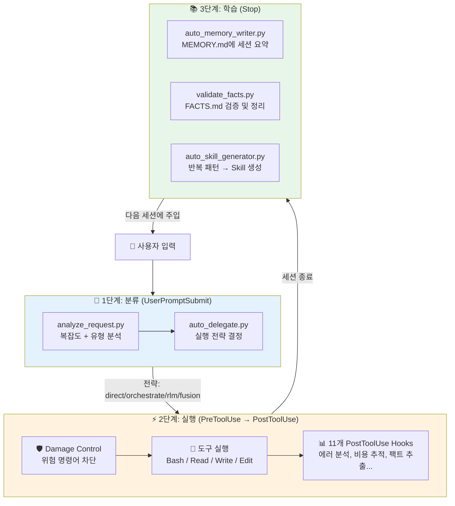

### 왜 이런 구조인가?

**3단계 파이프라인**을 사용하는 이유:

1. **분류 → 실행 → 학습** 순서는 인간의 사고 과정을 모방합니다
   - 사람도 "이 작업이 뭐지?" → "어떻게 하지?" → "다음엔 더 잘하자" 순서로 일합니다
2. **각 단계가 독립적**이기 때문에 하나가 실패해도 다른 것에 영향을 주지 않습니다
   - 분류가 틀려도 실행은 가능하고, 실행이 실패해도 학습은 진행됩니다
3. **Hook 기반**이기 때문에 확장이 쉽습니다
   - 새로운 기능을 추가하려면 Hook 하나만 추가하면 됩니다

### 디렉토리 구조

```
claude-agentic-framework/
│
├── 📁 global-hooks/              # 37개 Hook (핵심 자동화 엔진)
│   ├── damage-control/           #   → 보안: 위험 명령어 차단
│   │   ├── unified-damage-control.py
│   │   └── patterns.yaml         #   → 차단 패턴 정의 (편집 가능)
│   └── framework/
│       ├── session/              #   → 세션 관리 (시작/종료/잠금)
│       ├── caddy/                #   → 요청 분류 및 전략 위임
│       ├── automation/           #   → 자동화 (에러 분석, 비용, 리뷰...)
│       ├── context/              #   → Context 압축 및 보존
│       ├── memory/               #   → MEMORY.md 자동 기록
│       ├── facts/                #   → FACTS.md 자동 추출/검증
│       ├── knowledge/            #   → SQLite FTS5 지식 DB
│       ├── notifications/        #   → 음성 알림 (TTS)
│       └── security/             #   → 설정 변경 감사
│
├── 📁 global-agents/             # 8개 Agent 정의 (.md 파일)
├── 📁 global-commands/           # 15개 Slash Command (.md 파일)
├── 📁 global-skills/             # 9개 Skill (SKILL.md + 리소스)
├── 📁 global-status-lines/       # Status bar 커스터마이징
│
├── 📁 templates/
│   └── settings.json.template    # ⚠️ 설정 편집은 여기서! (settings.json 직접 편집 금지)
│
├── 📁 data/
│   ├── model_tiers.yaml          # Agent별 모델 할당 (7 Opus + 1 Haiku)
│   ├── caddy_config.yaml         # Caddy 분류기 설정
│   ├── budget_config.yaml        # 비용 예산 설정
│   └── team_templates/           # 팀 구성 템플릿
│
├── 📁 scripts/
│   └── generate_docs.py          # README.md + CLAUDE.md 자동 생성
│
├── install.sh                    # 설치 스크립트 (symlink + 설정 생성)
├── CLAUDE.md                     # Claude Code가 매 세션 읽는 지침서
└── README.md                     # 프로젝트 문서 (자동 생성)
```

### 왜 이렇게 구성하는가?

| 디렉토리 | 왜 분리하는가? |
|----------|--------------|
| `global-hooks/` | Hook은 Claude Code의 settings.json이 참조함. 경로가 바뀌면 모든 Hook이 죽음 |
| `global-agents/` | Agent .md 파일은 `~/.claude/agents/`에 symlink됨. 중앙 관리 필수 |
| `templates/` | settings.json을 직접 편집하면 `install.sh`가 덮어씀. Template이 진실의 원천 |
| `data/` | YAML 설정은 런타임에 읽힘. Git으로 버전 관리 가능 |

---

## 3. 설치 및 설정

### 설치 순서

```bash
# 1. Repository clone
git clone <repo-url> ~/Documents/claude-agentic-framework
cd ~/Documents/claude-agentic-framework

# 2. 설치 실행 (모든 것을 자동으로 설정)
bash install.sh
```

### `install.sh`가 하는 일

```mermaid
flowchart LR
    A["install.sh 실행"] --> B["templates/settings.json.template 읽기"]
    B --> C["__REPO_DIR__를 실제 경로로 치환"]
    C --> D["~/.claude/settings.json 생성"]
    D --> E["global-agents/ → ~/.claude/agents/ symlink"]
    E --> F["global-commands/ → ~/.claude/commands/ symlink"]
    F --> G["global-skills/ → ~/.claude/skills/ symlink"]
    G --> H["generate_docs.py 실행\nREADME.md + CLAUDE.md 재생성"]
    H --> I["git pre-push hook 설치"]
```

### 왜 symlink을 사용하는가?

```
❌ 파일 복사 (cp)
   → 원본 수정 시 복사본은 그대로 → 불일치 발생
   → 매번 수동으로 다시 복사해야 함

✅ Symlink (ln -s)
   → 원본 수정 시 즉시 반영
   → 하나의 진실의 원천 (Single Source of Truth)
   → install.sh 한 번만 실행하면 영구 동기화
```

### 설정 변경 방법 (중요!)

```bash
# ⚠️ 절대 이렇게 하지 마세요:
vim ~/.claude/settings.json          # ← install.sh가 덮어씁니다!

# ✅ 올바른 방법:
vim templates/settings.json.template # ← 여기를 편집
bash install.sh                      # ← 적용
```

**왜?** `settings.json`은 `install.sh`가 template에서 생성하는 파생 파일입니다. Template이 진실의 원천이고, settings.json은 그 결과물입니다. 직접 편집하면 다음 install에서 사라집니다.

---

## 4. Hook System — 37개의 자동화 Hook

### Hook이란?

Hook은 Claude Code의 **lifecycle event**에 자동으로 실행되는 스크립트입니다.

```
사용자가 "파일 수정해줘" 입력
    ↓
[UserPromptSubmit Hook] → 요청 분석, 전략 결정
    ↓
Claude가 Edit 도구 호출하려 함
    ↓
[PreToolUse Hook] → "이 편집 허용할까?" (Damage Control 검사)
    ↓
Edit 도구 실행 완료
    ↓
[PostToolUse Hook] → 에러 분석, 비용 추적, 팩트 추출, 음성 알림...
    ↓
Claude가 작업 완료
    ↓
[Stop Hook] → 메모리 기록, 팩트 검증, Skill 생성
```

### 왜 Hook인가? (Prompt vs Hook)

| 방식 | 장점 | 단점 |
|------|------|------|
| **Prompt 지시** ("매번 에러 분석해줘") | 쉬움 | Claude가 잊을 수 있음, 일관성 없음 |
| **Hook** (자동 스크립트) | **100% 일관성**, 매번 동일하게 실행 | 설정이 필요함 |

Hook은 **결정론적(deterministic)**입니다. Prompt는 Claude가 "유연하게 해석"할 수 있지만, Hook은 **매번 정확히 같은 방식**으로 실행됩니다.

### 16개 Event Type 전체 표

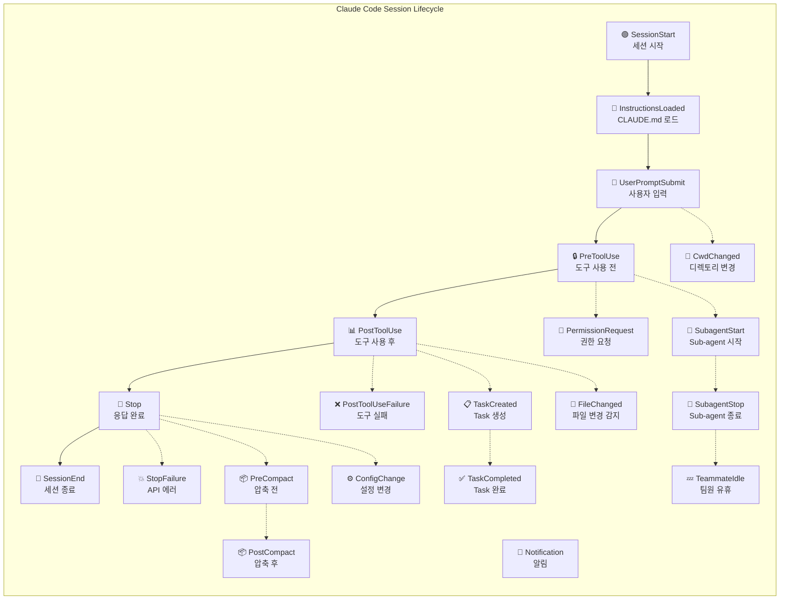

### 우리가 사용하는 16개 Event와 37개 Hook

| Event | Hook 수 | Async | 핵심 Hook | 왜 필요한가? |
|-------|---------|-------|-----------|-------------|
| **SessionStart** | 2 | 0 | `session_startup.py`, `repo_map.py` | 세션 시작 시 context priming, symbol index 생성 |
| **SessionEnd** | 1 | 1 | `session_lock_manager.py` | 세션 종료 시 lock 해제 (backup) |
| **UserPromptSubmit** | 4 | 0 | `analyze_request.py`, `auto_delegate.py` | 모든 입력을 분석하고 전략을 결정 |
| **PreToolUse** | 3 | 0 | `unified-damage-control.py` | 위험한 명령어 차단 |
| **PostToolUse** | 11 | 5 | `auto_error_analyzer.py`, `auto_fact_extractor.py` | 실행 결과 분석, 학습, 알림 |
| **PostToolUseFailure** | 1 | 0 | `auto_error_analyzer.py` | 도구 실패 시 에러 분석 |
| **Stop** | 6 | 1 | `auto_memory_writer.py`, `auto_skill_generator.py` | 메모리 저장, Skill 생성 |
| **StopFailure** | 1 | 0 | `stop_failure_recovery.py` | API 에러 시 복구 안내 |
| **SubagentStart** | 1 | 1 | `subagent_tracker.py` | Sub-agent 생성 추적 |
| **SubagentStop** | 1 | 0 | `subagent_tracker.py` | Sub-agent 완료 추적 |
| **TaskCompleted** | 1 | 0 | `task_quality_gate.py` | Task 완료 검증 |
| **CwdChanged** | 1 | 0 | `project_fingerprint.py` | 프로젝트 기술 스택 자동 감지 |
| **FileChanged** | 1 | 1 | `file_watcher.py` | 외부 파일 변경 감지 |
| **ConfigChange** | 1 | 0 | `audit_config_change.py` | 설정 변경 감사 로그 |
| **PreCompact** | 1 | 0 | `pre_compact_preserve.py` | Context 압축 전 핵심 정보 보존 |
| **PostCompact** | 1 | 1 | `post_compact_verify.py` | Context 압축 후 보존 확인 |

### Async Hook이란?

```
일반 Hook:    Claude 실행 ──[Hook 실행 대기]──> 결과 반영 후 계속
Async Hook:   Claude 실행 ──> 바로 계속 (Hook은 백그라운드 실행)
                                          └─> 결과는 다음 턴에 전달
```

**왜 Async를 사용하는가?**

PostToolUse에 11개 Hook이 있습니다. 모두 동기적으로 실행하면 매 도구 호출마다 수 초의 지연이 발생합니다. 음성 알림, 비용 추적, 번들 로깅 같은 Hook은 **결과를 기다릴 필요가 없으므로** async로 실행하여 **50-70% 지연 감소**를 달성합니다.

### Hook 4가지 유형

```
1. command (우리가 주로 사용) — Python 스크립트 실행
   {"type": "command", "command": "uv run /path/to/hook.py"}

2. prompt (가벼운 검증에 적합) — LLM이 직접 판단
   {"type": "prompt", "prompt": "이 편집이 코딩 표준을 준수하는가?"}

3. http (원격 통합용) — HTTP endpoint 호출
   {"type": "http", "url": "http://localhost:8080/hooks"}

4. agent (복잡한 검증용) — Sub-agent가 도구를 사용하며 판단
   {"type": "agent", "prompt": "테스트 파일을 읽고 커버리지를 확인해"}
```

### Circuit Breaker (회로 차단기)

**문제:** Hook 하나가 계속 실패하면 모든 도구 호출이 차단됩니다.

**해결:** Circuit breaker가 3번 연속 실패하면 해당 Hook을 60초간 비활성화합니다.

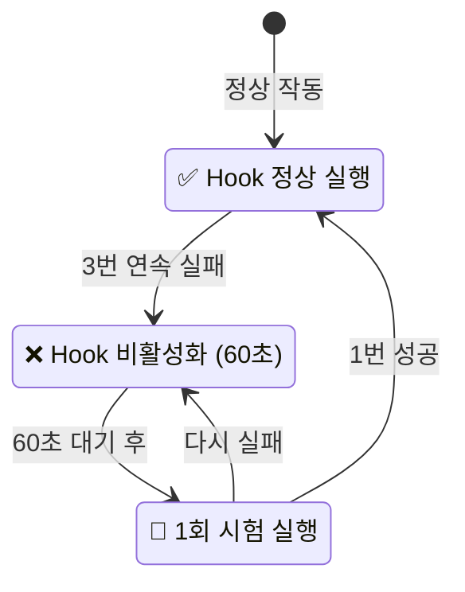

**왜 필요한가?** Hook 하나의 버그 때문에 전체 시스템이 마비되는 것을 방지합니다. "하나가 죽어도 나머지는 계속 동작"이라는 **격리(isolation)** 원칙입니다.

---

## 5. Agent System — 8개의 전문 Agent

### Agent란?

Agent는 **독립된 context window**에서 실행되는 전문화된 Claude입니다. 메인 Claude가 Sub-agent를 생성하면, 그 Sub-agent는 자신만의 context에서 작업하고 결과만 돌려보냅니다.

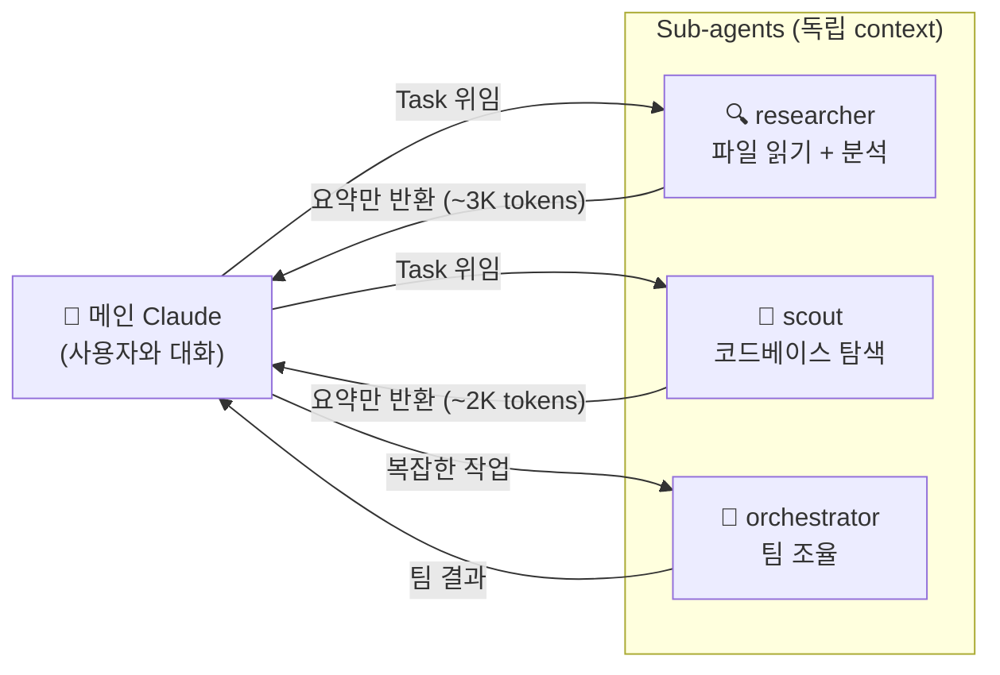

### 왜 Sub-agent를 사용하는가?

```
❌ 메인 Claude가 직접 100개 파일을 읽으면:
   → 100K+ tokens 소비
   → Context window 가득 참
   → 이전 대화 내용 잊어버림

✅ Sub-agent에게 위임하면:
   → Sub-agent가 100K tokens 소비 (자기 context에서)
   → 메인에게 3K tokens 요약만 반환
   → 메인의 context는 깨끗하게 유지
   → 97% token 절약
```

### 8개 Agent 상세

| Agent | Model | 역할 | `disallowedTools` | `initialPrompt` | 왜 이 설정? |
|-------|-------|------|-------------------|-----------------|------------|
| **orchestrator** | Opus | 팀 조율, 전략 결정 | - | `/prime` | 가장 강력한 추론 필요. auto-prime으로 즉시 context 확보 |
| **project-architect** | Opus | 아키텍처 설계, Agent 생태계 생성 | - | `/prime` | Worktree 격리로 안전한 실험. auto-prime으로 프로젝트 이해 |
| **critical-analyst** | Opus | 모든 결정과 계획을 비판적으로 분석 | - | - | 읽기 + 질문만 가능. 수정 권한 없이 순수 분석 |
| **researcher** | Opus | 파일 읽기, 웹 검색, 분석 종합 | `[Write, Edit]` | `/prime` | **Read-only** — 연구만 하고 수정은 안 함. 안전성 보장 |
| **scout-report-suggest** | Opus | 코드베이스 문제 탐색 및 보고 | `[Write, Edit, Bash]` | - | **가장 제한적** — 읽기만 가능. 코드 변경 불가 |
| **rlm-root** | Opus | Recursive Language Model — 무한 context 처리 | - | - | 반복 탐색의 중심. 자기 자신을 재귀적으로 호출 |
| **meta-agent** | Opus | 새로운 Agent 파일 자동 생성 | - | - | Worktree 격리. 자기 자신과 같은 Agent를 만들 수 있음 |
| **docs-scraper** | Haiku | 문서 스크래핑 | - | - | 속도 > 품질. 기계적 작업이므로 Haiku 사용 |

### `disallowedTools`의 의미

```yaml
# researcher agent frontmatter
disallowedTools: [Write, Edit]   # Write와 Edit 도구 사용 금지
```

**왜?** Researcher의 역할은 "조사하고 보고하는 것"입니다. 코드를 수정하는 것은 범위 밖입니다.
- 만약 researcher가 코드를 수정하면, 그 수정이 검증 없이 적용될 수 있습니다
- Read-only 제한은 **"조사는 조사, 구현은 구현"**이라는 역할 분리를 강제합니다

### `initialPrompt`의 의미

```yaml
initialPrompt: "/prime"   # Agent 생성 즉시 /prime 자동 실행
```

**왜?** Agent가 생성되면 프로젝트에 대해 아무것도 모릅니다. `/prime`이 자동 실행되면:
1. `.claude/PROJECT_CONTEXT.md` 캐시를 확인
2. 프로젝트 구조, Hook, Agent, Command 정보를 즉시 주입
3. Agent가 "어, 이 프로젝트가 뭐지?" 단계를 건너뛰고 바로 작업 시작

---

## 6. Command System — 15개의 Slash Command

### Command란?

Command는 **사용자가 직접 호출**하는 Slash 명령어입니다. `/command-name`으로 실행합니다.

### 전체 Command 목록

| Command | 목적 | 사용 시점 | 예시 |
|---------|------|----------|------|
| `/prime` | 프로젝트 context 로딩 | 세션 시작 시 (자동 실행됨) | `/prime` |
| `/orchestrate` | 복잡한 multi-agent 작업 | 5+ 파일 수정, 큰 리팩토링 | `/orchestrate auth 시스템 전면 리팩토링` |
| `/rlm` | 무한 context 반복 탐색 | 거대한 코드베이스 분석 | `/rlm 이 모노레포의 의존성 전체 매핑` |
| `/fusion` | Best-of-N 접근법 | 최고 품질이 필요할 때 | `/fusion 이 알고리즘의 최적 구현` |
| `/research` | Token-효율적 조사 위임 | 많은 파일 읽기가 필요할 때 | `/research 이 repo의 인증 시스템` |
| `/review` | 코드 리뷰 | PR 전 품질 확인 | `/review` |
| `/test` | 테스트 생성/실행 | 구현 후 검증 | `/test auth module에 unit test 추가` |
| `/commit` | 스마트 커밋 | 변경사항 커밋 | `/commit` |
| `/plan` | 구현 계획 수립 | 복잡한 작업 시작 전 | `/plan OAuth2 PKCE 플로우 구현` |
| `/debug` | 에러 진단 | 에러 발생 시 | `/debug TypeError: Cannot read property...` |
| `/refine` | 리뷰 결과 자동 수정 | `/review` 후 발견된 문제 수정 | `/refine` |
| `/costs` | API 사용량 + 비용 추적 | 비용 확인 시 | `/costs` |
| `/kr` | 한국어 모드 토글 | 한국어로 응답받고 싶을 때 | `/kr` |
| `/loadbundle` | 이전 세션 상태 복원 | 세션 이어서 작업 시 | `/loadbundle` |
| `/arch-map` | Architecture 의존성 맵 생성 | 프로젝트 구조 이해 | `/arch-map` |

### Command 실행 흐름 예시

```
사용자: /research 이 repo의 DB 레이어 분석해줘

1. Claude가 research.md Command를 로드
2. Command 지침에 따라 3-Layer 파이프라인 실행:

   Layer 1 — Index Scan (Explore agent)
   └─ Glob/Grep만 사용, 파일 내용은 읽지 않음
   └─ "DB 관련 파일 15개 발견, 주요 패턴 3개"
   └─ ~500 tokens

   Layer 2 — Targeted Read (Researcher agent)
   └─ Layer 1 결과의 특정 라인만 읽음
   └─ "ORM: Prisma, 스키마: 12 모델, 마이그레이션: 34개"
   └─ ~2000 tokens

   Layer 3 — Synthesis (메인 Claude)
   └─ 요약만 받아서 종합 보고서 작성
   └─ ~1000 tokens

총 비용: ~3,500 tokens (기존 방식: ~150,000 tokens)
```

---

## 7. Skill System — 9개의 자동 Skill

### Skill vs Command의 차이

```
Command = 사용자가 "/command-name"으로 직접 호출
Skill   = Claude가 맥락을 보고 자동으로 활성화
```

| 특성 | Command | Skill |
|------|---------|-------|
| **호출 방식** | 사용자가 `/name` 입력 | Claude가 자동 감지 |
| **트리거** | 명시적 | 암시적 (맥락 기반) |
| **예시** | `/commit` | "에러가 발생했습니다" → `error-analyzer` 자동 활성화 |

### 9개 Skill 상세

| Skill | 자동 트리거 조건 | 하는 일 |
|-------|-----------------|---------|
| `code-review` | 코드 리뷰 요청 감지 | 버그, 보안, 성능, 스타일 종합 리뷰 |
| `error-analyzer` | 에러/스택 트레이스 감지 | 근본 원인 분석 + 수정 제안 |
| `test-generator` | 테스트 요청 감지 | 포괄적 테스트 스위트 생성 |
| `security-scanner` | 보안 감사 요청 감지 | 취약점 스캔 + 패턴 분석 |
| `refactoring-assistant` | 리팩토링 요청 감지 | 안전한 단계별 리팩토링 가이드 |
| `knowledge-db` | 지식/기억 관련 질문 | SQLite FTS5 지식 DB 검색/저장 |
| `facts` | 프로젝트 팩트 관리 | FACTS.md 추가/조회/폐기 |
| `arch-map` | 아키텍처 매핑 요청 | 의존성 다이어그램 + 영향 범위 테이블 생성 |
| `skill-builder` | 새 Skill 생성 요청 | 대화형 Skill 설계/생성/설치 |

### Auto Skill Generation (자동 Skill 생성)

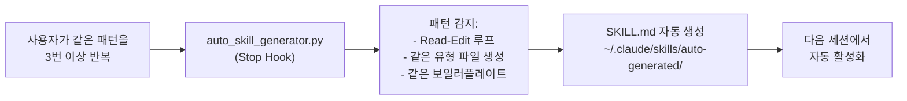

**왜?** 사용자가 "매번 .tsx 파일 만들 때 같은 import 패턴을 쓴다"면, 그걸 Skill로 만들어서 자동화하는 것이 효율적입니다. Framework가 사용자의 반복 패턴을 **관찰 → 감지 → 자동화**합니다.

---

## 8. Memory System — 4-Layer 인지 구조

### 왜 4개의 Layer인가?

인간의 기억 체계를 모방했습니다:

```
Layer 0 — SENSORY (감각 기억)    = 현재 도구 출력         [1턴, 즉시 사라짐]
Layer 1 — WORKING (작업 기억)    = TaskList + 압축 요약    [현재 세션만]
Layer 2 — EPISODIC (일화 기억)   = FACTS.md + MEMORY.md   [프로젝트별, 영구]
Layer 3 — SEMANTIC (의미 기억)   = ~/.claude/memory/       [전역, 모든 프로젝트]
```

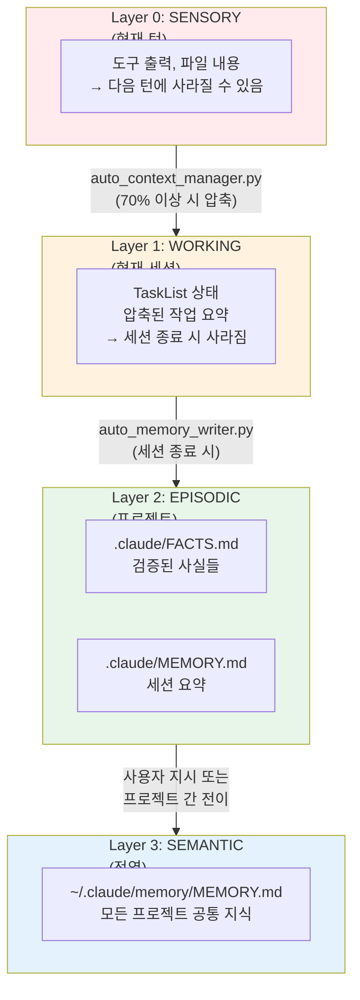

### 각 Layer의 자동화

| Layer | 기록 Hook | 읽기 시점 | 삭제 정책 |
|-------|----------|----------|----------|
| **FACTS.md** | `auto_fact_extractor.py` (PostToolUse) | SessionStart (자동 주입) | 90일 후 STALE → `validate_facts.py`가 정리 |
| **MEMORY.md** | `auto_memory_writer.py` (Stop) | 수동 (`Read .claude/MEMORY.md`) | 최대 30개 항목, 20줄/항목 |
| **Knowledge DB** | `knowledge_db.py` (knowledge skill) | `/knowledge-db` skill 사용 시 | 수동 관리 |

### FACTS.md 예시

```markdown
## CONFIRMED (실행으로 확인된 사실)
- [2026-03-28] `uv run scripts/run_tests.py --fast`로 전체 테스트 실행 가능
- [2026-03-29] install.sh는 38개 Hook 경로를 모두 검증함

## GOTCHAS (실패에서 배운 교훈)
- [2026-03-27] .env 파일에 대한 직접 접근은 damage-control이 차단함
- [2026-03-28] settings.json 직접 편집하면 install.sh가 덮어씀

## PATHS (핵심 경로)
- settings.json template: templates/settings.json.template
- hook 디렉토리: global-hooks/framework/

## PATTERNS (발견된 패턴)
- Hook 출력 형식: {"hookSpecificOutput": {"additionalContext": "..."}}
```

**왜 FACTS.md가 중요한가?**

Session이 길어지면 Claude는 초반에 발견한 사실을 잊습니다. `auto_fact_extractor.py`가 **Bash 명령 성공/실패 패턴**에서 자동으로 사실을 추출하여 FACTS.md에 기록하고, 다음 세션 시작 시 이 파일이 주입됩니다. 즉, **한 번 배운 것을 영원히 기억**합니다.

---

## 9. Context Engineering — 압축과 보존

### 문제: Context Window는 유한하다

Claude의 context window는 크지만 무한하지 않습니다. 긴 세션에서는 가득 차게 되고, 이때 **compaction**(압축)이 발생합니다. 압축 시 이전 대화의 일부가 사라집니다.

### 해결: 2-Phase Context Pipeline

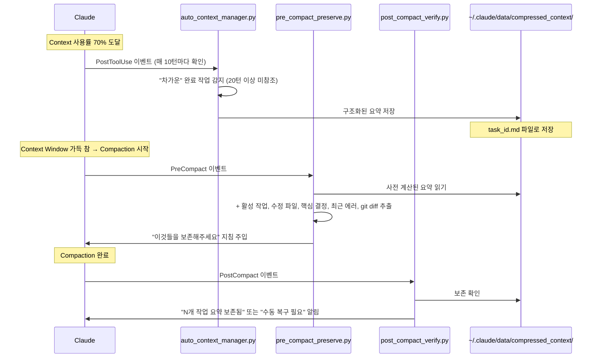

### 왜 2단계인가?

1. **Phase 1 (auto_context_manager)** — compaction이 일어나기 **전에** 미리 요약을 디스크에 저장
   - 왜? Compaction이 일어나면 이미 늦습니다. 미리 준비해야 합니다
2. **Phase 2 (pre_compact_preserve)** — compaction 모델에게 "이것들을 살려달라"고 지시
   - 왜? Compaction 모델은 무엇이 중요한지 모릅니다. 우리가 알려줘야 합니다
3. **Phase 3 (post_compact_verify)** — compaction 후 보존이 잘 되었는지 확인
   - 왜? "희망"이 아닌 "검증"이 필요합니다

---

## 10. Caddy Classifier — 자동 전략 선택

### 요청 분류 4차원

모든 사용자 입력은 4가지 차원으로 분류됩니다:

```
1. 복잡도 (Complexity): simple / moderate / complex / massive
2. 유형 (Type): implement / fix / refactor / research / test / review / document
3. 품질 (Quality): standard / high / critical
4. 범위 (Scope): focused / moderate / broad / unknown
```

### 전략 결정 트리

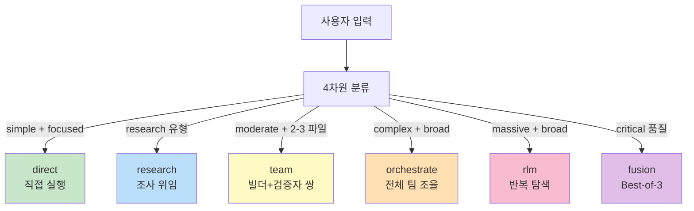

### 왜 자동 분류가 필요한가?

사용자가 "이 기능 추가해줘"라고 말했을 때:
- **간단한 기능** (버튼 하나 추가): 직접 실행이 최적
- **복잡한 기능** (결제 시스템 구현): 팀 구성이 필요
- 사용자는 이 판단을 매번 수동으로 하고 싶지 않습니다

Caddy가 자동으로 판단하여 **"이 작업에는 orchestrate가 적합합니다"**라고 제안(또는 자동 실행)합니다.

### 예시: Caddy가 Fusion을 추천하는 경우

```
사용자: "이 인증 시스템의 보안을 최대한 강화해줘"

Caddy 분석:
  - Complexity: moderate
  - Type: implement (보안 강화 구현)
  - Quality: critical (보안 = 중요)
  - Scope: moderate

→ Quality가 "critical"이므로 Fusion 추천

Fusion 실행:
  Agent 1 (Pragmatist): 실용적 보안 패치
  Agent 2 (Architect): 아키텍처 레벨 보안 설계
  Agent 3 (Optimizer): 성능을 고려한 보안 최적화

  → Fusion Judge가 3개 결과를 평가하여 최적 조합 선택
```

---

## 11. Damage Control — 보안 방어 체계

### 왜 Damage Control인가?

Claude Code는 `allow: ["*"]` (모든 것 허용) 모드로 실행됩니다. 이는 최대 자율성을 위해 필요하지만, **실수로 위험한 명령이 실행될 수 있습니다.**

```
Claude가 실수로 실행할 수 있는 것:
  rm -rf /                    ← 전체 시스템 삭제
  git push --force            ← 원격 저장소 기록 덮어쓰기
  DROP TABLE users;           ← 데이터베이스 테이블 삭제
  aws ec2 terminate-instances ← 클라우드 서버 종료
```

### 3-Tier 방어 체계

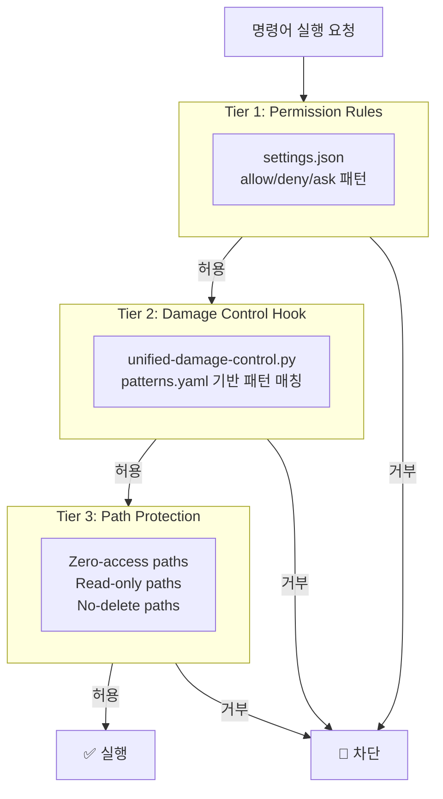

### patterns.yaml 구조

```yaml
# 차단 카테고리 예시
bash_patterns:
  # 파일 시스템 파괴
  - pattern: '\brm\s+-rf\s+/'
    reason: "전체 시스템 삭제 시도"

  # Git 위험 작업
  - pattern: '\bgit\s+push\s+--force\b'
    reason: "Force push는 원격 기록을 덮어씀"

  # 클라우드 파괴
  - pattern: '\baws\s+ec2\s+terminate-instances\b'
    reason: "EC2 인스턴스 종료"

  # SQL 파괴
  - pattern: '\bDROP\s+TABLE\b'
    reason: "테이블 삭제"

# 경로 보호
zero_access_paths:    # 접근 완전 차단
  - "*.env"           # 환경 변수 (API 키 포함)
  - "~/.ssh/*"        # SSH 키
  - "*.pem"           # TLS 인증서

read_only_paths:      # 읽기만 허용
  - "patterns.yaml"   # Damage Control 설정 자체
  - "/usr/*"          # 시스템 디렉토리

no_delete_paths:      # 삭제만 차단
  - ".claude/"        # Framework 설정
  - "LICENSE"         # 라이선스 파일
  - ".git/"           # Git 저장소
```

### Quoted Content Stripping

**문제:** `git commit -m "rm -rf / 관련 버그 수정"` 같은 명령에서 따옴표 안의 `rm -rf /`가 오탐(false positive)될 수 있습니다.

**해결:** Damage control은 **따옴표, heredoc, subshell 내용을 제거**한 후 패턴 매칭합니다.

```
원래 명령:  git commit -m "fixed rm -rf / vulnerability"
스트립 후:  git commit -m ""
매칭 대상:  git commit -m ""  ← "rm -rf /"가 없으므로 통과 ✅
```

---

## 12. 프로젝트별 자동 적응

### Project Fingerprinting (v4.0 신규)

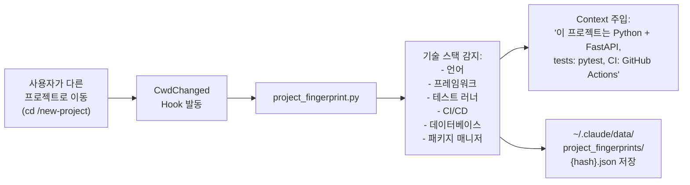

### 감지 가능한 기술 스택

| 마커 파일 | 감지 결과 |
|----------|----------|
| `package.json` + `react` in deps | JavaScript/TypeScript + React |
| `package.json` + `next` in deps | JavaScript/TypeScript + Next.js |
| `pyproject.toml` + `fastapi` | Python + FastAPI |
| `Cargo.toml` | Rust |
| `go.mod` | Go |
| `.github/workflows/` | GitHub Actions CI |
| `prisma/` | Prisma DB |

### 왜 프로젝트 감지가 중요한가?

같은 `/review` 명령이라도 프로젝트에 따라 다르게 동작해야 합니다:
- **React 프로젝트**: component 패턴, hook 사용법, 접근성 검사
- **Python API**: type hints, 보안 검증, SQL injection 검사
- **Rust 프로젝트**: lifetime 이슈, unsafe 블록, 메모리 안전성

Fingerprint이 있으면 Claude가 **프로젝트에 맞는 맥락**으로 작업합니다.

---

## 13. 자기 개선 시스템

### 현재 구현된 자기 개선 메커니즘

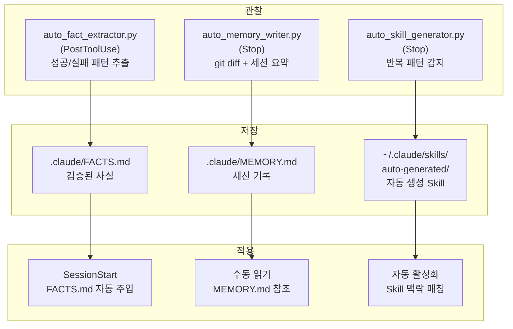

### 학습 루프의 구체적 예시

```
세션 1:
  사용자: "pytest로 테스트 실행해줘"
  Claude: `pytest tests/` 실행 → 실패
  Claude: `pytest tests/ -x --tb=short` 실행 → 성공
  → auto_fact_extractor가 감지:
    CONFIRMED: "pytest tests/ -x --tb=short 로 테스트 실행 가능"

세션 2:
  → SessionStart 시 FACTS.md 주입
  → Claude가 "pytest tests/ -x --tb=short"를 즉시 사용
  → 첫 번째 시도에 성공 (이전 세션의 실패를 반복하지 않음)
```

### 미래 계획: Instinct-Based Learning (직관 학습)

현재의 `auto_skill_generator.py`는 Read-Edit 루프만 감지합니다. 향후 구현할 **Instinct 시스템**:

```
관찰 → 패턴 감지 → Instinct (신뢰도 0.3)
                        ↓ (5회 반복)
                   Instinct (신뢰도 0.8)
                        ↓ (관련 Instinct끼리 클러스터링)
                   Proto-Skill (초안)
                        ↓ (사용자 검증)
                   Active Skill (배포)
                        ↓ (성과 추적)
                   Evolved Skill (개선됨)
                        ↓ (30일 미사용)
                   Retired (폐기)
```

---

## 14. 실전 워크플로우 예시

### 워크플로우 1: 새 프로젝트 시작

```bash
# 1. Framework가 설치된 상태에서 새 프로젝트 디렉토리로 이동
cd ~/projects/my-new-app

# 2. Claude Code 시작 — 자동으로 발생하는 일:
#    SessionStart → session_startup.py 실행
#    → skill 무결성 검증 (SHA-256)
#    → PROJECT_CONTEXT.md 캐시 확인 (없으면 새로 생성 필요)

# 3. /prime 실행 (첫 세션)
/prime
#    → 프로젝트 구조 분석 (Phase 1-6)
#    → 보안 감사 (Phase 5)
#    → 팀 추천 (Phase 6)
#    → .claude/PROJECT_CONTEXT.md 캐시 저장 (Phase 7)
#    → 보고서 출력 (Phase 8)

# 4. Architecture map 생성
/arch-map
#    → 의존성 다이어그램 생성
#    → "X 변경 시 Y 업데이트" 테이블 생성
#    → .claude/ARCHITECTURE.md 저장

# 5. 이제 작업 시작!
```

### 워크플로우 2: 복잡한 기능 구현

```
사용자: "OAuth2 PKCE 인증 플로우를 구현해줘"

[자동 발생]
  Caddy 분석: complex implement, quality: high, scope: broad
  Caddy 추천: orchestrate (confidence: 85%)

[Claude 실행]
  1. /plan 으로 구현 계획 수립
     → specs/oauth2-pkce.md 저장

  2. /orchestrate 로 팀 구성
     → orchestrator가 전략 결정:
       - researcher: PKCE 스펙 조사
       - project-architect: 아키텍처 설계
       - builder (메인): 구현
       - scout: 코드 리뷰

  3. 병렬 실행:
     researcher → "PKCE는 code_verifier + code_challenge 필요..."
     architect → "auth/ 디렉토리에 pkce.ts, oauth-client.ts 생성..."

  4. 구현 후 자동 검증:
     /test → 테스트 생성 + 실행
     /review → 코드 리뷰
     /refine → 리뷰 결과 자동 수정

  5. 완료 시 자동 학습:
     auto_memory_writer → MEMORY.md에 "OAuth2 PKCE 구현 완료" 기록
     auto_fact_extractor → FACTS.md에 "auth/ 디렉토리에 PKCE 구현" 기록
```

### 워크플로우 3: 에러 디버깅

```
사용자: "TypeError: Cannot read properties of undefined (reading 'map')"

[자동 발생]
  Caddy 분석: simple fix, quality: standard
  error-analyzer Skill 자동 활성화

[Claude 실행]
  1. /debug 으로 진단
     → 스택 트레이스 분석
     → 관련 파일 읽기
     → 근본 원인: "API 응답이 null일 때 .map() 호출"

  2. 수정 적용
     → optional chaining 추가: data?.items?.map(...)

  3. 자동 학습:
     auto_fact_extractor → GOTCHAS에 "API 응답이 null일 수 있음" 기록
```

### 워크플로우 4: Rate Limit 자동 복구 (v4.0 신규)

```
[자동 발생 — 사용자 개입 없음]
  Claude가 API 호출 중 rate limit 발생
  → StopFailure 이벤트 발동
  → stop_failure_recovery.py 실행
  → "[Rate Limit] 60초 후 재시도하세요. 배치 작업을 줄이면 도움됩니다."
  → 로그: ~/.claude/data/stop_failures.jsonl
```

---

## 15. Architecture Map과 의존성 관리

### `/arch-map`이 생성하는 것

1. **Blast-Radius Table** — "X를 변경하면 Y도 업데이트해야 한다"

```markdown
| 변경 대상 | 영향 받는 곳 | 실행할 명령 |
|----------|------------|-----------|
| templates/settings.json.template | 모든 Hook 경로 | bash install.sh |
| data/model_tiers.yaml | README.md, CLAUDE.md | uv run scripts/generate_docs.py |
| patterns.yaml | Damage Control 동작 | 테스트: uv run scripts/run_tests.py |
```

2. **Mermaid Dependency Diagram** — 시스템 전체 의존성 시각화
3. **Critical Workflow Paths** — 주요 실행 경로와 소요 시간
4. **Data File Lineage** — 데이터 파일의 생성자 → 소비자 관계
5. **Duplication Warnings** — 동기화 필요한 중복 정의

### 왜 Architecture Map이 중요한가?

```
문제: 개발자가 hook 파일 하나를 이름 변경함
결과: settings.json이 존재하지 않는 파일을 참조
     → 모든 도구 호출에서 hook 에러 발생
     → 전체 시스템 마비

해결: Architecture Map의 Blast-Radius Table을 확인
     → "이 파일을 변경하면 settings.json.template도 수정 필요" 확인
     → 안전하게 변경 완료
```

---

## 16. 문제 해결 가이드

### 자주 발생하는 문제와 해결법

| 증상 | 원인 | 해결 |
|------|------|------|
| 모든 도구 호출에서 "hook error" | Hook 파일 경로가 깨짐 | `bash install.sh` 재실행 |
| Hook이 계속 실패 | Circuit breaker 작동 | `~/.claude/circuit_breakers/` 삭제 또는 60초 대기 |
| Damage Control이 정상 명령을 차단 | 패턴 오탐(false positive) | `patterns.yaml`에서 패턴 확인, 테스트 |
| Context가 자꾸 날아감 | 압축 시 보존 실패 | `~/.claude/data/compressed_context/` 확인 |
| Agent가 프로젝트를 모름 | Prime 캐시 없음 | `/prime` 실행 |
| 이전 세션 기억 못함 | FACTS/MEMORY 비어있음 | `.claude/FACTS.md`, `.claude/MEMORY.md` 확인 |
| Framework 디렉토리 이동 후 작동 안 함 | settings.json의 절대 경로가 깨짐 | `bash install.sh` 재실행 |

### 디버깅 순서

```
1. Hook 에러인가?
   → ~/.claude/circuit_breakers/ 확인
   → 있으면 삭제하고 재시도

2. 설정 문제인가?
   → bash install.sh 재실행
   → 모든 Hook 경로가 검증됨

3. Context 문제인가?
   → /prime 으로 프로젝트 context 재로드
   → .claude/FACTS.md 읽어서 최신 정보 확인

4. 특정 Hook 문제인가?
   → 직접 실행: echo '{}' | uv run global-hooks/framework/.../hook.py
   → stderr 출력 확인
```

---

## 부록: 모든 설정 파일 요약

| 파일 | 용도 | 편집 방법 |
|------|------|----------|
| `templates/settings.json.template` | Hook, 권한, 모델 설정 | 직접 편집 → `bash install.sh` |
| `data/model_tiers.yaml` | Agent-모델 매핑 | 직접 편집 → `uv run scripts/generate_docs.py` |
| `data/caddy_config.yaml` | Caddy 분류기 설정 | 직접 편집 (런타임 로드) |
| `data/budget_config.yaml` | 비용 예산 설정 | 직접 편집 (런타임 로드) |
| `global-hooks/damage-control/patterns.yaml` | 차단 패턴 정의 | 직접 편집 (런타임 로드) |
| `.claude/FACTS.md` | 검증된 프로젝트 사실 | 자동 관리 (수동 편집도 가능) |
| `.claude/MEMORY.md` | 세션 기록 | 자동 관리 |
| `.claude/PROJECT_CONTEXT.md` | Prime 캐시 | `/prime` 또는 자동 생성 |
| `.claude/ARCHITECTURE.md` | 의존성 맵 | `/arch-map` 으로 생성 |

---

*이 가이드는 Claude Agentic Framework v4.0 기준으로 작성되었습니다.*
*최신 정보: `/prime`으로 프로젝트 context를 확인하세요.*
