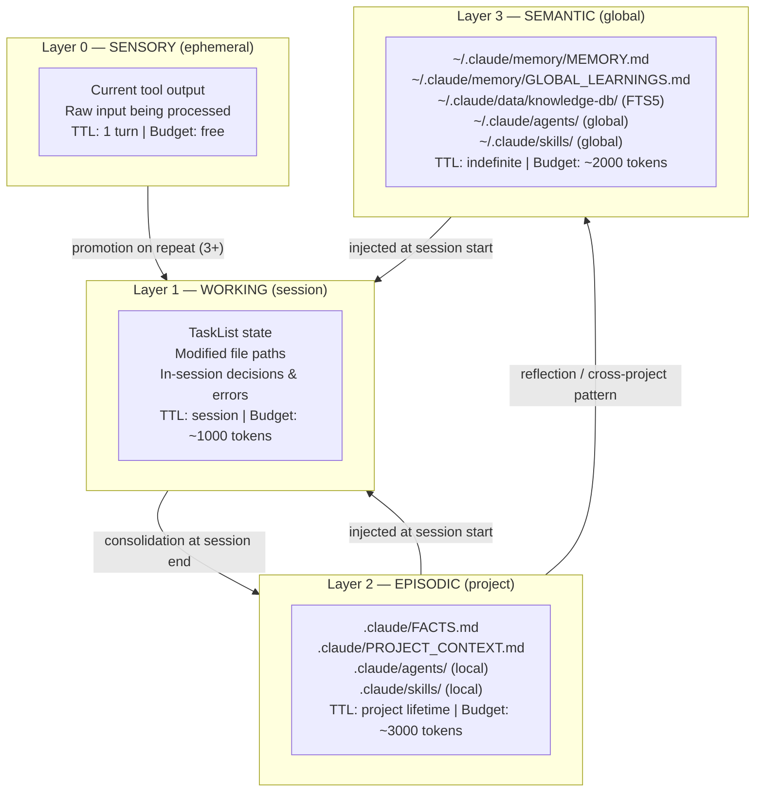
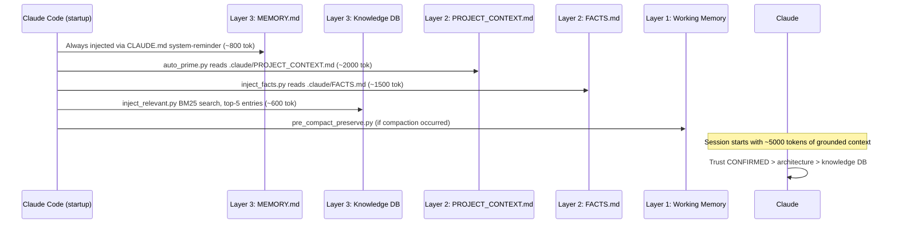
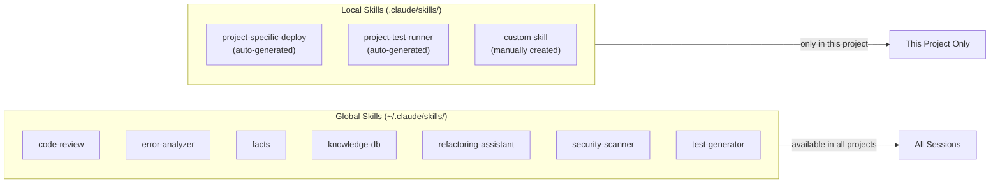
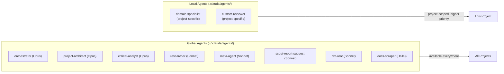
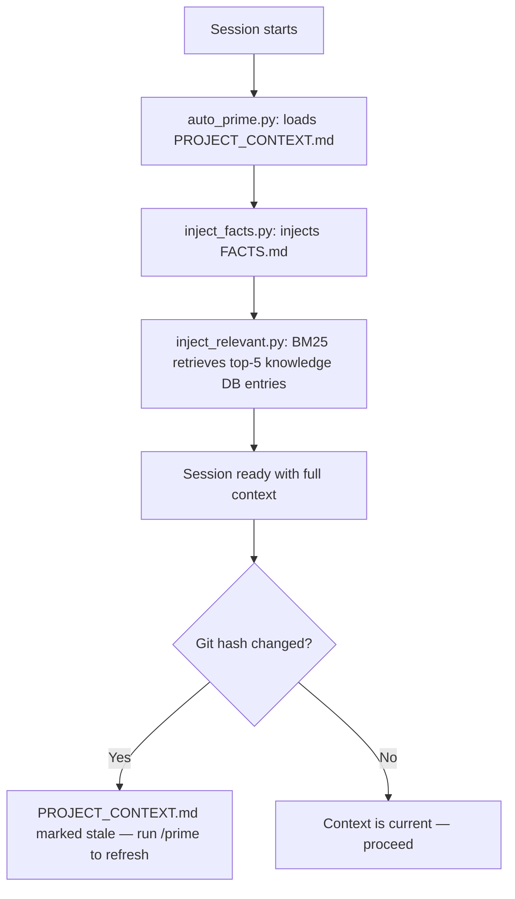
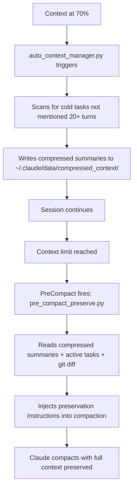
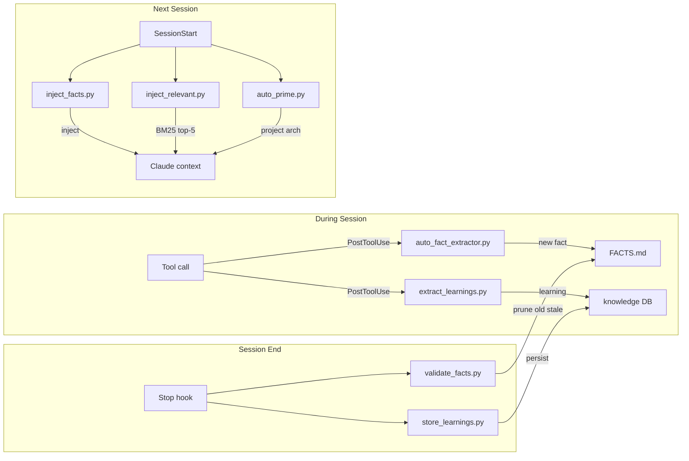

# Memory Architecture — Layered Context System

> Claude Agentic Framework v2.1 | Cognitive memory model for zero-hallucination sessions

## Overview

The framework implements a **4-layer cognitive memory system** inspired by MemGPT, ACT-R, and Generative Agent architectures. Each layer has a distinct scope, lifetime, token budget, and maintenance strategy.



---

## Layer Specifications

### Layer 0 — SENSORY (ephemeral)
| Property | Value |
|---|---|
| **Scope** | Current tool call |
| **TTL** | 1 turn (gone after response) |
| **Token budget** | Unlimited (raw tool output) |
| **Managed by** | Claude's own context window |
| **Contents** | Tool outputs, file reads, bash results |
| **Write mechanism** | Automatic (tool results) |
| **Read mechanism** | Direct (in-context) |

### Layer 1 — WORKING (session)
| Property | Value |
|---|---|
| **Scope** | Active session |
| **TTL** | Session only |
| **Token budget** | ~1,000 tokens |
| **Managed by** | `auto_context_manager.py` + `pre_compact_preserve.py` |
| **Contents** | Task list state, modified files, current decisions, recent errors |
| **Write mechanism** | TaskCreate/TaskUpdate, agent decisions |
| **Read mechanism** | Always in-context (TaskList) |
| **Compaction** | `pre_compact_preserve.py` preserves into compaction prompt |

### Layer 2 — EPISODIC (project)
| Property | Value |
|---|---|
| **Scope** | Single project |
| **TTL** | Project lifetime |
| **Token budget** | ~3,000 tokens (facts ~2000 + prime ~1000 summary) |
| **Location** | `{project}/.claude/` |
| **Managed by** | `inject_facts.py` (read) + `auto_fact_extractor.py` (write) + `validate_facts.py` (prune) |
| **Contents** | FACTS.md (verified facts), PROJECT_CONTEXT.md (architecture), local agents, local skills |
| **Write mechanism** | Auto (hooks) + manual (`/facts add`) |
| **Read mechanism** | Injected at `SessionStart` |

**FACTS.md categories (by confidence):**
```
✓ CONFIRMED  — execution-verified, trust fully          (confidence 1.0)
⚠ GOTCHAS    — known failure modes                     (confidence 0.9)
📁 PATHS      — key files and architecture               (confidence 0.85)
→  PATTERNS   — working command sequences                (confidence 0.8)
✗ STALE       — contradicted/superseded (not injected)   (confidence 0.0)
```

### Layer 3 — SEMANTIC (global)
| Property | Value |
|---|---|
| **Scope** | All projects |
| **TTL** | Indefinite |
| **Token budget** | ~2,000 tokens |
| **Location** | `~/.claude/` |
| **Managed by** | `inject_relevant.py` (read) + `extract_learnings.py` + `store_learnings.py` (write) |
| **Contents** | MEMORY.md, GLOBAL_LEARNINGS.md, cross-project knowledge DB, global agents, global skills |
| **Write mechanism** | Auto (Stop hooks) + manual (knowledge-db skill) |
| **Read mechanism** | Injected at `SessionStart` (FTS5 BM25 retrieval, top-5 relevant) |

---

## Session Start Injection Order

At session start, memory layers are injected in priority order:



**Total session start budget: ~5,000–7,000 tokens** across all layers.

---

## Skills Architecture (Global vs Local)



**Global skills** are installed by `install.sh` from `global-skills/` → symlinked to `~/.claude/skills/`.
**Local skills** live in `.claude/skills/` and override globals with the same name.

To create a local skill: `Write .claude/skills/my-skill.md` with the skill YAML frontmatter.

---

## Agents Architecture (Global vs Local)



**Local agents override global agents** with the same name. Claude Code loads `.claude/agents/` first.
Create a local agent: `Write .claude/agents/my-agent.md` with agent YAML frontmatter.

---

## Scenario Protocols

### Scenario A: New Project (first session)

```mermaid
flowchart TD
    A[Session starts] --> B{PROJECT_CONTEXT.md exists?}
    B -->|No| C[auto_prime_inject.py: force /prime]
    C --> D[/prime runs full analysis]
    D --> E[PROJECT_CONTEXT.md created]
    B -->|Yes| F{FACTS.md exists?}
    E --> F
    F -->|No| G[inject_facts.py: creates template]
    G --> H[Injects initialization notice]
    F -->|Yes| I[inject_facts.py: injects facts]
    H --> J[Session ready — no facts yet, populate as you work]
    I --> J
```

**Actions:**
1. Run `/prime` to create architecture cache
2. FACTS.md auto-created on first session
3. Facts accumulate automatically as you work

### Scenario B: Resuming Ongoing Project



**Actions:**
1. Read injected context before doing anything
2. CONFIRMED facts override your assumptions
3. GOTCHAS prevent known failure modes
4. Run `/prime` if context feels stale

### Scenario C: Small Project (<50 files)

- Direct mode preferred (1-2 files, read directly)
- RepoMap NOT generated (< 200 file threshold)
- FACTS.md will be sparse initially — grows as you work
- Knowledge DB may have no project-specific entries yet
- Token budget mostly available for working context

### Scenario D: Large Project (≥200 files)

- Delegated mode required (5+ files = spawn sub-agents)
- RepoMap generated by `repo_map.py` — use it for navigation
- FACTS.md critical: check PATHS before exploring file system
- Knowledge DB heavily used for cross-session pattern recall
- Sub-agents return 2-3 sentence findings, NOT raw code dumps

### Scenario E: Long Session (context approaching limit)



**Actions:**
- Never manually summarize — let the pipeline handle it
- After compaction, check that active tasks are still in TaskList
- Key decisions preserved automatically

---

## Memory Maintenance Lifecycle



---

## Anti-Hallucination Rules (Built into CLAUDE.md)

These behavioral guardrails enforce grounded execution:

1. **Never say "fixed" without executing** — reading code ≠ verification
2. **Check FACTS.md PATHS before reading files** — avoid redundant exploration
3. **Trust CONFIRMED over inference** — execution-verified beats reasoning
4. **GOTCHAS override assumptions** — if it's in GOTCHAS, you've hit it before
5. **Search before read** — Grep/Glob first, never open files blind
6. **Sub-agents return findings, not raw content** — 2-3 sentences max

---

## Knowledge DB Pipeline Status

```
OBSERVE  → observe_patterns.py   [PostToolUse — NOT WIRED ⚠]
ANALYZE  → analyze_session.py    [Stop — NOT WIRED ⚠]
LEARN    → store_learnings.py    [Stop — WIRED ✓]
EVOLVE   → inject_relevant.py    [SessionStart — WIRED ✓]

Parallel: extract_learnings.py   [PostToolUse — WIRED ✓ but split-brain bug ⚠]
```

**Split-brain bug:** `extract_learnings.py` writes to `~/.claude/knowledge.db` (via `knowledge_db.py`)
but `inject_relevant.py` reads from `~/.claude/data/knowledge-db/knowledge.db`. Fix: update `knowledge_db.py` DB_PATH.
