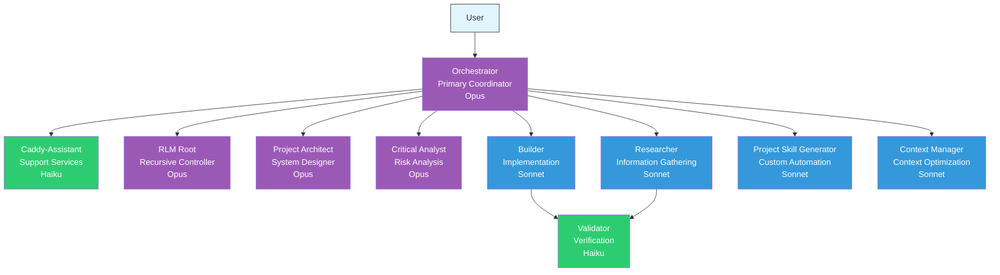
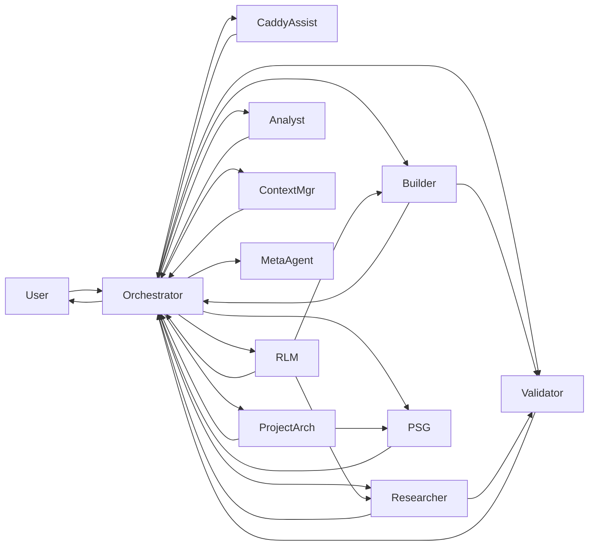
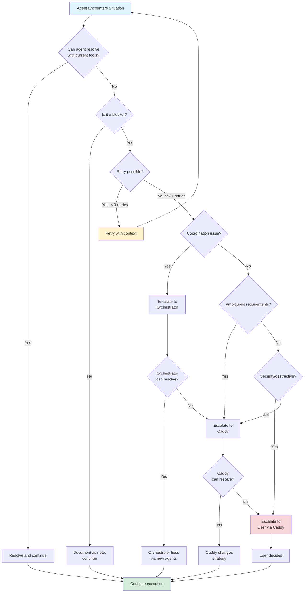
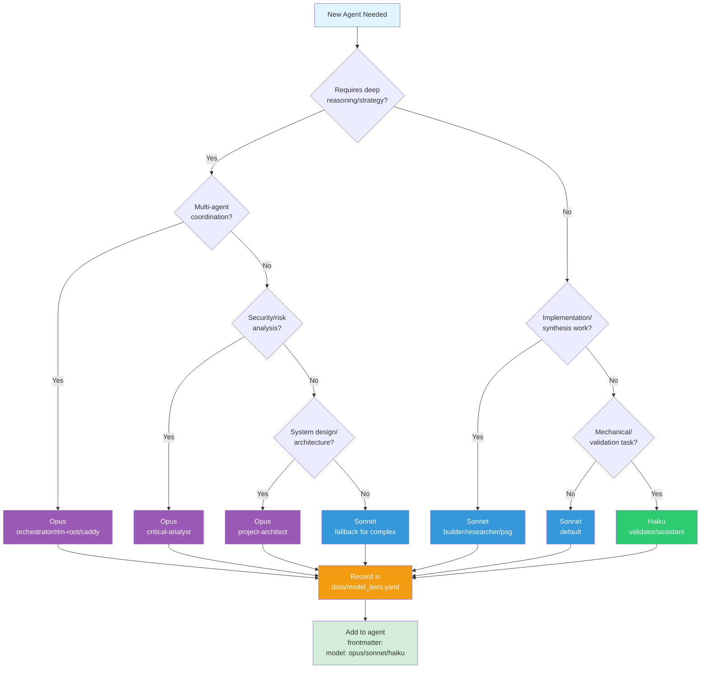

# Roles and Responsibilities (R&R)

**Version**: 2.0.0 (February 2026)
**Status**: Comprehensive agent framework hierarchy documentation

This document defines the complete organizational structure, responsibilities, communication protocols, and decision authority for the Claude Agentic Framework.

---

## Table of Contents

1. [Hierarchy Overview](#hierarchy-overview)
2. [Agent Responsibilities Matrix](#agent-responsibilities-matrix)
3. [Communication Protocols](#communication-protocols)
4. [Tool and Skill Coordination](#tool-and-skill-coordination)
5. [Decision Authority](#decision-authority)
6. [Execution Patterns](#execution-patterns)
7. [Model Tier Assignments](#model-tier-assignments)

---

## Hierarchy Overview

### Organizational Structure



### Tier Breakdown

```
TIER 0: User
├── Issues high-level goals
└── Receives synthesized results

TIER 1: Primary Coordinator (Opus)
├── Orchestrator (Strategy Selection + Coordination)
├── Analyzes user intent
├── Selects optimal execution strategy
├── Plans and coordinates agent teams
├── Monitors overall progress
└── Reports completion

TIER 2: Strategic Agents (Opus)
├── RLM Root (Recursive Control)
├── Project Architect (Design)
└── Critical Analyst (Risk Analysis)

TIER 3: Execution Agents (Sonnet)
├── Builder (Implementation)
├── Researcher (Information Gathering)
├── Project Skill Generator (Automation)
├── Context Manager (Context Optimization)
└── Meta-Agent (Agent Generation)

TIER 4: Support Agents (Haiku)
├── Caddy-Assistant (Skill Auditing + Triage)
├── Validator (Verification)
├── Create Worktree Subagent
├── Docs Scraper
└── Hello World Agent
```

---

## Agent Responsibilities Matrix

### Tier 1: Primary Coordinator

#### Orchestrator

**Role**: Primary coordinator with strategy selection and agent team management

| Responsibility | Input | Output | Tools | When to Delegate |
|---|---|---|---|---|
| **Analyze user intent** | Natural language request | Task classification (complexity, type, quality, scope) | Task, Read, Glob, Grep, Bash | Sometimes (to Caddy-Assistant for triage) |
| **Select execution strategy** | Task classification | Strategy selection (direct, team, rlm, fusion, research) | None | Never (core decision) |
| **Plan agent teams** | High-level goal | Agent team plan (roles, models, execution order) | Task, Read | Never (core responsibility) |
| **Match relevant skills** | Task classification | Skill recommendations | None | Sometimes (to Caddy-Assistant for audit) |
| **Spawn specialized agents** | Team plan | Sub-agent tasks | Task | Always (entire purpose) |
| **Coordinate execution** | Agent timeline | Execution management | Task | Never (coordination is core) |
| **Monitor execution progress** | Sub-agent status | Progress report | Task | Always (via sub-agents) |
| **Handle dependencies** | Agent dependencies | Sequential/parallel execution | Task | Never (coordination is core) |
| **Aggregate results** | All agent reports | Synthesized summary | None | Never (synthesis is core) |
| **Manage failures** | Agent failure report | Recovery action | Task | Always (spawn debugger agent) |
| **Report to user** | All sub-agent results | Executive summary | None | Never (core responsibility) |

**Decision Authority**:
- Chooses execution strategy
- Agent team composition
- Execution order (parallel vs sequential)
- Retry/recovery strategies
- Approves/blocks skills (based on Caddy-Assistant audit)
- Decides when to escalate to user
- Final authority on task completion

**Communication**:
- **Receives from**: User
- **Sends to**: Caddy-Assistant, RLM Root, Project Architect, Critical Analyst, Builder, Researcher, Validator, PSG, Meta-Agent, Context Manager
- **Reports to**: User

---

### Tier 2: Strategic Agents

---

#### RLM Root

**Role**: Recursive language model controller for infinite scale

| Responsibility | Input | Output | Tools | When to Delegate |
|---|---|---|---|---|
| **Search codebase** | Search pattern | File locations | Grep, Glob | Never (uses tools directly) |
| **Peek at files** | File paths | Brief orientation (max 50 lines) | Read | Never (targeted reading) |
| **Delegate analysis** | Code sections | Sub-agent tasks | Task | Always (for deep analysis) |
| **Synthesize findings** | Sub-agent reports | Aggregate analysis | None | Never (synthesis is core) |
| **Iterate exploration** | Current findings | Next search/analysis | Grep, Task | When needed (iterative discovery) |

**Decision Authority**:
- Which code sections to analyze
- When to iterate vs conclude
- Granularity of delegation

**Communication**:
- **Receives from**: Caddy
- **Sends to**: Researcher, Builder (for targeted analysis)
- **Reports to**: Caddy

**Pattern**: Search → Peek → Delegate → Synthesize → Repeat (if needed) → Report

---

#### Project Architect

**Role**: System designer and agent ecosystem creator

| Responsibility | Input | Output | Tools | When to Delegate |
|---|---|---|---|---|
| **Analyze projects** | Project directory | Architecture analysis | Read, Glob, Grep | Sometimes (spawn Researcher for large projects) |
| **Design agent ecosystems** | Project requirements | Custom agent specifications | Task | Never (design is core) |
| **Create automation workflows** | Project patterns | Skills, commands, agents | Write | Sometimes (spawn PSG for implementation) |
| **Design initialization guides** | Project structure | Onboarding documentation | Write | Never (documentation is core) |

**Decision Authority**:
- Agent ecosystem design
- Tool and skill recommendations
- Workflow patterns for project

**Communication**:
- **Receives from**: Caddy
- **Sends to**: Project Skill Generator (for implementation)
- **Reports to**: Caddy

---

#### Critical Analyst

**Role**: Risk analysis and assumption challenger

| Responsibility | Input | Output | Tools | When to Delegate |
|---|---|---|---|---|
| **Question assumptions** | Plan/decision | Challenge questions | None | Never (analysis is core) |
| **Identify risks** | Proposed approach | Risk assessment | Read, Grep | Sometimes (spawn Researcher for context) |
| **Challenge decisions** | Decision rationale | Alternative perspectives | None | Never (critical thinking is core) |
| **Force "why" articulation** | Implementation plan | Rationale validation | None | Never (questioning is core) |

**Decision Authority**:
- None (advisory only)
- All findings are recommendations to Caddy

**Communication**:
- **Receives from**: Caddy
- **Sends to**: Caddy (findings only)
- **Reports to**: Caddy

---

### Tier 3: Execution Agents

#### Builder

**Role**: Implementation specialist

| Responsibility | Input | Output | Tools | When to Delegate |
|---|---|---|---|---|
| **Implement features** | Task description + context | Code implementation | Read, Write, Edit, Bash | Never (implementation is core) |
| **Create files** | File specifications | New files | Write | Never (creation is core) |
| **Modify code** | Change requirements | Updated code | Edit | Never (modification is core) |
| **Run validation** | Code changes | Test/lint results | Bash | Never (validation is immediate) |
| **Update task status** | Task completion | Task marked completed | TaskUpdate | Never (status tracking is core) |

**Decision Authority**:
- Implementation approach (within task scope)
- File organization
- Code structure
- When task is complete

**Communication**:
- **Receives from**: Orchestrator, Caddy (direct assignment)
- **Sends to**: Validator (via Orchestrator)
- **Reports to**: Orchestrator or Caddy

**Post-tool validation** (automatic hooks):
- Ruff validator (on Write/Edit)
- Ty validator (on Write/Edit)

**Non-Responsibilities**:
- ❌ Planning or coordination
- ❌ Spawning other agents
- ❌ Expanding scope beyond task
- ❌ Multiple tasks simultaneously

---

#### Researcher

**Role**: Information gathering specialist

| Responsibility | Input | Output | Tools | When to Delegate |
|---|---|---|---|---|
| **Gather information** | Research topic | Research report (2-4k tokens) | Read, Grep, WebSearch, Bash | Never (research is core) |
| **Analyze documentation** | Doc paths | Analysis summary | Read | Never (analysis is core) |
| **Search codebase** | Search pattern | Relevant code sections | Grep, Glob | Never (search is core) |
| **Synthesize findings** | Raw information | Concise report | None | Never (synthesis is core) |

**Decision Authority**:
- Research depth and breadth
- Information relevance
- Summary granularity

**Communication**:
- **Receives from**: Orchestrator, Caddy, RLM Root
- **Sends to**: Builder (via Orchestrator), Orchestrator
- **Reports to**: Orchestrator, Caddy, or RLM Root

**Token budget**: 20-50k tokens (isolated context)

---

#### Project Skill Generator

**Role**: Project-specific automation creator

| Responsibility | Input | Output | Tools | When to Delegate |
|---|---|---|---|---|
| **Analyze project patterns** | Project structure | Pattern analysis | Read, Grep, Glob | Never (analysis is core) |
| **Generate custom skills** | Requirements | Skill files (SKILL.md + scripts) | Write | Never (generation is core) |
| **Create commands** | Workflow needs | Command files (.md) | Write | Never (creation is core) |
| **Design agents** | Project needs | Agent system prompts (.md) | Write | Never (design is core) |

**Decision Authority**:
- Skill/command/agent design
- File structure and organization
- Trigger phrase selection

**Communication**:
- **Receives from**: Orchestrator, Project Architect
- **Sends to**: Validator (for verification)
- **Reports to**: Orchestrator or Project Architect

---

#### Context Manager

**Role**: Context optimization specialist

| Responsibility | Input | Output | Tools | When to Delegate |
|---|---|---|---|---|
| **Analyze context usage** | Session history | Context report | Read, Grep | Never (analysis is core) |
| **Recommend optimizations** | Context patterns | Optimization strategies | None | Never (recommendations are core) |
| **Generate context bundles** | Session state | Bundle files | Write | Never (bundle creation is core) |
| **Restore context** | Bundle ID | Restored session state | Read | Never (restoration is core) |

**Decision Authority**:
- Context loading strategies
- Bundle granularity
- Optimization recommendations

**Communication**:
- **Receives from**: Caddy, Orchestrator
- **Sends to**: Any agent (via Orchestrator)
- **Reports to**: Caddy or Orchestrator

---

#### Meta-Agent

**Role**: Agent file generator

| Responsibility | Input | Output | Tools | When to Delegate |
|---|---|---|---|---|
| **Generate agent files** | Agent specifications | Agent .md files with frontmatter | Write | Never (generation is core) |
| **Define agent roles** | Requirements | Role descriptions | None | Never (definition is core) |
| **Set model tiers** | Agent complexity | Model assignment (opus/sonnet/haiku) | None | Never (tier selection is core) |
| **Configure tools** | Agent purpose | Tool list | None | Never (configuration is core) |

**Decision Authority**:
- Agent file structure
- Model tier assignment
- Tool selection

**Communication**:
- **Receives from**: Orchestrator, Project Architect
- **Sends to**: None
- **Reports to**: Orchestrator or Project Architect

---

### Tier 4: Support Agents

#### Caddy-Assistant

**Role**: Support assistant for skill auditing and rapid triage

| Responsibility | Input | Output | Tools | When to Delegate |
|---|---|---|---|---|
| **Quick classification** | User request | Initial task categorization | Read, Glob | Always (to Orchestrator for strategy) |
| **Context summarization** | File list | Brief context summary | Read, Grep | Always (to Orchestrator for analysis) |
| **Skill matching** | User intent signals | Preliminary skill list | None | Always (to Orchestrator for approval) |
| **Audit skills for security** | Skill name | Security report (critical/warning/info) | Bash (calls audit script) | Never (security service) |
| **Maintain skill registry** | Skill catalog | Updated registry | Read, Write | Never (registry maintenance) |

**Decision Authority**:
- None (advisory only)
- All recommendations reviewed by Orchestrator

**Communication**:
- **Receives from**: Orchestrator
- **Sends to**: Orchestrator (findings only)
- **Reports to**: Orchestrator

---

#### Validator

**Role**: Read-only verification specialist

| Responsibility | Input | Output | Tools | When to Delegate |
|---|---|---|---|---|
| **Inspect work** | Task ID + acceptance criteria | Validation report | Read, Bash (read-only) | Never (inspection is core) |
| **Verify changes** | Expected changes | Pass/fail status | Read, Grep | Never (verification is core) |
| **Run tests** | Test commands | Test results | Bash | Never (testing is immediate) |
| **Check acceptance criteria** | Task requirements | Criteria checklist | Read | Never (checking is core) |

**Decision Authority**:
- Pass/fail determination
- Severity of issues found

**Communication**:
- **Receives from**: Orchestrator, Builder (indirectly)
- **Sends to**: None
- **Reports to**: Orchestrator

**Disallowed Tools**: Write, Edit, NotebookEdit (read-only enforcement)

**Non-Responsibilities**:
- ❌ Modifying any files
- ❌ Fixing issues found
- ❌ Implementation work

---

#### Create Worktree Subagent

**Role**: Git worktree creation specialist

| Responsibility | Input | Output | Tools | When to Delegate |
|---|---|---|---|---|
| **Create worktrees** | Feature name, branch | New worktree path | Bash | Never (creation is core) |
| **Validate names** | Feature name | Validated name | Bash (validation script) | Never (validation is immediate) |
| **Report status** | Worktree creation | Status report | None | Never (reporting is core) |

**Decision Authority**:
- Worktree directory structure
- Branch naming conventions

**Communication**:
- **Receives from**: Caddy, Orchestrator (via worktree-manager-skill)
- **Sends to**: None
- **Reports to**: Caller

---

## Communication Protocols

### Who Can Message Whom



### Escalation Paths

```
Level 1: Execution Agent (Builder, Researcher, Validator)
  ↓ (Task blocked or failure)
Level 2: Strategic Agent (RLM Root, Project Architect, Critical Analyst)
  ↓ (Strategy failure or coordination needed)
Level 3: Primary Coordinator (Orchestrator)
  ↓ (Unresolvable or requires user decision)
Level 4: User
```

### Escalation Triggers

| Trigger | Current Level | Escalate To | Required Information |
|---|---|---|---|
| Task blocked (missing info) | Builder/Researcher | Orchestrator | Blocker description, attempted solutions |
| Agent failure (3+ retries) | Builder/Researcher | Orchestrator | Failure logs, context |
| Coordination failure | Strategic Agent | Orchestrator | Failed coordination plan, agent states |
| Ambiguous requirements | Any | Orchestrator | Ambiguity description, possible interpretations |
| Security critical decision | Any | Orchestrator | Decision context, risk assessment |
| Destructive operation | Any | Orchestrator → User | Operation description, impact assessment |
| Cost/time unusually high | Orchestrator | User | Estimate, rationale |
| Scope creep detected | Builder | Orchestrator | Original scope, discovered scope |

### Handoff Procedures

#### From User to Orchestrator

```yaml
Handoff Package:
  - task_description: "High-level goal in user's words"
  - (Orchestrator performs task classification):
      complexity: "simple|moderate|complex|massive"
      task_type: "implement|fix|refactor|research|test|review|document|deploy|plan"
      quality_need: "standard|high|critical"
      codebase_scope: "focused|moderate|broad|unknown"
  - relevant_context: "Key files, directories, constraints (if provided)"
  - success_criteria: "How to know when done"
  - constraints: "Time, resources, safety requirements"
```

#### From Orchestrator to Builder/Researcher

```yaml
Handoff Package:
  - task_id: "TaskList ID for tracking"
  - task_description: "Specific work to be done"
  - context: "Research reports, security checklists, etc."
  - acceptance_criteria: "Checklist for validation"
  - model: "opus|sonnet|haiku"
  - tools: ["Read", "Write", "Edit", "Bash"]
  - estimated_tokens: "Token budget estimate"
```

#### From Builder to Validator

```yaml
Handoff Package:
  - task_id: "TaskList ID"
  - work_summary: "What was implemented"
  - files_changed: ["file1.ts", "file2.ts"]
  - acceptance_criteria: "Original criteria from task"
  - validation_commands: ["npm test", "npm run lint"]
  - expected_results: "What should pass"
```

### Context Sharing Rules

#### What to Share

| Information Type | Share With | How | When |
|---|---|---|---|
| **Task classification** | Orchestrator | Via Caddy handoff | At delegation |
| **Research findings** | Builder | Via Orchestrator | Before implementation |
| **Security checklists** | Builder | Via Orchestrator | Before implementation |
| **Implementation summary** | Validator | Via Orchestrator | After completion |
| **Validation results** | Orchestrator | Direct report | After validation |
| **Failure context** | Debugger agent | Via Orchestrator | On failure |
| **Executive summary** | User | Via Caddy | At completion |

#### What NOT to Share

| Information Type | Why | Exception |
|---|---|---|
| **Raw agent outputs** | Too verbose, not synthesized | None |
| **Full file contents** | Token waste | Only targeted sections |
| **Debug logs** | Too low-level | Only on escalation |
| **All research material** | Information overload | Only relevant summaries |
| **Sub-agent internal state** | Implementation detail | None |

#### Context Compression

```python
# From Researcher to Builder
Raw Research: 45k tokens
↓
Synthesized Report: 2-4k tokens (only key findings)

# From Builder to Validator
Full Implementation: 30k tokens
↓
Summary + File List: 500 tokens

# From Orchestrator to Caddy
All Agent Reports: 10k tokens
↓
Executive Summary: 2-3k tokens
```

---

## Tool and Skill Coordination

### Tool Assignment by Role

| Tool | Caddy | Orchestrator | RLM Root | Builder | Researcher | Validator |
|---|---|---|---|---|---|---|
| **Task** | ✅ | ✅ | ✅ | ❌ | ❌ | ❌ |
| **Read** | ✅ | ✅ | ✅ | ✅ | ✅ | ✅ |
| **Write** | ❌ | ❌ | ❌ | ✅ | ❌ | ❌ |
| **Edit** | ❌ | ❌ | ❌ | ✅ | ❌ | ❌ |
| **Glob** | ✅ | ✅ | ✅ | ✅ | ✅ | ✅ |
| **Grep** | ✅ | ✅ | ✅ | ✅ | ✅ | ✅ |
| **Bash** | ✅ | ✅ | ❌ | ✅ | ✅ | ✅ (read-only) |
| **WebSearch** | ❌ | ❌ | ❌ | ❌ | ✅ | ❌ |
| **TaskCreate** | ✅ | ✅ | ✅ | ✅ | ✅ | ✅ |
| **TaskUpdate** | ✅ | ✅ | ✅ | ✅ | ✅ | ✅ |
| **TaskGet** | ✅ | ✅ | ✅ | ✅ | ✅ | ✅ |

### Skill Invocation Authority

| Skill Category | Who Can Invoke | Who Recommends | Who Audits |
|---|---|---|---|
| **Context (prime)** | Orchestrator, Builder, Researcher | Orchestrator | Caddy-Assistant |
| **Knowledge (knowledge-db)** | Any agent | Orchestrator | Caddy-Assistant |
| **Quality (code-review, test-generator)** | Builder, Validator | Orchestrator | Caddy-Assistant |
| **Security (security-scanner, dependency-audit)** | Critical Analyst, Builder | Orchestrator | Caddy-Assistant (mandatory) |
| **Planning (brainstorm, feasibility, task-decomposition)** | Orchestrator, Project Architect | Orchestrator | None |
| **Development (refactoring, error-analyzer, performance-profiler)** | Builder | Orchestrator | None |
| **Project (project-scaffolder, documentation-writer)** | PSG, Builder | Project Architect, Orchestrator | None |
| **Version Control (git-workflow, worktree-manager)** | Builder, Orchestrator | Orchestrator | Caddy-Assistant |
| **Meta (meta-skill)** | Meta-Agent, PSG | Project Architect, Orchestrator | Caddy-Assistant |

### Preventing Duplicate Tool Calls

#### Rule 1: Single Source of Truth for Task State

```yaml
Task State Owner: Orchestrator (primary coordinator)

Protocol:
  - Only Orchestrator updates TaskList state
  - Sub-agents report completion to Orchestrator
  - Orchestrator marks tasks completed
```

#### Rule 2: Read Operations Are Safe

```yaml
Read Operations: Read, Glob, Grep, TaskGet, Bash (read-only)

Rule:
  - Multiple agents can read same file simultaneously
  - No coordination needed for read-only operations
```

#### Rule 3: Write Operations Require Ownership

```yaml
Write Operations: Write, Edit, NotebookEdit, TaskUpdate, Bash (write)

Rule:
  - Only ONE agent writes to a file at a time
  - Orchestrator assigns file ownership during planning
  - Validator NEVER writes (enforced via disallowedTools)
```

#### Rule 4: File Ownership During Agent Teams

```yaml
Orchestrator Phase: Planning

For each file to be modified:
  - Assign to ONE Builder agent
  - Document in agent handoff
  - Other agents: read-only access

Example:
  Builder-1: auth/login.ts, auth/session.ts
  Builder-2: db/migrations/*.sql
  Builder-3: tests/auth/*.test.ts
```

### Coordination for File Access

#### Pattern: Sequential Dependency

```yaml
Scenario: Builder-1 must finish before Builder-2 starts

Orchestrator Plan:
  1. Builder-1 (writes auth/login.ts)
  2. Wait for Builder-1 completion
  3. Builder-2 (reads auth/login.ts, writes tests/login.test.ts)

Prevents: Race condition, file conflicts
```

#### Pattern: Parallel Independence

```yaml
Scenario: Builder-1 and Builder-2 work on different files

Orchestrator Plan:
  1. Builder-1 (writes src/feature-a.ts) [PARALLEL]
  2. Builder-2 (writes src/feature-b.ts) [PARALLEL]
  3. Wait for both to complete
  4. Validator (reads both)

Prevents: Blocking, unnecessary serialization
```

#### Pattern: Read-Validate-Write

```yaml
Scenario: Multiple agents need same context, one writes

Orchestrator Plan:
  1. Researcher (reads codebase, produces summary) [SINGLE]
  2. Wait for Researcher
  3. Builder-1 (reads summary, writes code-1) [PARALLEL]
  4. Builder-2 (reads summary, writes code-2) [PARALLEL]
  5. Builder-3 (reads summary, writes code-3) [PARALLEL]

Prevents: Each builder re-reading entire codebase
```

---

## Decision Authority

### Decision Matrix

| Decision Type | Authority | Can Be Overridden By | Requires Approval From |
|---|---|---|---|
| **Execution strategy selection** | Caddy | User | None |
| **Skill security approval** | Caddy | User | None (blocks on critical) |
| **Agent team composition** | Orchestrator | Caddy | None |
| **Agent model tier** | Meta-Agent, PSG | Caddy | None |
| **Implementation approach** | Builder | Orchestrator (scope only) | None |
| **Research depth** | Researcher | Orchestrator (token budget) | None |
| **Pass/fail determination** | Validator | Orchestrator (dispute) | None |
| **Task completion** | Assigned Agent | None | None |
| **Escalation to user** | Caddy | None | None |
| **Destructive operations** | None | User | User (always) |
| **Security-critical changes** | None | Caddy → User | User (destructive) or Caddy (non-destructive) |
| **Cost/time overrun** | None | Caddy → User | User |
| **Scope expansion** | None | Orchestrator → Caddy | Caddy or User |

### Approval Requirements

#### Destructive Operations (User Approval Required)

```yaml
Operations:
  - File deletion (rm, Delete tool)
  - Force push to main/master
  - Hard reset (git reset --hard)
  - Database schema changes
  - Production deployments
  - Credentials/secrets changes

Process:
  1. Agent detects destructive operation
  2. Escalate to Caddy
  3. Caddy presents to User with impact assessment
  4. User approves or denies
  5. Proceed only on explicit approval
```

#### Security-Critical Changes (Caddy Approval Required)

```yaml
Operations:
  - Authentication/authorization code
  - Cryptographic operations
  - API key/secret handling
  - Network security configuration
  - Input validation changes

Process:
  1. Builder implements with security best practices
  2. Critical Analyst reviews (if in team)
  3. Validator runs security tests
  4. Caddy reviews security checklist
  5. Caddy approves or requests changes
```

#### Cost/Time Overrun (User Approval Required)

```yaml
Thresholds:
  - Estimated tokens > 100k
  - Estimated time > 30 minutes
  - Estimated cost > $5

Process:
  1. Orchestrator or Caddy detects overrun
  2. Present revised estimate to User
  3. Explain rationale for increase
  4. User approves or requests alternative approach
```

### Escalation Decision Tree



---

## Execution Patterns

### Pattern 1: Direct Execution

```yaml
Trigger: Simple task, standard quality, focused scope

Flow:
  1. User → Caddy: "Fix typo in README.md line 42"
  2. Caddy analyzes: simple/fix/standard/focused
  3. Caddy → Builder: Direct assignment
  4. Builder: Read → Edit → Complete
  5. Builder → Caddy: Done
  6. Caddy → User: Report

Participants: Caddy, Builder
Token efficiency: Highest (no coordination overhead)
```

### Pattern 2: Research → Build → Test

```yaml
Trigger: Moderate task, needs context, implementation required

Flow:
  1. User → Caddy: "Add user authentication"
  2. Caddy analyzes: moderate/implement/high/moderate
  3. Caddy → Orchestrator: Coordinate team
  4. Orchestrator → Researcher: Auth best practices (parallel)
  5. Orchestrator → Critical Analyst: Auth vulnerabilities (parallel)
  6. Orchestrator waits for both
  7. Orchestrator → Builder: Implement (context from 4+5)
  8. Builder → Orchestrator: Done
  9. Orchestrator → Validator: Verify
  10. Validator → Orchestrator: PASS
  11. Orchestrator → Caddy: Synthesized report
  12. Caddy → User: Report

Participants: Caddy, Orchestrator, Researcher, Critical Analyst, Builder, Validator
Token efficiency: Medium (research in isolation, synthesis)
```

### Pattern 3: RLM (Ralph Loop) for Large Codebases

```yaml
Trigger: Massive task, broad scope, iterative exploration needed

Flow:
  1. User → Caddy: "Find all N+1 query problems"
  2. Caddy analyzes: massive/fix/high/broad
  3. Caddy → RLM Root: Execute RLM pattern
  4. RLM Root: Search codebase (Grep "ORM patterns")
  5. RLM Root: Peek at 50 locations (Read 50 lines each)
  6. RLM Root → Researcher (×3 parallel): Analyze locations 1-17, 18-33, 34-50
  7. RLM Root waits for all 3
  8. RLM Root: Synthesize findings (prioritized list)
  9. RLM Root: Iterate? (if more exploration needed, goto 4)
  10. RLM Root → Caddy: Complete analysis
  11. Caddy → Orchestrator: Fix top 10 issues (team)
  12. Orchestrator → Builder (×3 parallel): Fix issues 1-3, 4-7, 8-10
  13. Orchestrator → Validator: Verify all fixes
  14. Orchestrator → Caddy: Done
  15. Caddy → User: Report

Participants: Caddy, RLM Root, Researcher (×3), Orchestrator, Builder (×3), Validator
Token efficiency: High (RLM never loads full context, uses search+peek+delegate)
```

### Pattern 4: Fusion (Best-of-N) for Critical Quality

```yaml
Trigger: Critical quality, security-sensitive, production-facing

Flow:
  1. User → Caddy: "Implement payment processing"
  2. Caddy analyzes: complex/implement/critical/moderate
  3. Caddy → Orchestrator: Fusion pattern
  4. Orchestrator → Builder-Pragmatist: Simple approach (parallel)
  5. Orchestrator → Builder-Architect: Scalable approach (parallel)
  6. Orchestrator → Builder-Optimizer: Performant approach (parallel)
  7. Orchestrator waits for all 3
  8. Orchestrator: Score all 3 (correctness×3, simplicity×2, robustness×2, performance×1)
  9. Orchestrator: Fuse best solution (or merge elements)
  10. Orchestrator → Builder: Apply fused solution
  11. Orchestrator → Validator: Verify
  12. Orchestrator → Critical Analyst: Security review
  13. Orchestrator → Caddy: Synthesized report
  14. Caddy → User: Report with confidence score

Participants: Caddy, Orchestrator, Builder (×4: 3 perspectives + 1 final), Validator, Critical Analyst
Token efficiency: Low (3× implementations) but quality is maximized
Cost justification: Critical tasks worth 3× cost for 95% optimal vs 65% single-agent
```

### Pattern 5: Parallel Independent Work

```yaml
Trigger: Multiple independent sub-tasks

Flow:
  1. User → Caddy: "Refactor database layer"
  2. Caddy analyzes: complex/refactor/high/moderate
  3. Caddy → Orchestrator: Coordinate team
  4. Orchestrator plans: 3 independent modules
  5. Orchestrator → Builder-1: Refactor users.ts (parallel)
  6. Orchestrator → Builder-2: Refactor orders.ts (parallel)
  7. Orchestrator → Builder-3: Refactor products.ts (parallel)
  8. Orchestrator waits for all 3
  9. Orchestrator → Validator (×3 parallel): Verify each
  10. Orchestrator → Caddy: Synthesized report
  11. Caddy → User: Report

Participants: Caddy, Orchestrator, Builder (×3), Validator (×3)
Token efficiency: Very high (maximum parallelization)
Time efficiency: ~3× faster than sequential
```

### Pattern 6: Sequential Dependency Chain

```yaml
Trigger: Tasks with dependencies (A → B → C)

Flow:
  1. User → Caddy: "Add feature with migrations, code, tests"
  2. Caddy analyzes: complex/implement/high/moderate
  3. Caddy → Orchestrator: Coordinate chain
  4. Orchestrator plans: migration → implementation → tests
  5. Orchestrator → Builder-1: Create migration
  6. Orchestrator waits for Builder-1
  7. Orchestrator → Builder-2: Implement feature (reads migration)
  8. Orchestrator waits for Builder-2
  9. Orchestrator → Builder-3: Generate tests (reads implementation)
  10. Orchestrator waits for Builder-3
  11. Orchestrator → Validator: Run full test suite
  12. Orchestrator → Caddy: Report
  13. Caddy → User: Report

Participants: Caddy, Orchestrator, Builder (×3 sequential), Validator
Token efficiency: Medium (cannot parallelize due to dependencies)
Correctness: High (proper dependency order maintained)
```

---

## Model Tier Assignments

### Tier Distribution

```yaml
Opus (12% of agents):
  - Reason: Complex reasoning, deep analysis, strategic planning
  - Cost: Highest
  - Agents:
      - caddy (meta-orchestrator)
      - orchestrator (team coordination)
      - rlm-root (recursive control)
      - project-architect (system design)
      - critical-analyst (risk analysis)

Sonnet (48% of agents):
  - Reason: Good balance of speed, quality, cost for implementation
  - Cost: Medium
  - Agents:
      - builder (implementation)
      - researcher (information gathering)
      - project-skill-generator (automation creation)
      - context-manager (context optimization)
      - meta-agent (agent generation)
      - [+ 11 more specialized agents]

Haiku (39% of agents):
  - Reason: Fast, cheap, sufficient for mechanical/validation tasks
  - Cost: Lowest
  - Agents:
      - validator (verification)
      - caddy-assistant (triage)
      - create-worktree-subagent (worktree creation)
      - docs-scraper (doc fetching)
      - hello-world-agent (template)
      - [+ 8 more support agents]
```

### Model Selection Decision Tree



### Cost Optimization Guidelines

| Scenario | Recommended Model | Rationale |
|---|---|---|
| **Simple file operations** | Haiku | Fast, cheap, sufficient |
| **Code implementation** | Sonnet | Quality + speed balance |
| **Multi-file refactoring** | Sonnet | Needs understanding + speed |
| **Security audit** | Opus | Deep reasoning required |
| **Test generation** | Sonnet | Mechanical but needs understanding |
| **Documentation writing** | Sonnet | Clear writing + code understanding |
| **Agent team planning** | Opus | Strategic coordination |
| **Codebase exploration** | Sonnet | Search + synthesis |
| **Validation/verification** | Haiku | Read-only, straightforward checks |
| **Architecture design** | Opus | Trade-off analysis |

---

## Summary

This document provides the complete organizational structure for the Claude Agentic Framework. Key takeaways:

1. **Hierarchy is strict**: User → Caddy → Strategic Agents → Execution Agents → Support Agents
2. **Responsibilities are non-overlapping**: Each agent has clear boundaries
3. **Communication follows protocols**: Escalation, handoff, and context sharing are well-defined
4. **Tools are role-specific**: Write operations require ownership, reads are safe
5. **Decision authority is explicit**: Clear approval requirements prevent conflicts
6. **Patterns are reusable**: Direct, Research-Build-Test, RLM, Fusion, Parallel, Sequential
7. **Model tiers optimize cost**: Right model for the right task (50-60% savings)

For implementation details, see:
- [CLAUDE.md](../CLAUDE.md) - Operational protocols
- [README.md](../README.md) - Framework overview
- [2026_UPGRADE_GUIDE.md](2026_UPGRADE_GUIDE.md) - Migration guide
- [SECURITY_BEST_PRACTICES.md](SECURITY_BEST_PRACTICES.md) - Security layer details

---

**Version**: 2.0.0 (February 2026)
**Last Updated**: 2026-02-12
**Maintained by**: Claude Agentic Framework Core Team
