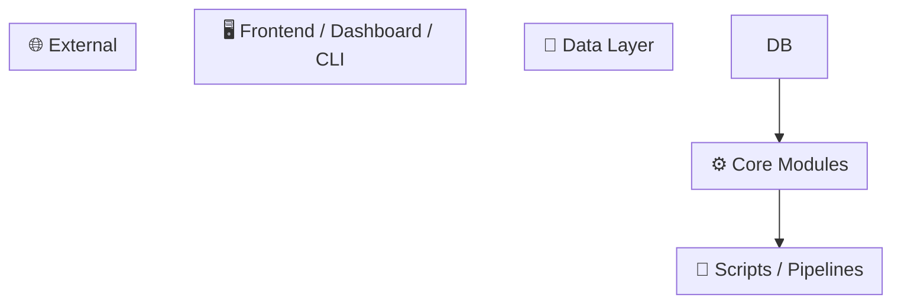

# Architecture Map Skill (`/arch-map`)

Generates a complete, living dependency map for any project. Works across any tech stack (Python, Node, Rust, Go, etc.). Output is a single `.claude/ARCHITECTURE.md` file that future Claude sessions can read instantly to understand the full system topology.

## When to Use

- User asks: "map the dependencies", "create an architecture diagram", "what do I need to update when X changes", "document the data flow", `/arch-map`
- After a project reaches moderate complexity (3+ interconnected scripts or modules)
- When onboarding to an existing codebase
- After a major restructuring or refactor
- Proactively when creating a new project's `.claude/` folder

---

## Workflow

### Phase 0: Check for Existing Map

```bash
if [ -f .claude/ARCHITECTURE.md ]; then
  echo "Existing map found"
  head -5 .claude/ARCHITECTURE.md   # check generation date
  git log --oneline -1               # compare to last commit
fi
```

If the map exists and was generated at the current git HEAD, ask the user: "Existing architecture map found. Regenerate from scratch, or update only changed sections?"

---

### Phase 1: Project Structure Discovery

Run these in parallel to understand the codebase shape:

```bash
# Get all tracked source files
git ls-files | grep -E '\.(py|js|ts|tsx|rs|go|java|rb|sh)$' | head -100

# Entry points and package config
ls -la
find . -maxdepth 2 -name "package.json" -o -name "pyproject.toml" -o -name "Cargo.toml" -o -name "go.mod" 2>/dev/null

# Data/config files
find . -maxdepth 3 -name "*.json" -o -name "*.yaml" -o -name "*.pkl" -o -name "*.db" 2>/dev/null | grep -v node_modules | grep -v .git

# Key directories
find . -maxdepth 2 -type d | grep -v node_modules | grep -v .git | grep -v __pycache__
```

Identify the **layer types** present in this project. Common layers:
- **Data layer**: databases, JSON files, binary caches, CSV, S3 buckets
- **Core/library layer**: shared modules, utilities, engine code
- **Script layer**: one-off runners, pipelines, sweep scripts
- **Service layer**: APIs, daemons, workers
- **UI/frontend layer**: dashboard pages, web app, CLI
- **External layer**: 3rd party APIs, webhooks, external data sources

---

### Phase 2: Dependency Mapping (spawn Explore agent)

Spawn an Explore subagent with the following task to do the heavy lifting without polluting the main context:

> **Explore agent prompt:**
> Map the full dependency graph for this project. For every significant file (scripts, modules, pages, services), find:
> 1. What files/databases it READS (grep for: `open(`, `json.load`, `pd.read_`, `read_text`, `sqlite`, `fetch(`, `axios.get`, `fs.readFile`, `File.read`, `json.Unmarshal`, `serde_json::from`)
> 2. What files/databases it WRITES (grep for: `json.dump`, `write_text`, `to_json`, `open.*'w'`, `\.write(`, `fs.writeFile`, `INSERT INTO`, `save(`, `pickle.dump`)
> 3. What modules/packages it imports from this project (not stdlib, not third-party)
> 4. What it exports/exposes for other files to use (key classes, functions, constants)
> Return as structured list: SCRIPT/MODULE: path → READS: [...] WRITES: [...] IMPORTS: [...] EXPORTS: [...]
> Focus on the 20 most important files. Skip test files unless they reveal important architecture.

Wait for the Explore agent to return before proceeding.

---

### Phase 3: Identify Key Relationships

From the dependency map, extract:

**1. Most-read files** (things everything depends on) → mark as critical nodes
**2. Most-written files** (things that get updated) → mark as output nodes
**3. Terminal consumers** (things that only read, never write) → dashboards, display layers
**4. Duplicated definitions** (same config/profile defined in 2+ places) → flag as tech debt
**5. Implicit dependencies** (things hardcoded as paths/filenames, not imported) → note as fragile

---

### Phase 4: Generate ARCHITECTURE.md

Write `.claude/ARCHITECTURE.md` with the following sections in order:

#### Section 1: Quick Reference Table (MOST IMPORTANT — put first)

```markdown
## Quick Reference: "If X changes, update Y"

| Changed | Must Also Update |
|---------|-----------------|
| [file/module] | [downstream files, commands to re-run] |
```

Rules for filling this table:
- Every file that is WRITTEN BY a script should have a row showing what reads it
- Every core module that is imported widely should show which consumers must be re-tested
- Every duplicated definition should show both locations
- Include re-run commands, not just file names (e.g. "Run `npm run build`", "Rebuild cache with X")

#### Section 2: Mermaid Dependency Diagram

Use `flowchart TD` (top-down) for pipeline-style projects, `flowchart LR` (left-right) for layered architectures.

Structure the diagram with subgraphs per layer type:



Node naming conventions:
- Databases: use `[(name)]` cylinder shape
- Files: use `[name]` box shape
- Modules: use `[name]` box shape
- External services: use `((name))` circle shape
- Use backtick multiline labels for key details: `` "`**filename**\nkey function()`" ``

Color/emoji conventions (use in subgraph labels):
- 💾 Data layer
- ⚙️ Core/engine
- 📜 Scripts/pipelines
- 🖥️ UI/frontend
- 🌐 External services
- 🦀 Rust/compiled modules
- 🧪 Test suites

#### Section 3: Critical Workflow Paths

Document the 3-5 most common workflows as step-by-step paths:

```markdown
### ⚡ Path A — [Name] (~time)
[Step 1] → [Step 2] → [Step 3] → [Output]
\`\`\`
command to run
\`\`\`
```

Include: estimated runtime, what triggers this path, what it produces.

#### Section 4: Data File Lineage Table

```markdown
## Data File Lineage

| File | Producer | Consumers | Rebuild When |
|------|----------|-----------|--------------|
| data/foo.json | scripts/generate.py | app.py, dashboard/page1 | Config changes |
```

#### Section 5: Duplication Warnings

List any configuration, profiles, constants, or logic defined in multiple places that must be kept in sync. Be specific about which files and what to change.

#### Section 6: Module Import Graph

A simplified text tree showing the import hierarchy:

```markdown
## Module Import Graph

App entry points
  └── service/api.py
        └── core/engine.py        ← shared by scripts + api
              └── models/types.py
        └── db/connection.py      ← @singleton, cached
```

---

### Phase 5: Update Project Memory

After writing `ARCHITECTURE.md`:

**If `.claude/MEMORY.md` exists** (auto-memory file):
```
Add to top comment block:
<!-- ARCHITECTURE MAP: .claude/ARCHITECTURE.md — full dependency graph + blast-radius table -->
```

**If `CLAUDE.md` exists** (project instructions):
Add a line pointing to the architecture map in the key files section.

**If `.claude/PROJECT_CONTEXT.md` exists** (prime cache):
Invalidate it so the next `/prime` re-reads the updated architecture:
```bash
# Get current git hash and update PROJECT_CONTEXT.md header
# OR simply note in the Architecture Highlights section:
# "Full dependency map: .claude/ARCHITECTURE.md"
```

---

### Phase 6: Deliver Summary

After writing the file, show the user a brief summary:

```
✅ Architecture map generated → .claude/ARCHITECTURE.md

📊 Mapped: [N] files, [N] data files, [N] modules
🗺️  Layers: [list layer names found]
⚠️  [N] duplication warnings
⚡  [N] critical paths documented

Key findings:
• [Most critical dependency in one line]
• [Most important duplication warning if any]
• [Biggest "if X changes" blast radius]

Future sessions: Read .claude/ARCHITECTURE.md for instant topology understanding.
```

---

## Tech Stack Adaptation Notes

The dependency scanning commands differ by stack. Adapt Phase 2 accordingly:

**Python projects:**
- Read patterns: `open(`, `json.load(`, `pd.read_`, `sqlite3.connect`, `pickle.load`, `Path(..).read_text`
- Write patterns: `json.dump(`, `pickle.dump(`, `.write_text(`, `open(.*, 'w')`
- Import patterns: `from mypackage.` or `import mypackage.`

**Node/TypeScript projects:**
- Read patterns: `fs.readFile`, `require(`, `import ... from`, `fetch(`, `axios.get`
- Write patterns: `fs.writeFile`, `writeFileSync`, `res.json(`, `db.insert`
- Config files: `package.json` scripts section shows entry points

**Rust projects:**
- Read patterns: `std::fs::read`, `serde_json::from_str`, `File::open`
- Write patterns: `std::fs::write`, `serde_json::to_string`, `File::create`
- Module graph: `Cargo.toml` `[dependencies]` + `mod` declarations in `lib.rs`/`main.rs`

**Go projects:**
- Read patterns: `os.Open`, `json.Unmarshal`, `ioutil.ReadFile`
- Write patterns: `os.Create`, `json.Marshal`, `ioutil.WriteFile`

**Mixed stacks (Python + Rust/Go/Node):**
- Map each language's modules separately in their own subgraph
- Show the FFI/bridge boundary explicitly (e.g. PyO3, CGo, WASM)
- Note serialization format at the boundary (JSON, protobuf, etc.)

---

## Output File Template

`.claude/ARCHITECTURE.md` MUST always start with a scannable header block (first ~15 lines), so Claude can read just this to know what's available without loading the full file:

```markdown
# [Project Name] — Architecture & Dependency Map
<!-- Generated: [date] | Git: [hash] -->
<!-- Regenerate: /arch-map -->

## 🗂️ Sections (read only what you need — discard after use)
| # | Section | When to read |
|---|---------|--------------|
| 1 | [Blast-radius table](#quick-reference) | Before making any change — find downstream impact |
| 2 | [Mermaid diagram](#full-dependency-diagram) | When you need to understand the full system topology |
| 3 | [Critical paths](#critical-paths) | When user asks how to run X workflow |
| 4 | [Data lineage](#data-file-lineage) | When a data file changes and you need to know what to rebuild |
| 5 | [Duplication warnings](#duplication-warnings) | When editing a config or profile defined in multiple places |

---

## Quick Reference: "If X changes, update Y"
...
```

And end with:

```markdown
---
*Generated by `/arch-map` skill. Run `/arch-map` again after major structural changes.*
```

---

## Maintenance

The architecture map should be **regenerated** (not manually updated) when:
- New scripts or modules are added
- Data file schemas change
- A major refactor occurs
- New dependencies between layers are introduced

It is **NOT** a living document edited by hand — always regenerate from scratch with `/arch-map` to avoid drift.

Suggested: Add to project's git hooks or CI to warn when `.claude/ARCHITECTURE.md` is more than 30 commits stale.

---

## Examples

### Example 1: Data Science / ML Project
User: "Map out how this project works"

Layers found: `data/` (raw CSVs, processed PKL) → `src/preprocessing/` → `src/models/` → `notebooks/` → `scripts/train.py` → `artifacts/` → `app/`

Diagram shows: raw data → preprocess → train → save model → serve

### Example 2: Web App (Next.js + Python API)
User: "What breaks if I change the auth module?"

Layers: `prisma/schema` → `lib/db.ts` → `api/routes/` → `pages/` + `components/`

Quick Reference shows: "Changed `lib/auth.ts` → affects: `api/routes/protected/*.ts` (8 files), `middleware.ts`, `components/AuthGuard.tsx`"

### Example 3: CLI Tool with Plugins
User: "/arch-map"

Maps plugin interface → core CLI → plugin directory → config file → output formatters

Duplication warning: "Plugin interface defined in `src/types.ts` AND `docs/plugin-api.md` — keep in sync"
