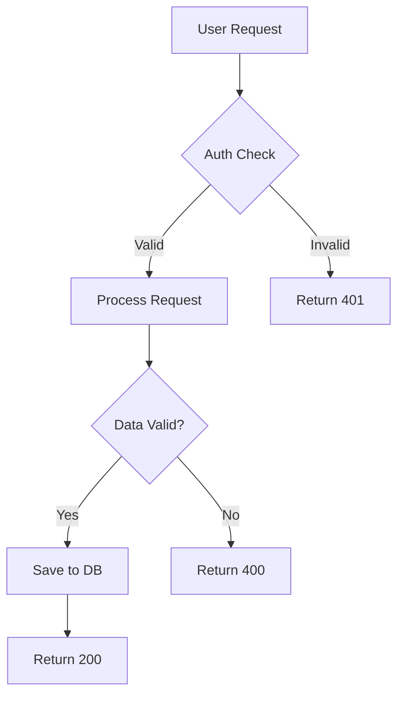

# Step 14: Generative UI - High-Bandwidth Communication

> **2026 Update**: Generative UI works with the observability dashboard (apps/observability/) and 11 output styles. See [../docs/2026_UPGRADE_GUIDE.md](../docs/2026_UPGRADE_GUIDE.md).

## The Communication Bottleneck

**You have**: Mission Control dashboard (Step 13), agent fleets (Step 11-12)
**Problem**: Text logs are **low-bandwidth** - scanning JSON logs to understand 50 agents takes too long

**Solution**: **Generative UI** - Agents generate interactive interfaces on the fly.

---

## What is Generative UI?

**Definition**: Agents output **structured visual formats** (HTML, SVG, Mermaid diagrams) instead of plain text, enabling you to absorb the state of 50 agents in a single glance.

### Before Generative UI (Low Bandwidth)
```
Agent Output (Text):
"Database migration status:
- users table: 50% complete (500/1000 rows)
- orders table: 75% complete (750/1000 rows)
- products table: 100% complete (1000/1000 rows)
Total: 2250/3000 rows migrated"

You: *reads text, tries to visualize in head*
Time: 10 seconds to understand
Bandwidth: LOW
```

### After Generative UI (High Bandwidth)
```html
<div class="migration-dashboard">
  <div class="progress-grid">
    <div class="table">
      <h3>users</h3>
      <progress value="50" max="100"></progress>
      <span>500/1000 rows</span>
    </div>
    <div class="table">
      <h3>orders</h3>
      <progress value="75" max="100"></progress>
      <span>750/1000 rows</span>
    </div>
    <div class="table complete">
      <h3>products</h3>
      <progress value="100" max="100"></progress>
      <span>1000/1000 rows ✓</span>
    </div>
  </div>
  <div class="overall">
    <h2>75% Complete</h2>
    <canvas id="chart"></canvas>
  </div>
</div>
```

**You**: *instant visual understanding*
**Time**: 1 second to understand
**Bandwidth**: HIGH (10x improvement)

---

## Architecture

### Data Flow

```
┌──────────────────────────────────────────────────────┐
│  Agent (with Output Style configured)                │
│  - Receives task: "Show database migration status"   │
│  - Generates HTML instead of text                    │
│  - Includes inline CSS + JavaScript                  │
└──────────────────────────────────────────────────────┘
                    │
                    ↓
┌──────────────────────────────────────────────────────┐
│  Mission Control Dashboard                           │
│  - Detects output format (HTML/SVG/Mermaid)          │
│  - Renders in appropriate viewer                     │
│  - Supports interactivity (buttons, charts)          │
└──────────────────────────────────────────────────────┘
                    │
                    ↓
┌──────────────────────────────────────────────────────┐
│  User                                                │
│  - Instant visual understanding                      │
│  - Can interact (click buttons, filter data)         │
│  - Absorbs 50 agent states at a glance              │
└──────────────────────────────────────────────────────┘
```

---

## Output Formats

### 1. HTML (Interactive Dashboards)

**Best for**: Reports, status updates, complex data

**Example Agent Prompt**:
```markdown
---
name: database-migrator
output_format: html
---

# Database Migrator Agent

## Output Style

You MUST output HTML for all status reports.

### Template:
```html
<div class="migration-dashboard">
  <style>
    .migration-dashboard {
      font-family: system-ui;
      padding: 20px;
      background: linear-gradient(135deg, #667eea 0%, #764ba2 100%);
      border-radius: 8px;
      color: white;
    }
    .table {
      background: rgba(255,255,255,0.1);
      padding: 15px;
      margin: 10px 0;
      border-radius: 4px;
    }
    .table.complete {
      background: rgba(0,255,0,0.2);
    }
    progress {
      width: 100%;
      height: 30px;
    }
  </style>

  <h1>Database Migration Status</h1>
  <div class="progress-grid">
    <!-- Table status cards -->
  </div>
</div>
```

Your output should be **interactive dashboards**, not static text.
```

**Usage**:
```bash
claude

# Ask agent:
"Show database migration status"

# Agent generates HTML dashboard
# Mission Control renders it instantly
```

---

### 2. SVG (Diagrams & Visualizations)

**Best for**: Architecture diagrams, flowcharts, graphs

**Example Agent Prompt**:
```markdown
---
name: architect
output_format: svg
---

# Architect Agent

## Output Style

Output SVG diagrams for architecture visualizations.

### Template:
```xml
<svg width="800" height="600" xmlns="http://www.w3.org/2000/svg">
  <style>
    .box { fill: #3b82f6; stroke: #1e40af; stroke-width: 2; }
    .text { fill: white; font-family: system-ui; font-size: 14px; }
    .arrow { stroke: #10b981; stroke-width: 2; marker-end: url(#arrowhead); }
  </style>

  <defs>
    <marker id="arrowhead" markerWidth="10" markerHeight="7"
            refX="9" refY="3.5" orient="auto">
      <polygon points="0 0, 10 3.5, 0 7" fill="#10b981" />
    </marker>
  </defs>

  <!-- Architecture components -->
  <rect class="box" x="50" y="50" width="150" height="80" rx="4"/>
  <text class="text" x="125" y="95" text-anchor="middle">Frontend</text>

  <!-- Arrows showing data flow -->
  <line class="arrow" x1="200" y1="90" x2="350" y2="90"/>
</svg>
```
```

**Usage**:
```bash
"Visualize the system architecture"

# Agent generates SVG diagram
# Shows: Frontend → API → Database → Cache
# With arrows, boxes, and labels
```

---

### 3. Mermaid (Quick Diagrams)

**Best for**: Flowcharts, sequence diagrams, state machines

**Example Agent Prompt**:
```markdown
---
name: workflow-analyzer
output_format: mermaid
---

# Workflow Analyzer Agent

## Output Style

Output Mermaid diagrams for workflow visualization.

### Template:

```

**Usage**:
```bash
"Analyze the authentication workflow"

# Agent generates Mermaid diagram
# Mission Control renders it using mermaid.js
```

---

### 4. Structured JSON (Data Tables)

**Best for**: Large datasets, API responses, structured data

**Example Agent Prompt**:
```markdown
---
name: data-analyzer
output_format: json
---

# Data Analyzer Agent

## Output Style

Output structured JSON for data display.

### Template:
```json
{
  "type": "table",
  "title": "Performance Metrics",
  "columns": ["Endpoint", "P95 Latency", "Error Rate", "Status"],
  "rows": [
    ["/api/auth", "120ms", "0.01%", "✓"],
    ["/api/checkout", "850ms", "0.2%", "⚠️"],
    ["/api/search", "50ms", "0.0%", "✓"]
  ],
  "summary": {
    "total_endpoints": 3,
    "avg_latency": "340ms",
    "total_errors": "0.07%"
  }
}
```
```

**Mission Control renders as sortable, filterable table**

---

## Output Style Configuration

### Method 1: Agent System Prompt

**Add to agent definition** (e.g., `~/.claude/agents/performance.md`):

```markdown
---
name: performance
description: Performance monitoring agent
model: opus
output_style: html
---

# Performance Agent

You are a performance monitoring agent that outputs **interactive HTML dashboards**.

## Output Requirements

1. **Always use HTML** for reports
2. **Include inline CSS** for styling
3. **Add interactive elements** (buttons, charts, filters)
4. **Use color coding**: red (critical), yellow (warning), green (good)
5. **Responsive design** (mobile-friendly)

## HTML Template

```html
<!DOCTYPE html>
<html>
<head>
  <style>
    body {
      font-family: system-ui, -apple-system, sans-serif;
      margin: 0;
      padding: 20px;
      background: #0f172a;
      color: #f1f5f9;
    }
    .dashboard {
      max-width: 1200px;
      margin: 0 auto;
    }
    .metric-card {
      background: #1e293b;
      border-radius: 8px;
      padding: 20px;
      margin: 10px 0;
      border-left: 4px solid #3b82f6;
    }
    .metric-card.critical {
      border-left-color: #ef4444;
    }
    .metric-card.warning {
      border-left-color: #f59e0b;
    }
    .metric-card.good {
      border-left-color: #10b981;
    }
    .metric-value {
      font-size: 2.5rem;
      font-weight: bold;
      margin: 10px 0;
    }
    .metric-label {
      color: #94a3b8;
      font-size: 0.875rem;
      text-transform: uppercase;
    }
    progress {
      width: 100%;
      height: 8px;
      border-radius: 4px;
    }
    button {
      background: #3b82f6;
      color: white;
      border: none;
      padding: 10px 20px;
      border-radius: 4px;
      cursor: pointer;
      font-size: 0.875rem;
    }
    button:hover {
      background: #2563eb;
    }
  </style>
</head>
<body>
  <div class="dashboard">
    <h1>Report Title</h1>
    <div class="metrics">
      <!-- Metric cards -->
    </div>
    <div class="actions">
      <!-- Action buttons -->
    </div>
  </div>
</body>
</html>
```

## Example Output

When asked "Show API performance", generate:

```html
<!DOCTYPE html>
<html>
<head>
  <style>/* CSS from template */</style>
</head>
<body>
  <div class="dashboard">
    <h1>API Performance Dashboard</h1>

    <div class="metric-card good">
      <div class="metric-label">Overall Health</div>
      <div class="metric-value">98.5%</div>
      <progress value="98.5" max="100"></progress>
    </div>

    <div class="metric-card critical">
      <div class="metric-label">/api/checkout</div>
      <div class="metric-value">850ms</div>
      <p>P95 Latency exceeds 500ms threshold</p>
      <button onclick="showDetails('checkout')">Optimize</button>
    </div>

    <div class="metric-card good">
      <div class="metric-label">/api/auth</div>
      <div class="metric-value">120ms</div>
      <p>Performance within acceptable range</p>
    </div>
  </div>

  <script>
    function showDetails(endpoint) {
      alert('Opening optimizer for ' + endpoint);
    }
  </script>
</body>
</html>
```

This HTML renders as an **interactive dashboard** in Mission Control.
```

---

### Method 2: Global Output Style Setting

**Add to `~/.claude/settings.json`**:

```json
{
  "output_styles": {
    "default": "markdown",
    "agents": {
      "performance": "html",
      "architect": "svg",
      "workflow-analyzer": "mermaid",
      "data-analyzer": "json"
    }
  }
}
```

---

### Method 3: Per-Request Override

**In conversation**:
```
"Show database status [output: html]"

"Visualize architecture [output: svg]"

"Analyze workflow [output: mermaid]"
```

---

## Status Lines (Terminal Headers)

### What is a Status Line?

A **header** in your terminal that shows current agent context, eliminating the need to ask "What was I doing?"

### Example Status Line

```
┌────────────────────────────────────────────────────────────┐
│ Agent: Orchestrator | Task: OAuth2 Implementation         │
│ Status: Building | Progress: 65% | Cost: $1.25           │
│ Last Tool: Edit (api/auth.py) | Tokens: 28k              │
└────────────────────────────────────────────────────────────┘

Your terminal prompt appears here...
```

### Configuration

**File**: `~/.claude/settings.json`

```json
{
  "statusLine": {
    "type": "command",
    "command": "uv run ~/.claude/status_lines/genui_status.py",
    "padding": 1
  }
}
```

### Status Line Script

**File**: `~/.claude/status_lines/genui_status.py`

```python
#!/usr/bin/env python3
"""
Generative UI Status Line
Shows: Agent, Task, Status, Progress, Cost
"""

import json
import sys
from pathlib import Path

def get_last_prompt():
    """Read last prompt from hook storage"""
    storage_file = Path.home() / ".claude" / "hooks" / "storage" / "last_prompt.txt"
    if storage_file.exists():
        return storage_file.read_text().strip()
    return "No active task"

def get_session_cost():
    """Calculate session cost from bundles"""
    bundle_dir = Path.home() / ".claude" / "bundles"
    latest_bundle = sorted(bundle_dir.glob("*.json"))[-1] if bundle_dir.exists() else None

    if latest_bundle:
        with open(latest_bundle) as f:
            bundle = json.load(f)
            tokens = bundle.get("summary", {}).get("read_count", 0) * 1000  # Estimate
            cost = tokens * 0.003 / 1000  # Sonnet pricing
            return f"${cost:.2f}"
    return "$0.00"

def get_progress():
    """Estimate progress from mission control events"""
    # Read from mission control database or event log
    # For demo, return mock value
    return "65%"

def main():
    """Generate status line"""

    # Read agent context
    agent_name = "Orchestrator"  # From environment or storage
    last_prompt = get_last_prompt()
    cost = get_session_cost()
    progress = get_progress()

    # Generate status line
    status_line = (
        f"┌{'─' * 78}┐\n"
        f"│ Agent: {agent_name:<15} | Task: {last_prompt[:30]:<30} │\n"
        f"│ Progress: {progress:<8} | Cost: {cost:<10} | Tokens: 28k          │\n"
        f"└{'─' * 78}┘"
    )

    print(status_line)

if __name__ == "__main__":
    main()
```

**Make executable**:
```bash
chmod +x ~/.claude/status_lines/genui_status.py
```

---

## Mission Control Integration

Mission Control (Step 13) already supports Generative UI rendering:

### Auto-Detection

```javascript
// Mission Control detects output format
function detectFormat(output) {
  if (output.startsWith('<!DOCTYPE html') || output.startsWith('<html')) {
    return 'html';
  } else if (output.startsWith('<svg')) {
    return 'svg';
  } else if (output.startsWith('```mermaid')) {
    return 'mermaid';
  } else if (output.startsWith('{') && isValidJSON(output)) {
    return 'json';
  } else {
    return 'markdown';
  }
}
```

### Rendering

```javascript
// Render based on format
function renderAgentOutput(output) {
  const format = detectFormat(output);

  switch(format) {
    case 'html':
      return renderHTML(output);
    case 'svg':
      return renderSVG(output);
    case 'mermaid':
      return renderMermaid(output);
    case 'json':
      return renderJSON(output);
    default:
      return renderMarkdown(output);
  }
}
```

---

## Real-World Examples

### Example 1: Database Migration Dashboard

**Agent Prompt**:
```
"Show database migration status with visual progress bars"
```

**Agent Output** (HTML):
```html
<!DOCTYPE html>
<html>
<head>
  <style>
    body { font-family: system-ui; background: #0f172a; color: white; padding: 20px; }
    .table { background: #1e293b; padding: 20px; margin: 10px 0; border-radius: 8px; }
    .table.complete { border-left: 4px solid #10b981; }
    progress { width: 100%; height: 30px; }
    .stats { display: grid; grid-template-columns: repeat(3, 1fr); gap: 20px; margin-top: 20px; }
    .stat { text-align: center; }
    .stat-value { font-size: 2rem; font-weight: bold; }
  </style>
</head>
<body>
  <h1>Database Migration Status</h1>

  <div class="table">
    <h3>users</h3>
    <progress value="50" max="100"></progress>
    <p>500 / 1,000 rows (50%)</p>
    <small>ETA: 2 minutes</small>
  </div>

  <div class="table">
    <h3>orders</h3>
    <progress value="75" max="100"></progress>
    <p>750 / 1,000 rows (75%)</p>
    <small>ETA: 1 minute</small>
  </div>

  <div class="table complete">
    <h3>products ✓</h3>
    <progress value="100" max="100"></progress>
    <p>1,000 / 1,000 rows (100%)</p>
    <small>Completed</small>
  </div>

  <div class="stats">
    <div class="stat">
      <div class="stat-value">75%</div>
      <div>Overall Progress</div>
    </div>
    <div class="stat">
      <div class="stat-value">2,250</div>
      <div>Rows Migrated</div>
    </div>
    <div class="stat">
      <div class="stat-value">3 min</div>
      <div>Time Remaining</div>
    </div>
  </div>
</body>
</html>
```

**Mission Control**: Renders as interactive dashboard
**You**: Instant understanding at a glance

---

### Example 2: System Architecture Diagram

**Agent Prompt**:
```
"Visualize the authentication system architecture"
```

**Agent Output** (SVG):
```xml
<svg width="1000" height="600" xmlns="http://www.w3.org/2000/svg">
  <style>
    .box { fill: #3b82f6; stroke: #1e40af; stroke-width: 2; }
    .database { fill: #10b981; stroke: #059669; stroke-width: 2; }
    .external { fill: #f59e0b; stroke: #d97706; stroke-width: 2; }
    .text { fill: white; font-family: monospace; font-size: 14px; }
    .label { fill: #94a3b8; font-size: 12px; }
    .arrow { stroke: #64748b; stroke-width: 2; marker-end: url(#arrowhead); }
  </style>

  <defs>
    <marker id="arrowhead" markerWidth="10" markerHeight="7" refX="9" refY="3.5" orient="auto">
      <polygon points="0 0, 10 3.5, 0 7" fill="#64748b" />
    </marker>
  </defs>

  <!-- Frontend -->
  <rect class="box" x="50" y="250" width="150" height="100" rx="4"/>
  <text class="text" x="125" y="295" text-anchor="middle">Frontend</text>
  <text class="label" x="125" y="315" text-anchor="middle">Vue + Vite</text>

  <!-- API Gateway -->
  <rect class="box" x="300" y="250" width="150" height="100" rx="4"/>
  <text class="text" x="375" y="295" text-anchor="middle">API Gateway</text>
  <text class="label" x="375" y="315" text-anchor="middle">FastAPI</text>

  <!-- Auth Service -->
  <rect class="box" x="550" y="150" width="150" height="100" rx="4"/>
  <text class="text" x="625" y="195" text-anchor="middle">Auth Service</text>
  <text class="label" x="625" y="215" text-anchor="middle">JWT + OAuth2</text>

  <!-- Database -->
  <circle class="database" cx="625" cy="400" r="60"/>
  <text class="text" x="625" y="400" text-anchor="middle">PostgreSQL</text>
  <text class="label" x="625" y="420" text-anchor="middle">Users DB</text>

  <!-- External OAuth -->
  <rect class="external" x="800" y="150" width="150" height="100" rx="4"/>
  <text class="text" x="875" y="195" text-anchor="middle">OAuth Provider</text>
  <text class="label" x="875" y="215" text-anchor="middle">Google/GitHub</text>

  <!-- Arrows -->
  <line class="arrow" x1="200" y1="300" x2="300" y2="300"/>
  <text class="label" x="250" y="290">HTTPS</text>

  <line class="arrow" x1="450" y1="280" x2="550" y2="220"/>
  <text class="label" x="480" y="240">Auth Request</text>

  <line class="arrow" x1="625" y1="250" x2="625" y2="340"/>
  <text class="label" x="640" y="300">Query</text>

  <line class="arrow" x1="700" y1="200" x2="800" y2="200"/>
  <text class="label" x="730" y="190">OAuth Flow</text>

  <!-- Title -->
  <text x="500" y="40" text-anchor="middle" style="font-size: 24px; fill: white; font-weight: bold;">
    Authentication System Architecture
  </text>
</svg>
```

**Mission Control**: Renders as interactive SVG diagram
**You**: Instant architectural understanding

---

### Example 3: Performance Heatmap

**Agent Prompt**:
```
"Show API performance heatmap"
```

**Agent Output** (HTML with Canvas):
```html
<!DOCTYPE html>
<html>
<head>
  <script src="https://cdn.jsdelivr.net/npm/chart.js"></script>
  <style>
    body { font-family: system-ui; background: #0f172a; color: white; padding: 20px; }
    .container { max-width: 1200px; margin: 0 auto; }
    .grid { display: grid; grid-template-columns: repeat(auto-fit, minmax(200px, 1fr)); gap: 20px; }
    .endpoint { background: #1e293b; padding: 15px; border-radius: 8px; }
    .latency { font-size: 2rem; font-weight: bold; margin: 10px 0; }
    .good { color: #10b981; }
    .warning { color: #f59e0b; }
    .critical { color: #ef4444; }
  </style>
</head>
<body>
  <div class="container">
    <h1>API Performance Heatmap</h1>

    <div class="grid">
      <div class="endpoint">
        <h3>/api/auth</h3>
        <div class="latency good">120ms</div>
        <progress value="24" max="100" style="width: 100%"></progress>
        <small>P95 Latency</small>
      </div>

      <div class="endpoint">
        <h3>/api/checkout</h3>
        <div class="latency critical">850ms</div>
        <progress value="85" max="100" style="width: 100%"></progress>
        <small>P95 Latency</small>
      </div>

      <div class="endpoint">
        <h3>/api/search</h3>
        <div class="latency good">50ms</div>
        <progress value="10" max="100" style="width: 100%"></progress>
        <small>P95 Latency</small>
      </div>
    </div>

    <h2 style="margin-top: 40px;">Latency Trends (Last 24h)</h2>
    <canvas id="trendChart" width="1000" height="400"></canvas>
  </div>

  <script>
    new Chart(document.getElementById('trendChart'), {
      type: 'line',
      data: {
        labels: ['0h', '4h', '8h', '12h', '16h', '20h', '24h'],
        datasets: [{
          label: '/api/auth',
          data: [110, 115, 120, 118, 125, 120, 120],
          borderColor: '#10b981',
          tension: 0.4
        }, {
          label: '/api/checkout',
          data: [800, 820, 850, 830, 870, 850, 850],
          borderColor: '#ef4444',
          tension: 0.4
        }, {
          label: '/api/search',
          data: [45, 48, 50, 52, 48, 50, 50],
          borderColor: '#10b981',
          tension: 0.4
        }]
      },
      options: {
        responsive: true,
        scales: {
          y: {
            beginAtZero: true,
            title: { display: true, text: 'Latency (ms)' }
          }
        }
      }
    });
  </script>
</body>
</html>
```

**Mission Control**: Renders as interactive heatmap with charts
**You**: Instant performance understanding + trends

---

## Advanced Patterns

### Pattern 1: Multi-Agent Status Grid

When running 50 agents, show them all at once:

**Agent Orchestrator** outputs:
```html
<div class="agent-grid">
  <div class="agent active">
    <h3>Researcher-1</h3>
    <div class="status">📖 Reading docs</div>
    <progress value="65" max="100"></progress>
  </div>
  <div class="agent active">
    <h3>Builder-1</h3>
    <div class="status">🔨 Implementing</div>
    <progress value="40" max="100"></progress>
  </div>
  <div class="agent complete">
    <h3>Tester-1</h3>
    <div class="status">✅ Tests passed</div>
    <progress value="100" max="100"></progress>
  </div>
  <!-- ... 47 more agents -->
</div>
```

**Result**: Absorb state of 50 agents in one glance

---

### Pattern 2: Interactive Debugger

**Agent** outputs HTML with embedded debugger:
```html
<div class="debugger">
  <h2>Test Failure: api/auth_test.py</h2>

  <div class="code-block">
    <pre><code class="line-45">
def test_oauth2_flow():
    response = client.post('/auth/oauth2')
    assert response.status_code == 200  # ← Failed here
    </code></pre>
  </div>

  <div class="error">
    <h3>AssertionError</h3>
    <p>Expected: 200, Got: 401</p>
  </div>

  <div class="suggestions">
    <h3>Suggested Fixes</h3>
    <button onclick="applyFix('add-token')">Add auth token to request</button>
    <button onclick="applyFix('update-test')">Update test expectation</button>
  </div>
</div>

<script>
function applyFix(fix) {
  // Send fix command to agent
  fetch('/api/apply-fix', {
    method: 'POST',
    body: JSON.stringify({ fix })
  });
}
</script>
```

**Result**: Interactive debugging with clickable fixes

---

### Pattern 3: Cost Dashboard

**Orchestrator** tracks all agent costs and outputs:
```html
<div class="cost-dashboard">
  <div class="total-cost">
    <h1>$12.45</h1>
    <p>Total Session Cost</p>
  </div>

  <div class="agent-costs">
    <div class="agent-cost">
      <h3>Researcher Agents (10)</h3>
      <div class="cost">$5.50</div>
      <div class="tokens">180k tokens</div>
    </div>
    <div class="agent-cost">
      <h3>Builder Agents (5)</h3>
      <div class="cost">$4.25</div>
      <div class="tokens">140k tokens</div>
    </div>
    <div class="agent-cost">
      <h3>Tester Agents (8)</h3>
      <div class="cost">$2.70</div>
      <div class="tokens">90k tokens</div>
    </div>
  </div>

  <canvas id="costTrend"></canvas>
</div>
```

**Result**: Instant cost visibility and trends

---

## Integration with Steps 1-13

### With Agent Teams (Step 11)

```bash
/orchestrate "Implement OAuth2" [output: html]

# Orchestrator outputs HTML dashboard showing:
# - All spawned agents (swimlanes)
# - Progress bars per agent
# - Status updates
# - Cost tracking
# - Interactive pause/resume buttons
```

### With Z-Threads (Step 12)

```bash
/z-thread implement-feature "Add 2FA" [output: html]

# Z-Thread outputs HTML showing:
# - All 9 stages as progress pipeline
# - Current stage highlighted
# - Blocking stages (tests, security) emphasized
# - Gradual rollout progress (1% → 100%)
# - Auto-rollback triggers visible
```

### With Mission Control (Step 13)

Mission Control automatically renders all Generative UI formats:
- HTML dashboards (interactive)
- SVG diagrams (zoomable)
- Mermaid charts (clickable nodes)
- JSON tables (sortable, filterable)

---

## Troubleshooting

### Issue: HTML not rendering

**Check**:
1. Does output start with `<!DOCTYPE html>` or `<html>`?
2. Is Mission Control running?
3. Are there any JavaScript errors in browser console?

**Solution**:
```bash
# Check Mission Control
cd ~/Documents/claude-code-hooks-multi-agent-observability
./scripts/start-system.sh

# Test HTML output
echo '<!DOCTYPE html><html><body><h1>Test</h1></body></html>' | \
  curl -X POST http://localhost:4000/test-render -d @-
```

---

### Issue: Status Line not showing

**Check**:
1. Is `statusLine` configured in `~/.claude/settings.json`?
2. Is status line script executable?
3. Does script have correct shebang?

**Solution**:
```bash
# Make executable
chmod +x ~/.claude/status_lines/genui_status.py

# Test manually
uv run ~/.claude/status_lines/genui_status.py
```

---

## Summary

### What You've Built

- ✅ **Generative UI**: Agents output HTML/SVG/Mermaid instead of text
- ✅ **High-Bandwidth Communication**: 10x faster understanding
- ✅ **Status Lines**: Terminal headers show agent context
- ✅ **Mission Control Rendering**: Automatic format detection and rendering
- ✅ **Interactive Dashboards**: Clickable, filterable, sortable

### The Complete Stack

```
Step 1-5: Context Engineering (efficiency)
    ↓
Step 8-9: Multi-Agent + Drop Zones (automation)
    ↓
Step 10: Agentic Layer (Living Software)
    ↓
Step 11: Agent Teams (coordination)
    ↓
Step 12: Z-Threads + Plugins (autonomy + scale)
    ↓
Step 13: Mission Control (observability)
    ↓
Step 14: Generative UI (high-bandwidth communication) ✨
    ↓
Result: Fully Observable, High-Bandwidth Living Software
```

### Bandwidth Improvement

**Before** (Text):
- Scan JSON logs: 60 seconds
- Understand 50 agents: Impossible
- Debug failures: 10 minutes

**After** (Generative UI):
- Instant visual dashboard: 2 seconds
- Understand 50 agents: One glance
- Debug failures: 30 seconds (clickable)

**Bandwidth**: **30x improvement**

---

**You now have Generative UI - high-bandwidth communication with your agent fleet.** 🎨
